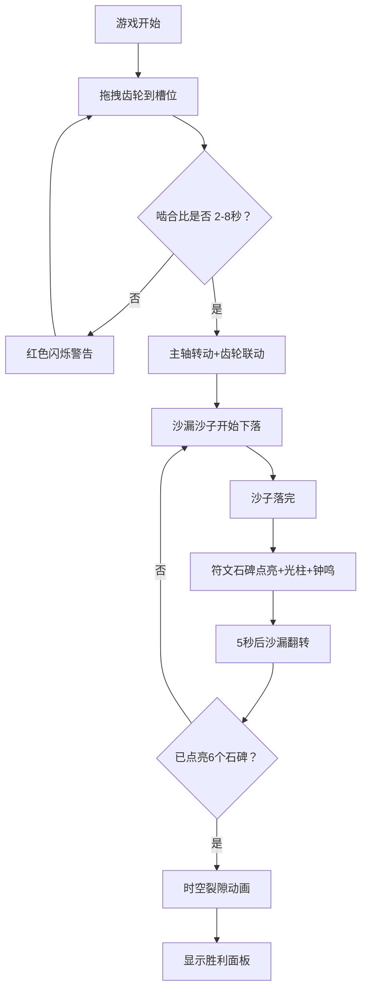

## 1. 产品概述

虚拟机械钟表匠齿轮啮合与时间流沙沙漏模拟游戏是一款沉浸式的古典机械美学互动游戏。用户扮演一位钟表匠与时间魔法师，通过拖拽青铜齿轮到主轴上调整啮合比，控制时间沙漏的流速，点亮十二时辰的符文石碑。

- 目标用户：喜爱机械美学、解谜类游戏的玩家
- 产品价值：提供高品质的视觉享受与机械逻辑解谜的乐趣

## 2. 核心功能

### 2.1 功能模块

1. **游戏主界面**：古典钟表工坊背景、中央主轴圆盘、沙漏、十二时辰符文石碑
2. **齿轮仓库面板**：6种不同尺寸/齿数的青铜齿轮展示、拖拽交互
3. **齿轮啮合系统**：拖拽到槽位、啮合比计算、异常警告
4. **沙漏流速模拟**：沙子粒子下落、堆积效果、翻转动画
5. **符文点亮系统**：时辰石碑渐变点亮、光柱效果、钟鸣音效
6. **胜利结算**：时空裂隙动画、胜利面板展示

### 2.2 页面详情

| 页面名称 | 模块名称 | 功能描述 |
|---------|---------|---------|
| 游戏主界面 | 主轴圆盘 | 直径500px圆盘，6个齿轮槽位，年轮纹理和铆钉装饰 |
| 游戏主界面 | 齿轮槽位 | 等距排列，接收拖拽齿轮，咔嗒嵌入动画 |
| 游戏主界面 | 沙漏组件 | 双球沙漏，金色沙子粒子下落，流速受啮合比控制 |
| 游戏主界面 | 符文石碑 | 12块圆形排列，古代篆刻符号，点亮时渐变与光柱效果 |
| 齿轮仓库面板 | 齿轮列表 | 6种齿轮垂直展示，悬停自转，点击预览啮合轨迹 |
| 胜利面板 | 结算展示 | 显示点亮时辰数和总用时 |

## 3. 核心流程

用户从右侧齿轮仓库拖拽齿轮到中央圆盘的6个槽位 → 系统计算齿轮啮合比 → 啮合比在2-8秒范围内时主轴开始转动驱动齿轮联动 → 沙漏开始按啮合比流速下落沙子 → 沙子落完触发对应时辰符文石碑点亮（渐变+光柱+钟鸣）→ 5秒后沙漏翻转开始下一个时辰计时 → 累计点亮6个石碑触发时空裂隙动画 → 展示胜利面板。

## 4. 用户界面设计

### 4.1 设计风格

- **主色调**：深胡桃木(#4a2c1a)、古铜金(#c9a96e)、黄铜(#daa520)、青铜绿(#3a5a3a)
- **辅助色**：旧纸页(#f5e6cc)、铁锈红(#8b3a3a)
- **按钮风格**：斜角边框模拟浮雕效果
- **齿轮纹理**：CSS扇形渐变模拟铸造质感
- **背景**：深胡桃木色渐变到暗铜绿色

### 4.2 页面设计概述

| 页面名称 | 模块名称 | UI元素 |
|---------|---------|--------|
| 游戏主界面 | 主轴圆盘 | 年轮纹理、铆钉装饰、6个槽位 |
| 游戏主界面 | 齿轮 | 青铜质感、扇形渐变纹理、自转/联动旋转动画 |
| 游戏主界面 | 沙漏 | CSS+SVG双球造型、金色沙粒(3x3px)、翻转180度动画 |
| 游戏主界面 | 符文石碑 | 圆形排列12块、古代篆刻、暗灰→琥珀金渐变、金色抖动光柱 |
| 齿轮仓库面板 | 齿轮卡片 | 悬停放大、2s匀速自转、点击虚线轨道预览2秒 |

### 4.3 响应式设计

- 桌面优先设计
- 768px以下：齿轮尺寸缩小30%，仓库变为底部横向滚动
- 触摸交互优化

### 4.4 动画与特效

- 齿轮嵌入槽位：0.3秒弹簧缓动缩放+旋转
- 主轴加速：0.5rpm→2rpm，缓入缓出1.5秒
- 符文点亮：0.8秒颜色渐变
- 沙漏翻转：180度旋转，1.2秒缓入缓出
- 时空裂隙：100个彩色粒子螺旋扩散2秒
- 沙子粒子：不超过40个/帧，requestAnimationFrame驱动

## 5. 性能要求

- Canvas渲染帧率≥50fps（集成显卡）
- 齿轮动画和粒子系统使用requestAnimationFrame
- 沙漏落沙粒子≤40个/帧
