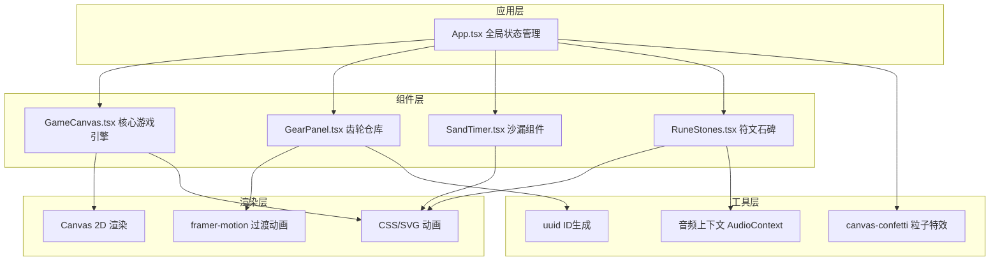

## 1. 架构设计



## 2. 技术描述

- **前端框架**：React 18 + TypeScript
- **构建工具**：Vite 5 + @vitejs/plugin-react
- **状态管理**：React useState/useReducer（App.tsx集中管理）
- **动画库**：framer-motion（组件过渡）、requestAnimationFrame（Canvas高性能渲染）
- **粒子特效**：canvas-confetti（胜利时空裂隙）
- **工具库**：uuid（齿轮实例ID生成）
- **音频**：Web Audio API（钟鸣音效）
- **样式**：内联CSS + CSS变量，响应式媒体查询

## 3. 路由定义

| 路由 | 用途 |
|------|------|
| / | 游戏主界面（单页应用） |

## 4. 数据模型

### 4.1 核心类型定义

```typescript
// 齿轮类型
interface GearType {
  id: string;
  name: string;
  teeth: number;
  size: number;
  color: string;
  description: string;
  hasCam?: boolean;      // 偏心齿轮凸轮
  isDual?: boolean;      // 双联齿轮
  dualTeeth?: number;    // 双联副齿数
  isHollow?: boolean;    // 镂空齿轮
}

// 已放置的齿轮实例
interface PlacedGear {
  instanceId: string;
  typeId: string;
  slotIndex: number;
  rotation: number;
}

// 符文石碑
interface RuneStone {
  index: number;
  name: string;          // 时辰名：子丑寅卯...
  symbol: string;        // 篆刻符号
  isLit: boolean;
  litProgress: number;   // 0-1 点亮进度
}

// 沙漏状态
interface SandTimerState {
  sandRatio: number;     // 0-1 上部剩余沙子比例
  isFlipping: boolean;
  flowSpeed: number;     // 每秒流速
}

// 游戏全局状态
interface GameState {
  phase: 'idle' | 'running' | 'flipping' | 'victory';
  currentHour: number;   // 当前时辰索引 0-11
  litRunes: number[];    // 已点亮的时辰索引
  totalTime: number;     // 总用时（秒）
  placedGears: PlacedGear[];
  sandTimer: SandTimerState;
  runes: RuneStone[];
  warning: boolean;
}
```

## 5. 核心算法

### 5.1 齿轮啮合比计算

```
啮合比 = 所有放置齿轮齿数的乘积 / 基准系数
实际流速(秒) = 基础时间(4秒) * (啮合比 / 理想啮合比)
```

啮合比转换后需落在 [2秒, 8秒] 区间，否则触发警告。

### 5.2 沙子粒子系统

- 最大同时存在粒子数：40
- 每帧根据流速生成新粒子（上限）
- 粒子物理：匀速下落(y += speed)，碰撞底部后堆积
- 堆积模拟：20个随机错位圆点，高度随落沙量线性增长

### 5.3 齿轮渲染

- Canvas绘制齿轮：圆心、半径、齿数、内孔、齿廓
- 旋转角度：rotation += (rpm / 60) * (2π) * deltaTime
- 啮合联动：相邻齿轮转速 = 主动转速 * (主动齿数/从动齿数)，方向相反

## 6. 性能优化

- Canvas渲染使用requestAnimationFrame，deltaTime计算确保帧率独立
- 粒子对象池复用，避免频繁GC
- 齿轮静态部分离屏缓存（OffscreenCanvas）
- React组件使用memo减少不必要重渲染
- 沙子粒子数严格限制在40/帧
