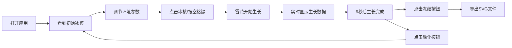

## 1. 产品概述
冰晶工作室是一款浏览器端虚拟雪花结晶与冰晶生长动画交互创作应用，为设计师、艺术爱好者和气象爱好者提供沉浸式的冰雪艺术创作体验。用户可通过调节温度、湿度和风速三种环境参数，观察雪花从微小冰核生长为六角形或树枝状复杂晶体的全过程，并将作品冻结保存为高分辨率SVG或PNG图片。

## 2. 核心功能

### 2.1 用户角色
| 角色 | 注册方式 | 核心权限 |
|------|----------|----------|
| 冰雪艺术家 | 无需注册 | 调节环境参数、观察雪花生长、导出作品 |

### 2.2 功能模块
1. **控制面板区**：温度、湿度、风速滑块调节，实时数值显示
2. **中央画布区**：800x800像素画布，冰核交互与雪花生长动画渲染
3. **底部工具栏**：冻结保存、融化重置按钮
4. **生长数据显示**：当前层数、总分支数、对称度百分比实时展示

### 2.3 页面详情
| 页面名称 | 模块名称 | 功能描述 |
|----------|----------|----------|
| 主页面 | 控制面板 | 三个滑块（温度-30°C~0°C、湿度30%~90%、风速0~5m/s），实时数值缓动动画显示 |
| 主页面 | 雪花画布 | 800x800px画布，初始冰核（白色六边形，直径8px），支持鼠标拖拽移动，分形生长动画 |
| 主页面 | 数据展示 | 实时显示当前层数（1-6层）、总分支数、对称度百分比 |
| 主页面 | 工具栏 | 冻结按钮（导出SVG）、融化按钮（重置状态） |

## 3. 核心流程

用户打开应用 → 看到中央冰核与深蓝色夜空背景 → 调节左侧环境参数（温度/湿度/风速）→ 点击冰核或按空格键开始生长 → 观察6秒分形生长过程，实时数据同步更新 → 点击"冻结"按钮保存SVG文件 → 点击"融化"按钮重置，开始新创作

## 4. 用户界面设计

### 4.1 设计风格
- **主色调**：冰蓝冷色系 — 深蓝夜空（#0a0a2e → #1a1a4e 渐变）、冰蓝（#c0e8f0）、冷白（#e8f8ff）、淡冰蓝（#b0e0e6）
- **按钮样式**：渐变蓝白（#4a90d9 → #b0e0e6），圆角设计，点击时0.2秒缩放回弹动画
- **字体**：纤细等宽字体，标题 #b0e0e6 色，数据 #a0d8ef 色
- **布局风格**：左窄控制区（260px，深蓝半透明 #1a1a3e，磨砂玻璃分割线）+ 中央画布区（右侧全宽，居中显示）
- **视觉效果**：径向光晕、闪烁粒子、微磨砂玻璃效果

### 4.2 页面设计概述
| 页面名称 | 模块名称 | UI 元素 |
|----------|----------|----------|
| 主页面 | 顶部标题 | "❄ 冰晶工作室" 纤细等宽字体，居中排列，#b0e0e6 色 |
| 主页面 | 控制面板 | 滑块轨道冰蓝色渐变填充，数值显示带缓动动画，悬停放大1.05倍 |
| 主页面 | 雪花画布 | 800x800px 居中，深蓝夜空渐变背景，冰核带极淡蓝白色径向光晕 |
| 主页面 | 数据条 | 画布底部带状区域，等宽字体显示三层数据 |
| 主页面 | 底部工具栏 | 冰晶形状SVG图标按钮，悬停旋转15度并变亮，融化按钮 |

### 4.3 响应式设计
- **桌面优先**：适配1280px以上桌面端
- **画布自适应**：窗口缩放时保持比例居中显示
- **触控优化**：滑块与按钮支持触控操作，点击响应延迟<50ms

### 4.4 交互动效
- **滑块拖动**：数值数字0.3秒缓动动画变化
- **冰核交互**：鼠标悬停放大1.05倍+亮度+20%，支持拖拽微移位置
- **生长动画**：每0.5秒轮生一层分支，共6秒生长周期，分支从冰蓝到冷白渐变，末端带圆形水滴
- **粒子效果**：50个闪烁粒子，大小1-3px随机，透明度0.3-0.1循环
- **按钮交互**：悬停放大1.05倍+亮度+20%，点击0.2秒缩放回弹
