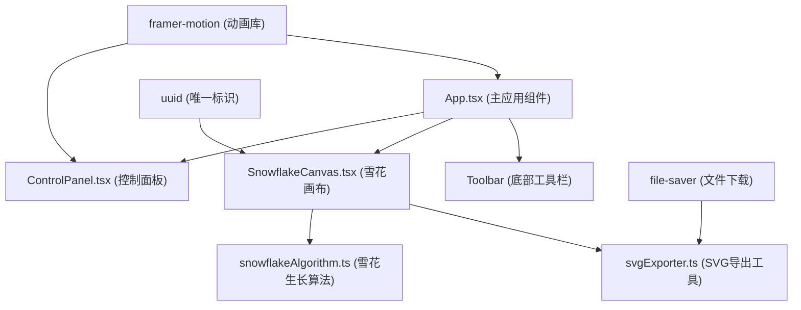

## 1. 架构设计



## 2. 技术描述

- **前端框架**: React@18 + TypeScript@5 + Vite@5
- **动画库**: framer-motion@11（用于滑块数值缓动、按钮交互动画）
- **文件导出**: file-saver@2（SVG文件下载）
- **工具库**: uuid@9（生成雪花唯一标识）
- **构建工具**: Vite@5 配合 @vitejs/plugin-react@4
- **路径别名**: @ 指向 src 目录
- **无后端服务**: 纯前端应用，所有计算在浏览器端完成

## 3. 项目文件结构

| 文件路径 | 作用 |
|----------|------|
| package.json | 项目依赖与脚本配置 |
| vite.config.js | Vite 构建配置，启用 React 插件，路径别名 |
| tsconfig.json | TypeScript 严格模式配置，JSX 为 react-jsx |
| index.html | 入口页面，zh-CN 语言，全屏 viewport |
| src/App.tsx | 主应用组件，状态管理，整体布局 |
| src/components/ControlPanel.tsx | 左侧控制面板，三个滑块组件 |
| src/components/SnowflakeCanvas.tsx | 中央雪花画布，Canvas 2D 渲染 |
| src/utils/snowflakeAlgorithm.ts | 分形生长核心算法，生成路径数据 |
| src/utils/svgExporter.ts | SVG 导出工具函数 |
| src/main.tsx | React 应用入口 |

## 4. 核心数据类型定义

```typescript
// 环境参数
interface EnvironmentParams {
  temperature: number; // -30 ~ 0 °C
  humidity: number;    // 30 ~ 90 %
  windSpeed: number;   // 0 ~ 5 m/s
}

// 雪花分支点
interface BranchPoint {
  x: number;
  y: number;
  angle: number;
  length: number;
  width: number;
}

// 雪花生长层
interface GrowthLayer {
  layer: number;
  branches: BranchPoint[];
}

// 雪花完整数据
interface SnowflakeData {
  id: string;
  centerX: number;
  centerY: number;
  layers: GrowthLayer[];
  totalBranches: number;
  symmetry: number; // 0 ~ 100 %
  params: EnvironmentParams;
}

// 雪花粒子
interface Particle {
  x: number;
  y: number;
  size: number;
  opacity: number;
  phase: number;
}
```

## 5. 雪花生长算法设计

### 5.1 分形参数计算
- **最大层数**：固定 6 层（对应 6 秒生长周期）
- **每层分支数**：
  - 第 1 层：6 个主枝（六角对称）
  - 第 2-6 层：温度越低分支越多（(-temperature/10) + 2）
- **分支长度**：
  - 主枝：60-120px，湿度越高越长
  - 次枝：主枝长度 × (0.3 ~ 0.6)，保持左右对称
- **毛刺扰动**：风速 × 2px，作用于分支末端

### 5.2 对称度计算
```
对称度 = 100 - (Σ|左枝长度 - 右枝长度| / 平均长度) × 100 / 对数
```

### 5.3 生长节奏
- 每 0.5 秒完成一层生长
- 使用 requestAnimationFrame 实现平滑动画
- 帧率控制：每帧绘制 ≤ 200 条线条，≤ 50 个粒子

## 6. 性能优化策略

| 优化点 | 技术方案 |
|--------|----------|
| 动画帧率 | 使用 requestAnimationFrame，按 30FPS 节流 |
| 绘制优化 | 分层绘制，使用离屏 Canvas 缓存已完成层 |
| 粒子管理 | 对象池复用 50 个粒子，避免频繁 GC |
| SVG 导出 | 预计算路径数据，字符串拼接生成，100ms 内完成 |
| 响应式 | Canvas 使用 CSS 缩放，内部坐标固定 800x800 |

## 7. 交互事件处理

| 事件 | 处理方式 |
|------|----------|
| 滑块拖动 | useState 本地管理状态，onChange 实时回调，framer-motion 动画数值 |
| 冰核点击 | 触发 startGrowth()，设置 isGrowing 状态 |
| 空格键 | 全局 keydown 监听，空格键触发生长 |
| 冰核拖拽 | mousedown/mousemove/mouseup，更新冰核位置 |
| 冻结按钮 | 调用 canvas ref 的 exportSVG() 方法 |
| 融化按钮 | 重置所有状态，重新渲染初始冰核 |
