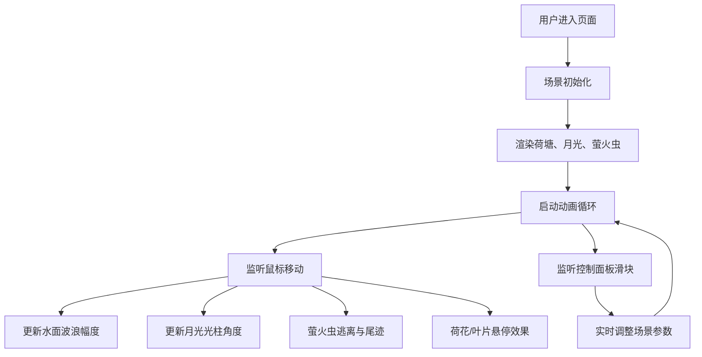

## 1. 产品概述

月下荷塘萤火虫交互可视化项目，用户在浏览器中化身夏夜观察者，通过鼠标移动和点击，在宁静的荷塘上感受萤火虫群随月光和风的变化翩翩起舞。

- 核心目的：打造沉浸式、诗意的夜间自然交互体验
- 目标用户：喜爱自然美学、交互艺术的用户
- 产品价值：通过 Three.js 实现梦幻般的粒子动画与场景渲染，带来治愈系视觉享受

## 2. 核心特性

### 2.1 功能模块

| 模块名称 | 功能描述 |
|---------|---------|
| 荷塘场景 | 渐变夜空背景、动态波浪水面、月光光柱效果 |
| 萤火虫群 | 500个发光粒子、随机游走、闪烁动画、鼠标逃离与尾迹 |
| 荷花与叶片 | 12朵荷花（8片花瓣+花蕊）、叶片带叶脉、悬停交互 |
| 控制面板 | 月光强度、风涡力度、萤火虫密度三个调节滑块 |
| 性能优化 | 保证 30+ FPS，粒子更新周期 < 30ms |

### 2.2 页面详情

| 页面名称 | 模块名称 | 功能描述 |
|---------|---------|---------|
| 主场景 | 夜空背景 | 深蓝紫(#1a1a3e)到蓝灰(#2c3e5e)渐变 |
| 主场景 | 水面波浪 | 动态纹理，幅度随鼠标X轴在2-5px变化 |
| 主场景 | 月光光柱 | 右上角投射，250个闪烁小点，角度随鼠标Y轴30-60度 |
| 主场景 | 萤火虫粒子 | 500个粒子，黄绿到淡金渐变，环形区域游走 |
| 主场景 | 荷花叶片 | 12朵荷花+若干叶片，悬停交互动画 |
| 控制面板 | 滑块调节 | 月光强度(0-1)、风涡力度(0-2)、萤火虫密度(100-500) |

## 3. 核心流程

## 4. 用户界面设计

### 4.1 设计风格

- **主色调**：深蓝紫(#1a1a3e)、蓝灰色(#2c3e5e)
- **点缀色**：柔黄绿(#c4ff6e)、淡金色(#ffe066)、粉白(#ffdae0)、粉紫(#d4b6e0)
- **视觉风格**：梦幻、诗意、宁静的月夜氛围
- **交互元素**：毛玻璃半透明背景(backdrop-filter: blur(8px))，柔和悬停高亮(0.3s缓出)
- **模式**：全屏暗色模式

### 4.2 页面设计概述

| 页面名称 | 模块名称 | UI 元素 |
|---------|---------|--------|
| 主场景 | 夜空 | 垂直渐变背景，从上到下深蓝紫到蓝灰 |
| 主场景 | 水面 | 占据画面下半部分，动态波浪纹理 |
| 主场景 | 月光 | 右上角银白色径向渐变光柱，含闪烁粒子 |
| 主场景 | 萤火虫 | 500个发光圆点，随机闪烁，环形分布 |
| 主场景 | 荷花 | 散布在水面，8片花瓣环绕花蕊 |
| 主场景 | 叶片 | 圆形绿色叶片，带叶脉纹理 |
| 控制面板 | 滑块组 | 右侧垂直排列，毛玻璃背景，实时数值显示 |

### 4.3 响应式设计

- 以桌面端为主，全屏展示
- 画布自适应窗口大小
- 控制面板固定在右侧，不随窗口缩放变形

### 4.4 3D 场景指引

- **环境与氛围**：夜晚荷塘，月光朦胧，萤火虫闪烁，宁静诗意
- **光照设置**：主光源为右上方月光，环境光为微弱蓝紫色
- **相机设置**：正交或透视相机，俯视略带角度，展现荷塘全景
- **构图与焦点**：萤火虫群为动态视觉焦点，荷花为静态点缀
- **交互与动画**：
  - 鼠标移动影响水面波纹、月光角度、萤火虫行为
  - 悬停荷花/叶片触发开合/叶脉动画
  - 滑块实时调节全局参数
- **后处理效果**：发光效果(Glow)、轻微泛光
- **性能预算**：500粒子维持30+FPS，单帧更新<30ms
