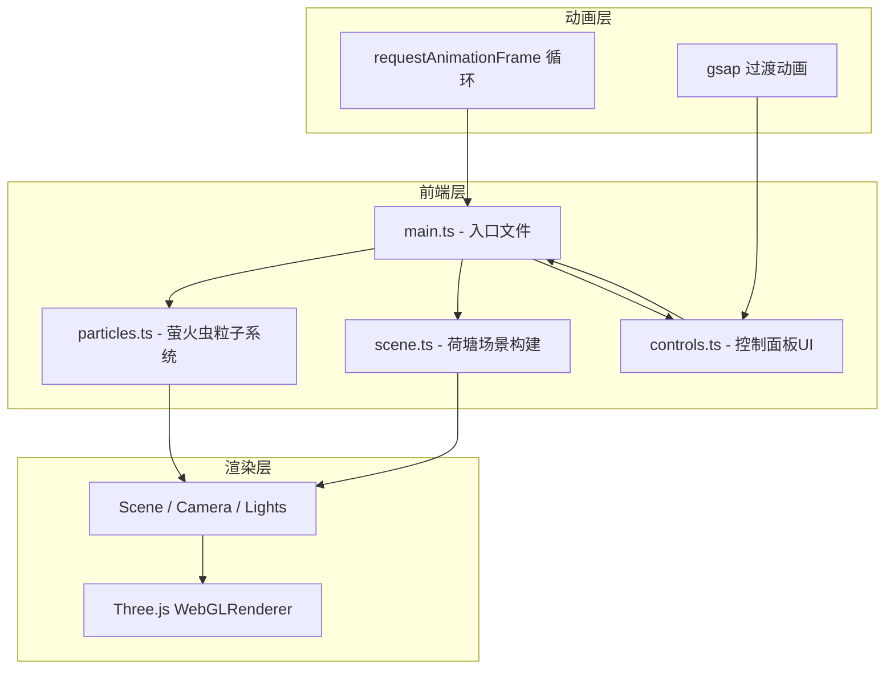

## 1. 架构设计

## 2. 技术描述

- **前端框架**：TypeScript + Three.js@0.160.0
- **构建工具**：Vite@5
- **动画库**：gsap
- **类型定义**：@types/three
- **初始化方式**：手动配置 Vite + TypeScript 项目

## 3. 文件结构

| 文件路径 | 用途 |
|---------|------|
| package.json | 项目依赖与脚本配置 |
| vite.config.js | Vite 构建配置，启用 TypeScript，base: './' |
| tsconfig.json | TypeScript strict 模式配置 |
| index.html | 入口 HTML，包含全屏样式与 main.ts 引入 |
| src/main.ts | 入口文件，初始化场景/相机/渲染器，启动动画循环 |
| src/particles.ts | 萤火虫粒子系统：位置初始化、闪烁动画、鼠标逃离、尾迹 |
| src/scene.ts | 荷塘场景：水面、月光、荷花、叶片、鼠标交互 |
| src/controls.ts | 右侧控制面板：三个滑块、实时数值、事件绑定 |

## 4. 核心模块说明

### 4.1 粒子系统 (particles.ts)

- **粒子数量**：500 个发光粒子
- **粒子属性**：位置、速度、大小(6-12px)、颜色(黄绿#c4ff6e到淡金#ffe066渐变)、闪烁周期(0.8-2.0s)、亮度(0.1-1.0)
- **运动方式**：在半径 150-350px 环形区域内随机游走
- **鼠标交互**：40px 范围内加速逃离，留下 0.3 秒浅黄色尾迹
- **性能策略**：使用 BufferGeometry + ShaderMaterial 批量渲染

### 4.2 场景系统 (scene.ts)

- **夜空背景**：深蓝紫(#1a1a3e)到蓝灰(#2c3e5e)垂直渐变
- **水面**：动态波浪纹理，幅度随鼠标X轴在 2-5px 间变化
- **月光光柱**：右上角投射，径向渐变 + 250个闪烁小点，角度随鼠标Y轴 30-60 度
- **荷花**：12 朵，8 片花瓣环绕花蕊，悬停时每秒开合一次(缩放 0.2-1.0)
- **叶片**：圆形，直径 35-65px，深绿到浅绿渐变，12 等份叶脉，悬停叶脉显现并 0.3 度旋转

### 4.3 控制面板 (controls.ts)

- **月光强度**：0-1 范围，影响萤火虫亮度和水面光柱透明度
- **风涡力度**：0-2 范围，影响粒子游走速度和波纹幅度
- **萤火虫密度**：100-500 范围，控制可见粒子数量
- **UI 样式**：毛玻璃背景(backdrop-filter: blur(8px))，0.2s 过渡动画，0.3s 悬停缓出

### 4.4 性能优化策略

- 使用 BufferGeometry 批量渲染粒子，减少 draw call
- 粒子位置更新在 CPU 端计算，使用 TypedArray 提升性能
- 月光粒子与萤火虫粒子分离管理
- 荷花/叶片使用 Raycaster 检测悬停，按需更新
- 目标：500 粒子时单帧更新 < 30ms，FPS ≥ 30

## 5. 交互事件定义

| 事件 | 触发源 | 响应 |
|-----|--------|------|
| mousemove | 画布 | 更新水面幅度、月光角度、萤火虫逃离检测 |
| mouseover | 荷花 | 花瓣开合动画 |
| mouseover | 叶片 | 叶脉显现 + 旋转 |
| input | 滑块 | 实时更新对应参数，带过渡动画 |
| resize | 窗口 | 调整画布大小和相机投影 |
