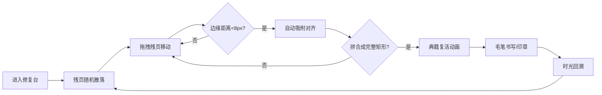

## 1. 产品概述
虚拟古籍修复师工作台是一个浏览器端沉浸式交互应用，让古籍爱好者无需亲手接触珍贵文献，即可体验从碎片中拼接典籍、复原墨迹的全过程。
- 核心价值：通过模拟残页拼合与毛笔书写，为用户提供高度拟真的古籍修复体验
- 目标用户：古籍爱好者、书法爱好者、文化教育领域用户

## 2. 核心功能

### 2.1 功能模块
1. **修复台主界面**：暗黄纸色渐变背景、木质卷轴架装饰、800x600px拼合画布
2. **残页拼合系统**：6-8片不规则多边形残页的散落、拖拽、旋转放大、边缘吸附对齐
3. **修复工具箱**：毛笔工具（压感笔触）、墨水瓶（四色墨选择）、印章工具（随机朱红印章）
4. **典籍复活动画**：拼合完成后的金色光芒扩散、纸质统一、完整诗文显现
5. **时光回溯功能**：残页分步骤沿曲线轨迹飞回初始状态、墨迹渐隐消失

### 2.2 页面详情
| 页面名称 | 模块名称 | 功能描述 |
|-----------|-------------|---------------------|
| 修复台主页面 | 背景装饰 | 暗黄纸色线性渐变(#c8b896→#a58a6d)、仿古宣纸纹理(径向渐变+噪声)、顶部木质卷轴架 |
| 修复台主页面 | 拼合画布 | 800x600px画布，0.5px棕色虚线边框，承载残页交互 |
| 修复台主页面 | 残页碎片 | 6-8片不规则多边形残页(边长40-120px)，老旧纸色#d4c5a9，磨损纹理，浅手写文字线条 |
| 修复台主页面 | 拖拽交互 | 鼠标拖拽移动残页，长按旋转15度+放大1.1倍，释放复位 |
| 修复台主页面 | 吸附对齐 | 边缘距离<8px自动吸附，0.3秒缓动动画，0.5秒金色光晕 |
| 修复台主页面 | 典籍复活 | 拼合误差<15px触发：10个金色光晕圆环扩散(1.2秒/个，间隔0.15秒)，纸质统一#d9c8a6，显示楷体诗文 |
| 工具箱面板 | 毛笔工具 | SVG毛笔图标，点击后笔头棕色，支持压感书写（10px↔2px渐变，0.3秒过渡），墨迹飞白效果 |
| 工具箱面板 | 墨水瓶 | 点击弹出色板：松烟墨#1a1a1a、油烟墨#2b2b2b、朱砂红#c04040、藤黄#f0c040，默认松烟墨 |
| 工具箱面板 | 印章工具 | 圆形图标，点击盖30x30px方形朱红印章，内容随机从"藏/鉴/珍/宝"选，10%透明度复古效果 |
| 工具箱面板 | 时光回溯 | 底部圆形逆时针箭头按钮，悬停放大1.1倍+淡金光晕，点击残页3步飞回(0.8秒/步，间隔0.5秒)，墨迹0.5秒渐隐 |

## 3. 核心流程

用户进入修复台 → 画布随机散落6-8片残页 → 拖拽残页移动/旋转 → 边缘靠近自动吸附对齐 → 拼合成完整矩形区域 → 触发典籍复活动画（金色光芒+显示完整诗文）→ 使用毛笔/墨水在复原页面书写 → 使用印章盖印 → 点击时光回溯回到初始状态

## 4. 用户界面设计

### 4.1 设计风格
- **主色调**：暗黄纸色 #c8b896 → #a58a6d 线性渐变；古纸色 #d4c5a9、#d9c8a6；深褐文字 #3b2a1a
- **强调色**：金色光晕（用于吸附、拼合、悬停效果）；朱红 #c04040（印章、朱砂墨）
- **工具箱色**：半透明浅木色 #b8956a，透明度 0.8
- **按钮风格**：圆形按钮，悬停1.02倍缩放+淡金色描边（0.2px）+淡金色光晕
- **字体**：楷体（诗文），字号20px，行距1.8
- **布局风格**：左侧主画布区 + 右侧固定工具箱面板（宽220px），顶部木质卷轴装饰
- **图标风格**：SVG 绘制，毛笔、墨水瓶、印章、逆时针箭头

### 4.2 页面设计概述
| 页面名称 | 模块名称 | UI 元素 |
|-----------|-------------|-------------|
| 修复台主页面 | 背景层 | 径向渐变宣纸纹理、0.3% opacity噪声伪元素 |
| 修复台主页面 | 顶部装饰 | 木质卷轴架模拟效果 |
| 修复台主页面 | 中央画布 | 800x600px，0.5px棕色虚线边框 |
| 修复台主页面 | 残页碎片 | 不规则多边形、磨损纹理、浅文字线条 |
| 右侧工具箱 | 工具面板 | 半透明浅木色、固定定位、宽220px、可滚动 |
| 右侧工具箱 | 毛笔工具 | SVG毛笔图标、点击变色、选中状态 |
| 右侧工具箱 | 墨水瓶 | 弹出四色色板、选中指示 |
| 右侧工具箱 | 印章工具 | 圆形印章图标、点击盖印 |
| 右侧工具箱 | 时光回溯 | 底部圆形按钮、逆时针箭头图标 |

### 4.3 响应式
- 桌面优先设计，画布800x600px固定尺寸
- 工具箱面板固定右侧，滚动时保持位置
- 整体布局居中显示

### 4.4 动画与性能
- **动画帧率**：≥40fps，画布渲染≥50fps
- **缓动函数**：全部使用 ease-out 或 ease-in-out
- **拼合算法**：8片残页邻近距离搜索≤2ms
- **吸附动画**：0.3秒缓动
- **典籍复活**：10个光晕圆环，每个1.2秒，间隔0.15秒
- **时光回溯**：残页3步飞回，每步0.8秒，间隔0.5秒
