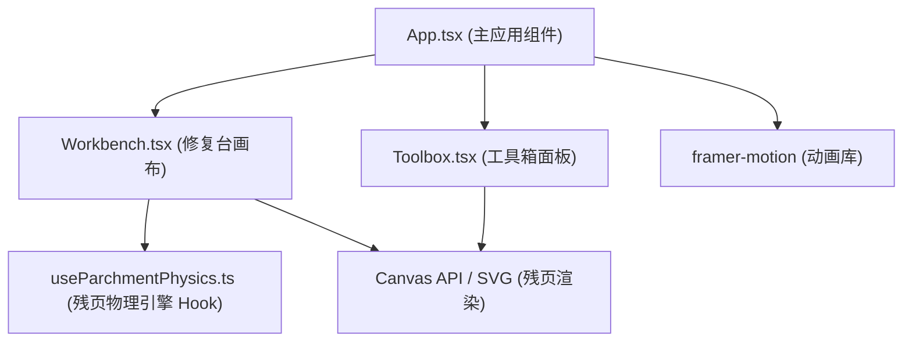

## 1. 架构设计



## 2. 技术描述
- **前端框架**：React 18 + TypeScript
- **构建工具**：Vite 5 + @vitejs/plugin-react
- **动画库**：framer-motion
- **唯一ID生成**：uuid
- **初始化工具**：vite-init（使用 react-ts 模板）
- **后端**：无（纯前端应用）
- **状态管理**：React useState/useReducer + 自定义Hook

## 3. 项目文件结构
```
package.json          # 项目依赖与脚本
vite.config.js        # Vite 构建配置（base: './'）
tsconfig.json         # TypeScript 配置（严格模式，target ES2020）
index.html            # 入口 HTML
src/
  App.tsx             # 主应用组件：整体布局、状态管理、组件协调
  components/
    Workbench.tsx     # 修复台画布：残页散落、拖拽、吸附、拼合逻辑
    Toolbox.tsx       # 工具箱面板：毛笔、墨水、印章工具管理
  hooks/
    useParchmentPhysics.ts  # 自定义Hook：残页物理引擎（拖拽、旋转、吸附、拼合判定）
```

## 4. 核心数据模型

### 4.1 残页数据类型
```typescript
interface ParchmentPiece {
  id: string;
  // 多边形顶点（相对于残页中心点的相对坐标）
  polygon: { x: number; y: number }[];
  // 当前位置（画布坐标系）
  position: { x: number; y: number };
  // 初始位置（用于时光回溯）
  initialPosition: { x: number; y: number };
  // 旋转角度（度）
  rotation: number;
  // 初始旋转角度
  initialRotation: number;
  // 缩放比例
  scale: number;
  // 是否已吸附
  isSnapped: boolean;
  // 吸附到的残页ID
  snappedTo: string | null;
  // 残页上的文字片段
  textFragment: string;
  // 磨损纹理种子
  textureSeed: number;
}
```

### 4.2 工具箱状态
```typescript
type ToolType = 'brush' | 'ink' | 'stamp' | null;

interface ToolboxState {
  activeTool: ToolType;
  inkColor: string;  // 墨色：#1a1a1a | #2b2b2b | #c04040 | #f0c040
  showColorPalette: boolean;
}
```

### 4.3 书写笔触
```typescript
interface BrushStroke {
  id: string;
  points: { x: number; y: number; width: number }[];
  color: string;
  opacity: number;
}
```

### 4.4 印章数据
```typescript
interface StampData {
  id: string;
  position: { x: number; y: number };
  character: '藏' | '鉴' | '珍' | '宝';
}
```

## 5. 核心算法

### 5.1 残页生成算法
- 在 800x600 画布内随机生成 6-8 片不规则多边形残页
- 每片边长 40-120px，通过随机偏移正多边形顶点生成不规则形状
- 残页位置随机分布，避免过度重叠

### 5.2 吸附检测算法
- 遍历所有残页对，计算边缘顶点间的最小距离
- 当最小距离 < 8px 时触发吸附
- 吸附对齐：将移动中的残页平移至与目标残页边缘重合
- 复杂度 O(n²)，n≤8 时控制在 2ms 以内

### 5.3 拼合完成判定
- 计算所有残页组成的最小包围矩形
- 计算该矩形的面积覆盖率
- 当覆盖率 > 90% 且边缘误差 < 15px 时判定拼合完成

### 5.4 毛笔压感模拟
- mousedown：笔触宽度从 10px 线性渐变到 2px（0.3秒）
- mousemove：根据速度调整宽度，每 5px 随机产生 0.5-2px 飞白间断
- mouseup：笔触宽度从 2px 线性渐变到 10px（0.3秒）

## 6. 状态管理策略

### 6.1 状态提升
- App.tsx 管理全局状态：残页数据、工具箱状态、拼合状态、书写笔触、印章
- Workbench 接收残页数据和回调函数，负责渲染和交互
- Toolbox 接收工具箱状态和回调函数，负责工具选择

### 6.2 动画管理
- 使用 framer-motion 处理残页移动、旋转、吸附等交互动画
- 使用 CSS 动画处理金色光晕扩散、时光回溯等效果
- 书写笔触使用 Canvas API 实时渲染

## 7. 性能优化
- 残页渲染使用 CSS transform/opacity，避免重排
- 吸附检测使用 requestAnimationFrame 节流
- 拼合判定在每次吸附后触发，而非每一帧
- 毛笔书写使用 Canvas 离屏渲染减少重绘
