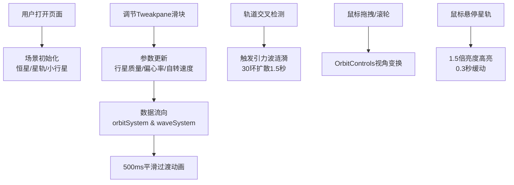

## 1. 产品概述

虚拟星轨引力场模拟交互应用，为天文艺术家打造的参数驱动可视化创作工具。用户通过调节行星参数实时观察半抽象星轨与引力波涟漪的动态交互效果，探索引力场中轨道扭曲、交错与共振的视觉诗篇。

- 核心用户：天文艺术家、科学可视化爱好者、交互艺术观众
- 产品价值：将抽象的引力场物理规律转化为直观可调节的视觉艺术表现

## 2. 核心功能

### 2.1 功能模块

1. **主场景渲染**：Three.js 3D场景，包含恒星、星轨、小行星、引力波涟漪
2. **参数控制面板**：Tweakpane半透明面板，三个核心参数滑块
3. **星轨系统**：3条彩色发光轨道环，随参数动态变化
4. **引力波系统**：轨道交叉点生成涟漪动画
5. **相机交互**：OrbitControls全空间视角控制

### 2.2 页面详情

| 页面名称 | 模块名称 | 功能描述 |
|-----------|-------------|---------------------|
| 主场景 | 中央恒星 | 发光球体+径向光晕，自转速度随参数变化 |
| 主场景 | 星轨系统 | 3条倾斜轨道（15°/30°/45°），每条含8颗小行星，颜色随质量/倾角变化 |
| 主场景 | 引力波涟漪 | 轨道交叉点触发30环同心扩散涟漪，持续1.5秒消失 |
| 控制面板 | 参数滑块 | 行星质量(0.5-10)、轨道偏心率(0-0.9)、自转速度(0.1-5) |
| 交互反馈 | 悬停高亮 | 星轨环悬停1.5倍亮度，0.3秒缓动 |

## 3. 核心流程

用户打开应用 → 场景初始化（恒星+3条星轨+小行星）→ 调节参数滑块 → 参数传递至星轨系统/波系统 → 500ms平滑过渡动画 → 星轨交叉触发引力波 → 鼠标拖拽/滚轮控制视角 → 悬停星轨触发高亮

## 4. 用户界面设计

### 4.1 设计风格
- **主色调**：深空黑(#050510) → 紫黑色(#1a0a2e)径向渐变背景
- **星轨色彩**：质量小时偏蓝(#4f9fff)，质量大时偏红(#ff6b4a)，平滑插值
- **涟漪色彩**：蓝紫色(#7b68ee) ↔ 青绿色(#00ced1)渐变
- **恒星色彩**：暖橙色(#ffaa44)发光效果
- **视觉风格**：科幻星河抽象风，全部线条使用emissive发光材质
- **字体**：现代无衬线字体，控制面板半透明毛玻璃效果

### 4.2 页面设计概述

| 页面名称 | 模块名称 | UI元素 |
|-----------|-------------|-------------|
| 主场景 | 视觉核心 | 中央暖橙色发光恒星，3条倾斜彩色星轨环均匀分布，小行星沿轨道公转，引力波从交叉点扩散 |
| 控制面板 | 右上角固定 | 半透明深色背景，三个垂直排列滑块，实时数值显示，淡入淡出过渡 |
| 背景层 | 全屏径向渐变 | 深空黑到紫黑色过渡，营造宇宙深邃感 |

### 4.3 响应性
- Desktop-first设计，监听window resize事件
- Three.js渲染器和相机自动适配窗口尺寸
- 控制面板固定右上角，相对屏幕定位

### 4.4 3D场景指导
- **环境**：纯深空渐变背景，无HDRI，点光源+环境光组合
- **光照**：恒星自发光(emissive)作为主要光源，微弱环境光补充暗部
- **相机**：PerspectiveCamera，初始距离400，fov 60°
- **镜头运动**：OrbitControls全空间旋转，阻尼平滑，滚轮缩放
- **后期**：轻微辉光效果增强发光感
- **性能预算**：总粒子<500，涟漪环<30，帧率≥45fps
