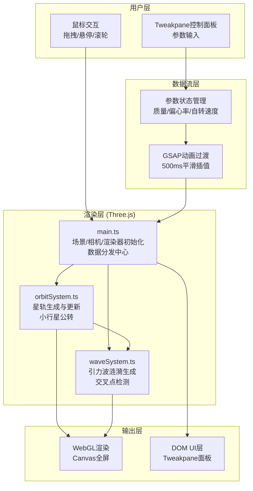

## 1. 架构设计



## 2. 技术描述

- **前端框架**：原生 TypeScript + Three.js（不使用React，因为用户明确指定Three.js+Vite+TS）
- **构建工具**：Vite@5 + TypeScript
- **核心依赖**：
  - three@0.160.0：WebGL 3D渲染引擎
  - @types/three：Three.js类型声明
  - gsap：动画过渡库，用于参数平滑插值
  - tweakpane：参数控制面板UI
- **无后端**：纯前端应用，无需服务器

### 2.1 文件结构与职责

```
project/
├── package.json          # 依赖配置，启动脚本
├── vite.config.js        # Vite构建配置
├── tsconfig.json         # TypeScript严格模式配置
├── index.html            # 入口HTML
└── src/
    ├── main.ts           # 【入口调度】场景/相机/渲染器初始化，GUI创建，参数分发，数据流向管理
    ├── orbitSystem.ts    # 【星轨系统】接收参数→生成3条星轨（每条200点）→提供位置数组给waveSystem
    └── waveSystem.ts     # 【涟漪系统】接收星轨位置→交叉检测→生成30环引力波→渲染动画到场景
```

### 2.2 调用关系与数据流向

1. **输入层 → 主程序**：Tweakpane参数变化事件 → main.ts监听 → 参数对象更新
2. **主程序 → 子系统**：main.ts通过方法调用将参数传递给 `orbitSystem.update(params)` 和 `waveSystem.update(params)`
3. **星轨 → 涟漪**：orbitSystem提供 `getOrbitPoints()` 方法返回三条轨道的位置数组 → waveSystem在update中调用获取
4. **子系统 → 场景**：两个系统都持有scene引用，直接向场景添加/更新Object3D对象
5. **动画循环**：main.ts的requestAnimationFrame循环中调用各系统的update方法

## 3. 核心数据结构定义

### 3.1 行星参数接口

```typescript
interface PlanetParams {
  mass: number;        // 0.5-10，步长0.1
  eccentricity: number; // 0-0.9，步长0.05
  rotationSpeed: number; // 0.1-5，步长0.1
}
```

### 3.2 星轨点数据

```typescript
interface OrbitData {
  points: THREE.Vector3[];  // 200个点的位置数组
  inclination: number;      // 倾斜角15/30/45度
  color: THREE.Color;       // 质量插值颜色
  lineWidth: number;        // 1-5px渐变
  asteroids: AsteroidData[]; // 8颗小行星数据
}

interface AsteroidData {
  mesh: THREE.Mesh;
  radius: number;           // 3-6px随机
  orbitAngle: number;       // 当前公转角
  orbitSpeed: number;       // 与自转速度成正比
  color: THREE.Color;       // 随轨道倾角变化
}
```

### 3.3 引力波涟漪数据

```typescript
interface RippleData {
  position: THREE.Vector3;  // 交叉点位置
  startTime: number;        // 触发时间
  duration: number;         // 1500ms
  rings: THREE.Line[];      // 30个同心环
}
```

## 4. 关键实现策略

### 4.1 性能优化策略
- **对象复用池**：涟漪环创建后复用，避免频繁GC
- **帧率控制**：requestAnimationFrame中使用deltaTime控制动画速度
- **粒子上限**：小行星总数24颗 + 涟漪最大30环 = 远低于500限制
- **交叉检测优化**：每N帧检测一次，而非每帧
- **材质复用**：同类对象共享Material实例

### 4.2 动画过渡策略
- **GSAP tween**：参数变化时使用gsap.to(500ms)过渡，避免突变
- **颜色插值**：使用THREE.Color.lerp实现蓝到红的平滑过渡
- **缓动函数**：power2.out实现自然的缓入缓出效果

### 4.3 悬停交互策略
- **Raycaster检测**：每帧检测鼠标与星轨线的交点
- **GSAP高亮**：悬停时emissiveIntensity从1→1.5，0.3秒缓动

### 4.4 颜色系统
- 星轨：`lerp(#4f9fff, #ff6b4a, (mass - 0.5) / 9.5)`
- 小行星：基于轨道倾角HSL色相偏移
- 涟漪：色相在#7b68ee和#00ced1之间随时间正弦振荡

## 5. 初始化与启动

1. `npm install` 安装依赖
2. `npm run dev` 启动Vite开发服务器
3. 浏览器访问 http://localhost:5173
