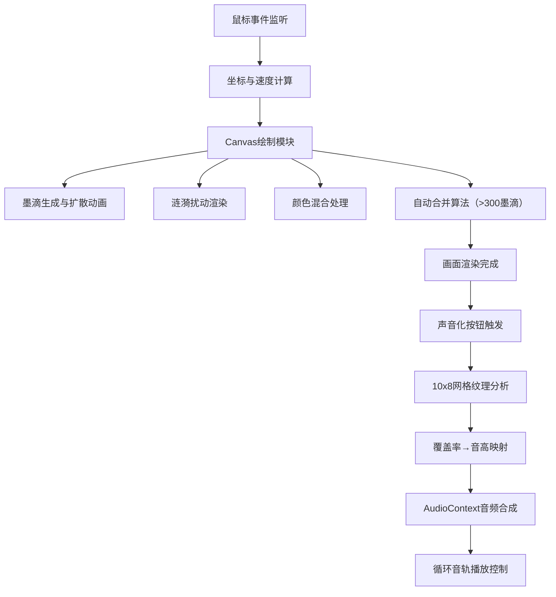

## 1. 产品概述
墨流音画是一款浏览器端的虚拟墨流画（Suminagashi）创作与纹理转音频交互应用，为数字艺术家和冥想爱好者提供视觉与听觉同步生成的沉浸式艺术体验。用户通过在水面画布上创作墨水扩散纹理，系统实时将纹理特征转化为微妙的环境音，实现墨、水、声三者的交融。

## 2. 核心功能

### 2.1 功能模块
1. **水面画布模块**：800x600px 动态水面画布，带正弦波动波纹效果，支持鼠标拖拽生成墨滴
2. **墨滴扩散系统**：墨滴接触水面后烟雾状缓慢扩散，扩散形态受鼠标移动速度影响（慢拖圆润，快拖丝状分支）
3. **调色盘模块**：六色调色盘（烟墨、群青、胭脂、藤黄、松绿、清除），支持颜色切换与加法混合
4. **涟漪扰动系统**：点击已扩散墨迹生成向外扩散的多层涟漪，推动墨迹产生位移
5. **声音化模块**：分析画布纹理（10x8 网格覆盖率），映射为音高生成循环环境音
6. **音频播放控制**：播放/停止按钮控制合成音频

### 2.2 页面详情
| 页面名称 | 模块名称 | 功能描述 |
|-----------|-------------|---------------------|
| 主页面 | 水面画布 | 800x600px 渐变背景，动态波纹，墨滴扩散渲染，涟漪动画 |
| 主页面 | 调色盘 | 右上角六色按钮，点击切换颜色，最后一个为清除按钮 |
| 主页面 | 声音化按钮 | 左下方圆角按钮，触发纹理分析与音频生成 |
| 主页面 | 播放/停止按钮 | 控制循环音频的播放与停止 |
| 主页面 | 涟漪系统 | 点击墨迹区域生成 6 层半透明白色圆环涟漪 |

## 3. 核心流程

### 3.1 主要用户流程
用户进入页面后，首先在水面画布上通过鼠标拖拽创作墨流画。拖拽过程中，墨滴根据移动速度呈现不同扩散形态，颜色间自然晕染。创作完成后，可点击墨迹区域产生涟漪扰动效果。最后点击"声音化"按钮，系统将画布纹理分析后生成4秒循环音频，用户通过播放/停止按钮欣赏视觉与听觉的同步艺术。

### 3.2 数据流程图

## 4. 用户界面设计

### 4.1 设计风格
- **主色调**：黑白灰为基调（冷白#f5f0eb、浅灰蓝#dbe4ee渐变背景）
- **点缀色**：烟墨#2a2a2a、群青#1e3a5f、胭脂#8b3a3a、藤黄#c9a94e、松绿#2f6f4a
- **按钮风格**：圆角矩形（border-radius: 10px），半透明毛玻璃效果（backdrop-filter: blur(6px)）
- **字体**：东方水墨感衬线字体搭配简洁无衬线字体
- **动效曲线**：墨滴扩散使用 easeOutQuad，涟漪扩散使用 easeOutElastic

### 4.2 页面设计概览
| 页面名称 | 模块名称 | UI元素 |
|-----------|-------------|-------------|
| 主页面 | 画布区域 | 800x600px 居中，冷白→浅灰蓝径向渐变背景，动态波纹层 |
| 主页面 | 调色盘 | 右上角 3x2 六色圆形色块，选中态带白色描边，毛玻璃容器 |
| 主页面 | 控制按钮 | 左下方垂直排列，圆角毛玻璃按钮，悬停上浮效果 |
| 主页面 | 墨迹效果 | 烟雾状边缘羽化，颜色加法混合，丝状分支与圆润扩散两种形态 |
| 主页面 | 涟漪效果 | 6层白色半透明圆环，半径0→80px，透明度0.6→0，1.2秒弹性缓动 |

### 4.3 响应式设计
- **桌面端**：画布居中 800x600px，控件分布于右上角与左下方
- **移动端**（≥768px）：单列布局，画布宽度 95%，控件堆叠排列于画布下方
- **触摸优化**：支持触屏拖拽与点击，增大可点击区域

## 5. 性能与质量要求
- **帧率目标**：全程 60fps 流畅运行
- **优化策略**：墨滴超过 300 个时自动合并距离 <8px 的相邻墨滴，颜色取平均值
- **兼容性**：支持现代浏览器（Chrome/Edge/Firefox/Safari 最新版）
- **动画流畅度**：所有过渡使用缓动函数，禁止跳帧
