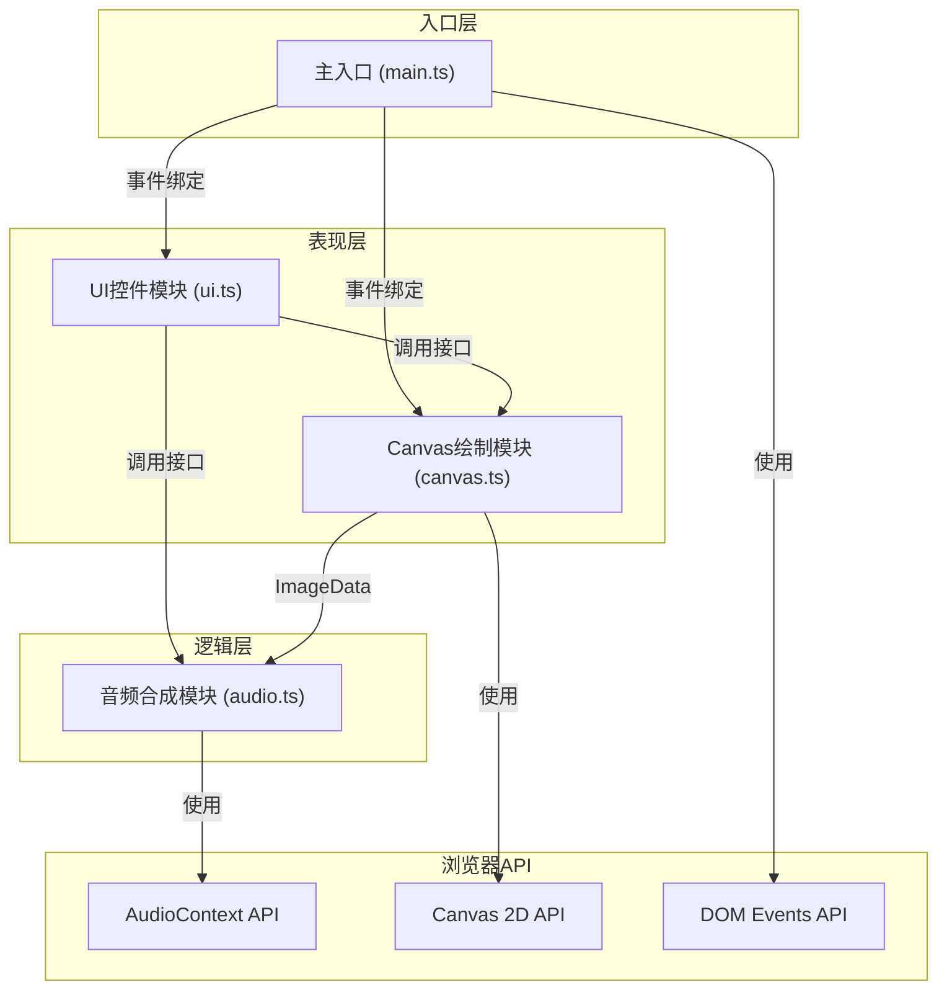

## 1. 架构设计



## 2. 技术选型
- **前端框架**：无框架（纯 TypeScript + DOM API）
- **构建工具**：Vite@5
- **语言**：TypeScript（严格模式，目标 ES2020，模块 ESNext）
- **音频**：Web Audio API（AudioContext 原生合成）
- **渲染**：HTML5 Canvas 2D API
- **样式**：内联 CSS（嵌入 index.html）

## 3. 文件结构
```
auto211/
├── package.json          # 依赖与脚本配置
├── vite.config.js        # Vite 构建配置
├── tsconfig.json         # TypeScript 配置
├── index.html            # 入口 HTML（含样式）
└── src/
    ├── main.ts           # 入口文件：初始化、事件绑定、数据流
    ├── canvas.ts         # Canvas模块：墨滴、扩散、涟漪、混合、合并
    ├── audio.ts          # 音频模块：纹理分析、音高映射、合成播放
    └── ui.ts             # UI模块：控件创建、事件处理
```

## 4. 模块接口定义

### 4.1 Canvas 模块 (canvas.ts)
```typescript
interface Drop {
  x: number;
  y: number;
  baseX: number;
  baseY: number;
  radius: number;
  targetRadius: number;
  color: { r: number; g: number; b: number };
  speed: number;
  alpha: number;
  branches: { dx: number; dy: number; len: number }[];
  createdAt: number;
}

interface Ripple {
  x: number;
  y: number;
  startTime: number;
  duration: number;
}

interface CanvasModule {
  init(canvas: HTMLCanvasElement): void;
  addDrop(x: number, y: number, color: string, speed: number): void;
  ripple(x: number, y: number): void;
  getImageData(): ImageData;
  clear(): void;
}
```

### 4.2 音频模块 (audio.ts)
```typescript
interface GridCell {
  coverage: number;
  pitch: number;
  volume: number;
  oscillator: OscillatorNode | null;
  gain: GainNode | null;
}

interface AudioModule {
  init(): void;
  analyzeAndPlay(imageData: ImageData): void;
  stop(): void;
  isPlaying(): boolean;
}
```

### 4.3 UI 模块 (ui.ts)
```typescript
interface UIModule {
  init(
    canvasAPI: CanvasModule,
    audioAPI: AudioModule,
    getCanvas: () => HTMLCanvasElement
  ): void;
  getCurrentColor(): string;
}
```

## 5. 核心算法

### 5.1 墨滴扩散算法
- **速度影响形态**：speed < 2 → 圆润扩散，easeOutQuad 缓动；speed ≥ 2 → 丝状分支，随机生成 3-6 个方向分支
- **扩散进度**：progress = easeOutQuad((now - createdAt) / duration)，radius = initialRadius + maxExpansion * progress
- **颜色混合**：使用 globalCompositeOperation = 'source-over' + 低 alpha 值叠加，模拟加法混合

### 5.2 自动合并算法
```
当 drops.length > 300：
  对所有墨滴按 x 坐标排序
  遍历相邻墨滴对：
    计算欧氏距离 dist = sqrt((x1-x2)² + (y1-y2)²)
    如果 dist < 8：
      合并为新墨滴：
        x = (x1*r1² + x2*r2²)/(r1² + r2²)  （面积加权）
        y = (y1*r1² + y2*r2²)/(r1² + r2²)
        color = 两色 RGB 平均值
        radius = sqrt(r1² + r2²)
      移除原两个墨滴，加入新墨滴
```

### 5.3 覆盖率→音高映射
| 覆盖率范围 | 音高 | 频率(Hz) |
|-----------|------|---------|
| 0-10% | C4 | 261 |
| 10-30% | E4 | 330 |
| 30-60% | G4 | 392 |
| 60%+ | B4 | 494 |

网格：10列 × 8行 = 80 个音轨，音量 = coverage / 100，每个音轨为正弦波振荡器。

### 5.4 涟漪扰动算法
```
涟漪进度 t = (now - startTime) / duration
easeOutElastic(t) 应用于半径与透明度
每层圆环半径 = maxRadius * progress * (1 + layerIndex * 0.15)
对每个墨滴：
  到涟漪中心距离 d = distance(drop, rippleCenter)
  如果 d < 当前涟漪半径 + 20 且 d > 当前涟漪半径 - 40：
    偏移方向 = 从涟漪中心指向墨滴
    偏移量 = (1 - |d - radius|/30) * maxOffset
    drop.x = baseX + offsetDir.x * offset
    drop.y = baseY + offsetDir.y * offset
```

## 6. 动画缓动函数
```typescript
function easeOutQuad(t: number): number {
  return 1 - (1 - t) * (1 - t);
}

function easeOutElastic(t: number): number {
  const c4 = (2 * Math.PI) / 3;
  return t === 0 ? 0 : t === 1 ? 1
    : Math.pow(2, -10 * t) * Math.sin((t * 10 - 0.75) * c4) + 1;
}
```
