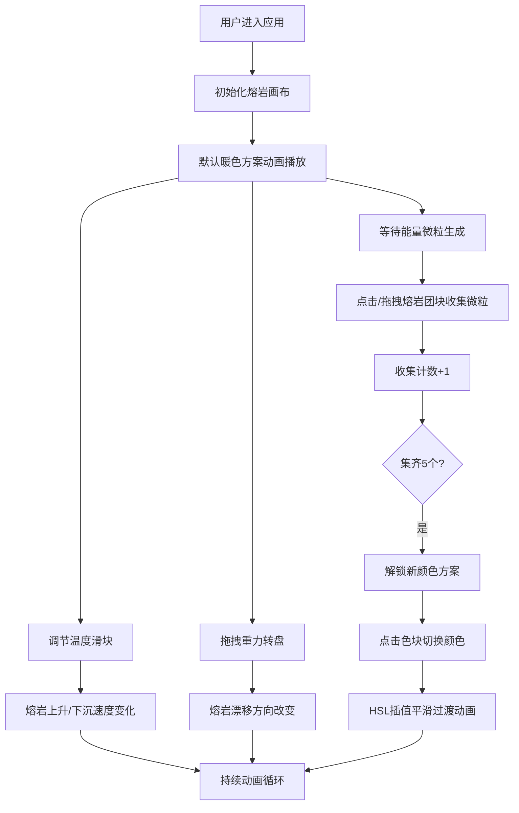

## 1. 产品概述

虚拟熔岩灯（Lava Lamp）形态模拟与交互变形游戏应用，让用户扮演熔岩灯设计师兼物理操纵者，通过点击、拖拽和键盘调节温度与重力方向，观察灯内蜡质熔岩团块在彩色液体中缓慢上升、分裂、融合、下沉的有机流体动画，并可在熔岩流动过程中收集随机浮现的"能量微粒"来解锁新的灯油颜色与蜡块纹理。

- **核心价值**：提供沉浸式的流体物理模拟体验，结合探索解锁机制，打造兼具视觉美感与交互乐趣的创意工具
- **目标用户**：设计爱好者、物理模拟爱好者、休闲游戏玩家

## 2. 核心功能

### 2.1 功能模块

1. **熔岩画布**：核心渲染区域，使用 Canvas 2D API 绘制 15-20 个半透明熔岩团块，实现 Perlin 噪声形变、分裂与合并逻辑
2. **控制面板**：温度滑块、重力方向转盘、颜色解锁区
3. **能量微粒系统**：随机生成六边形发光微粒，支持点击/拖拽收集
4. **颜色解锁机制**：每收集 5 个微粒解锁新颜色方案，共 4 种预设
5. **平滑过渡动画**：颜色切换、分裂合并、重力惯性过渡

### 2.2 页面详情

| 页面名称 | 模块名称 | 功能描述 |
|-----------|-------------|---------------------|
| 主页面 | 熔岩画布 | Canvas 2D 渲染熔岩团块，支持 Perlin 噪声形变、温度驱动的升降运动、分裂合并逻辑 |
| 主页面 | 控制面板 | 温度调节滑块（0-100%）、重力方向转盘（0-360°）、颜色预览区（3x2 色块） |
| 主页面 | 能量微粒系统 | 每 8-12 秒随机生成发光六边形微粒，支持碰撞吸收收集 |
| 主页面 | 颜色解锁系统 | 收集进度追踪，4 种颜色方案解锁，HSL 插值平滑过渡 |

## 3. 核心流程

### 3.1 主流程

用户进入应用 → 看到默认暖色熔岩灯动画 → 调节温度观察熔岩升降 → 调整重力方向改变熔岩流向 → 收集能量微粒 → 解锁新颜色方案 → 切换颜色体验不同视觉效果

### 3.2 流程图

## 4. 用户界面设计

### 4.1 设计风格

- **整体风格**：暗色调酒吧氛围，复古熔岩灯美学
- **主背景**：从深酒红（#2b0e1a）到墨蓝（#0d1b2a）的径向渐变
- **画布边框**：暖橙色（#c95a2b）2px 细边框，模拟金属灯罩质感
- **灯油背景**：半透明渐变（底部深橙 #e65c00 → 顶部浅黄 #ffb347，透明度 0.6）
- **熔岩配色**：中心暖黄（#ffcc33）→ 边缘半透明琥珀（#cc5500）的径向渐变

### 4.2 页面设计概述

| 页面名称 | 模块名称 | UI 元素 |
|-----------|-------------|-------------|
| 主页面 | 顶部控制面板 | 高度 80px，半透明磨砂玻璃效果（backdrop-filter: blur(8px)），温度滑块、重力转盘、颜色预览区横向排列 |
| 主页面 | 底部熔岩画布 | 900x600px 画布居中，暖橙色边框，内部液体渐变背景 + 波纹效果 |
| 主页面 | 交互控件 | 悬停放大（scale 1.05, 0.2s ease），点击内陷阴影反馈 |

### 4.3 响应式设计

- **桌面端（≥768px）**：上下结构，顶部控制面板横向排列
- **移动端（<768px）**：控制面板移至左侧垂直排列，控件尺寸缩小 75%
- **重力转盘移动端**：变为可点击切换 8 个预设方向

### 4.4 动画与动效

- **熔岩形变**：Perlin 噪声驱动，每帧 0.2-1.0px 顶点位移
- **分裂合并**：0.4s ease-out 平滑缩放动画
- **重力惯性**：松手后 1.2s ease-out 渐变回原位
- **颜色切换**：2 秒 HSL 插值平滑过渡
- **微粒吸收**：环形光晕扩散（0→60px，0.8→0 透明度，0.5s）
- **微光闪烁**：颜色切换时内部闪烁两次（0.2→0.6→0.2，每次 0.3s）
