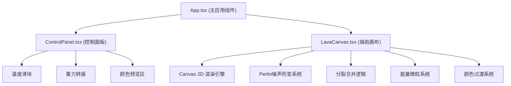

## 1. 架构设计



## 2. 技术描述

- **前端框架**：React 18 + TypeScript
- **构建工具**：Vite 5
- **动画库**：framer-motion
- **UI渲染**：Canvas 2D API
- **状态管理**：React useState/useRef（局部状态）
- **工具库**：uuid（唯一标识生成）

### 2.1 核心依赖

| 依赖包 | 版本 | 用途 |
|--------|------|------|
| react | ^18 | UI 框架 |
| react-dom | ^18 | DOM 渲染 |
| typescript | ^5 | 类型系统 |
| vite | ^5 | 构建工具 |
| @vitejs/plugin-react | ^4 | React 插件 |
| framer-motion | ^11 | 动画库 |
| uuid | ^9 | 唯一 ID 生成 |

## 3. 项目结构

```
.
├── package.json
├── vite.config.js
├── tsconfig.json
├── index.html
├── src/
│   ├── App.tsx              # 主应用组件
│   ├── components/
│   │   ├── LavaCanvas.tsx   # 核心画布组件
│   │   └── ControlPanel.tsx # 控制面板组件
│   ├── utils/
│   │   ├── perlinNoise.ts   # Perlin噪声算法
│   │   ├── colorUtils.ts    # 颜色工具函数
│   │   └── physics.ts       # 物理计算工具
│   └── types/
│       └── index.ts         # 类型定义
```

## 4. 核心数据模型

### 4.1 熔岩团块 (LavaBlob)

```typescript
interface LavaBlob {
  id: string;
  x: number;
  y: number;
  radius: number;
  targetRadius: number;
  vx: number;
  vy: number;
  noiseOffset: number;
  color: {
    center: string;
    edge: string;
  };
  scaleAnimation: {
    active: boolean;
    startTime: number;
    startScale: number;
    endScale: number;
  };
}
```

### 4.2 能量微粒 (EnergyParticle)

```typescript
interface EnergyParticle {
  id: string;
  x: number;
  y: number;
  vx: number;
  vy: number;
  color: string;
  size: number;
  lifeTime: number;
  createdAt: number;
}
```

### 4.3 颜色方案 (ColorScheme)

```typescript
interface ColorScheme {
  id: string;
  name: string;
  unlocked: boolean;
  background: {
    bottom: string;
    top: string;
  };
  lava: {
    center: string;
    edge: string;
  };
  glow: string;
}
```

### 4.4 全局状态

```typescript
interface AppState {
  temperature: number;     // 0-100
  gravityAngle: number;    // 0-360度
  gravityStrength: number; // 重力强度
  currentColorScheme: string;
  colorSchemes: ColorScheme[];
  particleCount: number;
  collectedParticles: number;
}
```

## 5. 性能优化策略

### 5.1 Canvas 渲染优化

- 使用 `requestAnimationFrame` 驱动动画循环
- 离屏 canvas 预渲染渐变和静态元素
- 限制团块数量上限为 20 个
- 每个团块使用缓存的径向渐变

### 5.2 物理计算优化

- 空间分区检测碰撞（网格法）
- 合并检测只在相近团块间进行
- Perlin 噪声使用查找表优化

### 5.3 内存管理

- 对象池复用团块和微粒对象
- 及时清理已消失的微粒和动画
- 避免频繁创建新对象

## 6. 响应式实现

- 使用 CSS Media Queries 适配不同屏幕
- 移动端重力转盘改为 8 方向点击切换
- Canvas 尺寸根据容器自适应缩放
- 触控设备优化拖拽交互
