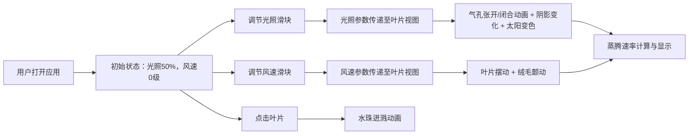

## 1. 产品概述

虚拟植物蒸腾观测箱是一个面向自然教育场景的交互式 Web 应用，帮助学生直观理解植物叶片蒸腾作用与环境因子（光照、风速）之间的动态关系。

- 核心目标：通过可视化交互，让学习者掌握植物蒸腾速率与温湿度反馈机制
- 目标用户：自然教育者、学生群体
- 产品价值：将抽象的植物生理过程转化为可操作、可观察的动态演示

## 2. 核心功能

### 2.1 用户角色
| 角色 | 权限 |
|------|------|
| 学习者 | 调节参数、观察动画、查看实时数据 |
| 教育者 | 演示教学、引导学生观察 |

### 2.2 功能模块
1. **观测箱主界面**：透明观测箱可视化，包含木质支架、渐变背景、中央叶片
2. **光照控制模块**：光照强度滑块（0-100%），太阳图标渐变，叶片阴影变化
3. **风速控制模块**：风速滑块（0-10级），叶片摆动动画，绒毛颤动效果
4. **交互反馈模块**：点击叶片触发水珠迸溅动画，模拟气孔剧烈蒸腾
5. **数据显示模块**：实时蒸腾速率数值（mmol/m²/s），动态变色动画

### 2.3 页面详情
| 页面名称 | 模块名称 | 功能描述 |
|-----------|-------------|---------------------|
| 主观测页面 | 观测箱视图 | 中央叶片 Canvas 绘制，叶脉纹理清晰，气孔动态开合 |
| 主观测页面 | 光照控制面板 | 左下方滑块，调节光照强度 0-100%，太阳图标颜色渐变 |
| 主观测页面 | 风速控制面板 | 右下方滑块，调节风速 0-10级，叶片摆动效果 |
| 主观测页面 | 数据显示区 | 右上角实时蒸腾速率，数值动态变色反馈 |
| 主观测页面 | 交互响应区 | 点击叶片触发水珠迸溅动画 |

## 3. 核心流程

**用户操作流程说明：**
1. 用户进入应用，看到中央叶片和两个控制滑块
2. 拖动光照滑块，观察气孔开合、阴影变化和太阳颜色渐变
3. 拖动风速滑块，观察叶片摆动幅度和频率变化
4. 点击叶片任意位置，触发水珠迸溅特效
5. 右上角蒸腾速率数值随参数变化实时更新，并伴随变色动画

## 4. 用户界面设计

### 4.1 设计风格
- **主色调**：亚麻白 (#f5f0e8)、叶绿 (#6a9c6a)
- **辅助色**：木质棕 (#8b735b)、琥珀色 (#ffb347)、天蓝色 (#87ceeb)
- **背景渐变**：浅亚麻色 (#f5f0e8) → 柔灰绿 (#d1d9c0)
- **字体**：Google Fonts - Lora（标题）+ Open Sans（正文）
- **布局风格**：卡片式观测箱居中，控制滑块分布在底部两侧
- **动效原则**：所有动画缓出效果，交互响应 < 100ms

### 4.2 页面设计概述
| 页面名称 | 模块名称 | UI 元素 |
|-----------|-------------|-------------|
| 主观测页面 | 观测箱容器 | 细黑线边框（0.5px），四角木质支架，内部渐变背景 |
| 主观测页面 | 中央叶片 | Canvas 绘制，径向渐变立体感，叶脉 #5a8c5a，侧脉间距 8px |
| 主观测页面 | 光照滑块 | 左下方，半透明琥珀色拖柄，范围 0-100% |
| 主观测页面 | 风速滑块 | 右下方，半透明天蓝拖柄，范围 0-10级 |
| 主观测页面 | 太阳图标 | 顶部，颜色从浅黄 (#ffe066) 渐变到亮白 (#ffffcc) |
| 主观测页面 | 数据显示 | 右上角，蒸腾速率数值，动态变色从 #2d5a27 到 #a63a3a |

### 4.3 响应式设计
- **桌面端优先**：观测箱固定宽度 800px，高度 600px
- **移动端适配**：观测箱等比缩放，滑块移至底部纵向排列
- **触控优化**：滑块拖柄增大触摸区域，最小 44x44px

### 4.4 动画与交互规范
| 动画元素 | 参数规格 |
|---------|---------|
| 气孔开合 | 椭圆短轴 2px→6px，时长 0.5s，easeOut |
| 叶片摆动 | 振幅 2-10px，频率 0.5-2Hz，easeInOut |
| 水珠迸溅 | 6-8 个蓝色圆点，直径 4-8px，时长 0.8s |
| 数值变色 | #2d5a27 → #a63a3a → #2d5a27，时长 0.3s |
| 水珠蒸发 | 缩放 1.0→1.3→0.5，透明度渐变至 0 |
| 绒毛颤动 | 虚线线段，风速增大时颤动频率增加 |

## 5. 性能要求
- Canvas 重绘帧率稳定 ≥ 55FPS
- 使用 requestAnimationFrame，禁止 setInterval
- 交互响应时间 < 100ms
- 无明显卡顿或闪烁
