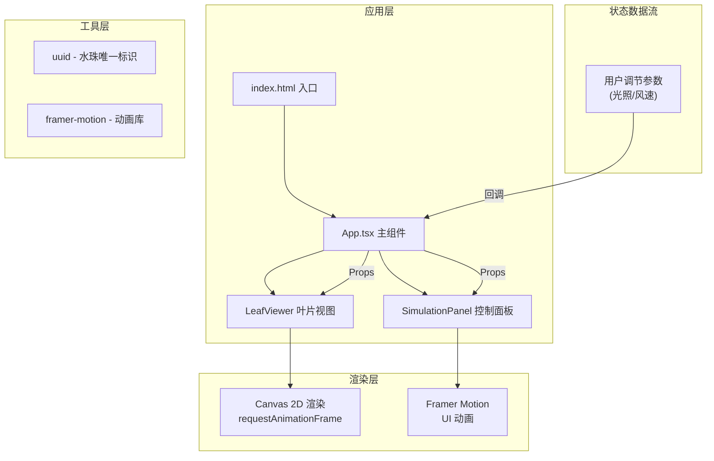

## 1. 架构设计



**数据流说明：**
1. `App.tsx` 作为单一数据源，管理全局状态（光照强度、风速）
2. `SimulationPanel` 通过回调函数向 `App.tsx` 输出用户调节值
3. `App.tsx` 将最新参数通过 Props 传递给 `LeafViewer`
4. `LeafViewer` 接收参数后，在 requestAnimationFrame 循环中每帧更新 Canvas 绘制

## 2. 技术描述

### 2.1 前端技术栈
| 技术 | 版本 | 用途 |
|------|------|------|
| React | 18.x | 组件化 UI 框架 |
| React DOM | 18.x | DOM 渲染 |
| TypeScript | 5.x | 类型安全 |
| Vite | 5.x | 构建工具与开发服务器 |
| @vitejs/plugin-react | 4.x | React 支持 |
| framer-motion | 11.x | UI 组件动画 |
| uuid | 9.x | 生成水珠唯一标识符 |

### 2.2 初始化工具
- 使用 `vite-init` 脚手架初始化项目
- 模板选择：`react-ts`

### 2.3 构建配置
- **vite.config.js**：启用 React 插件，`base: './'`
- **tsconfig.json**：严格模式，`target: ES2020`，`moduleResolution: bundler`

## 3. 项目文件结构

```
├── index.html              # 入口 HTML，包含根 div 和 Google Fonts
├── package.json            # 依赖配置与启动脚本
├── vite.config.js          # Vite 构建配置
├── tsconfig.json           # TypeScript 配置
└── src/
    ├── App.tsx             # 主布局组件，状态管理
    ├── main.tsx            # React 入口
    ├── index.css           # 全局样式
    └── components/
        ├── SimulationPanel.tsx   # 控制面板（滑块、太阳图标）
        └── LeafViewer.tsx        # 叶片可视化（Canvas 动画）
```

**文件调用关系：**
1. `index.html` → 加载 `main.tsx`
2. `main.tsx` → 渲染 `<App />`
3. `App.tsx` → 渲染 `<SimulationPanel />` 和 `<LeafViewer />`
4. `SimulationPanel.tsx` → 通过 `onLightChange`/`onWindChange` 回调传递参数给 `App.tsx`
5. `LeafViewer.tsx` → 从 `App.tsx` 接收 `lightIntensity`/`windSpeed` props

## 4. 数据模型

### 4.1 核心类型定义

```typescript
// 应用状态类型
interface AppState {
  lightIntensity: number;    // 光照强度 0-100
  windSpeed: number;         // 风速等级 0-10
}

// 水珠粒子类型
interface WaterDroplet {
  id: string;                // uuid
  x: number;                 // 初始 x 坐标
  y: number;                 // 初始 y 坐标
  vx: number;                // x 方向速度
  vy: number;                // y 方向速度
  size: number;              // 初始直径 4-8px
  opacity: number;           // 透明度 0-1
  scale: number;             // 缩放比例
  life: number;              // 生命值 0-1
  createdAt: number;         // 创建时间戳
}

// 气孔类型
interface Stoma {
  x: number;                 // x 坐标
  y: number;                 // y 坐标
  baseRadius: number;        // 基础半径 3-8px
  openness: number;          // 开合度 0-1（控制短轴长度）
}

// 叶片绒毛类型
interface LeafHair {
  x: number;                 // 起点 x
  y: number;                 // 起点 y
  angle: number;             // 角度
  length: number;            // 长度
  trembleOffset: number;     // 颤动偏移量
}
```

### 4.2 蒸腾速率计算公式

```typescript
// 光照贡献：线性映射 50-200
const lightContribution = 50 + (lightIntensity / 100) * 150;

// 风速贡献：二次曲线，5级时达到峰值 100-350
// 公式: -10 * (windSpeed - 5)² + 350，限制在 100-350
const windFactor = Math.max(100, Math.min(350, -10 * Math.pow(windSpeed - 5, 2) + 350));

// 综合蒸腾速率
const transpirationRate = (lightContribution + windFactor) / 2;
```

## 5. 动画实现方案

### 5.1 Canvas 动画循环（LeafViewer）
- 使用 `requestAnimationFrame` 实现 60FPS 渲染循环
- 每帧执行：
  1. 计算当前时间戳与上一帧的 delta time
  2. 更新叶片摆动位置（基于风速的正弦函数）
  3. 更新气孔开合度（目标值基于光照强度，缓动过渡）
  4. 更新水珠粒子位置、缩放、透明度
  5. 更新绒毛颤动偏移
  6. 清空 Canvas 并重绘所有元素

### 5.2 UI 动画（SimulationPanel）
- 使用 `framer-motion` 的 `motion.div` 实现：
  - 太阳图标颜色渐变动画
  - 滑块拖柄样式变化
  - 蒸腾速率数值变色动画

### 5.3 性能优化策略
- Canvas 元素使用离屏缓存（必要时）
- 动画参数计算使用 delta time 确保帧率独立
- 避免在渲染循环中创建新对象，复用粒子池
- 使用 `will-change` CSS 属性优化重绘

## 6. 接口定义（组件 Props）

### 6.1 SimulationPanel Props
```typescript
interface SimulationPanelProps {
  lightIntensity: number;
  windSpeed: number;
  onLightChange: (value: number) => void;
  onWindChange: (value: number) => void;
  temperature: number;
}
```

### 6.2 LeafViewer Props
```typescript
interface LeafViewerProps {
  lightIntensity: number;
  windSpeed: number;
  onLeafClick?: (x: number, y: number) => void;
}
```

## 7. 路由定义

| 路由 | 组件 | 用途 |
|-------|------|------|
| `/` | App.tsx | 主观测页面 |

*注：本项目为单页面应用，无需复杂路由配置。*
