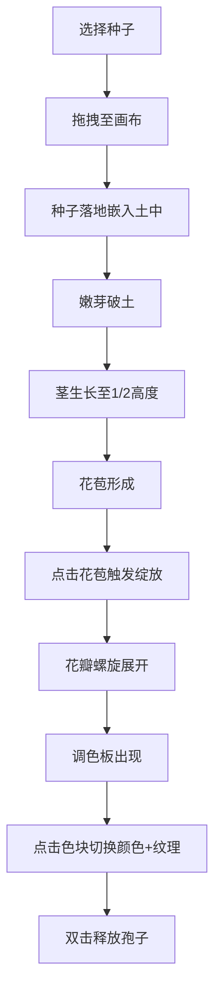

## 1. 产品概述

魔法种子生长与花瓣纹理生成器——一款面向儿童的交互式数字花卉培育应用，让孩子通过拖拽种子、点击花苞、选择配色等直觉操作，观察花朵从破土到绽放的完整生命旅程，并在绽放后自由绘制花瓣纹理。

## 2. 核心功能

### 2.1 用户角色

| 角色 | 注册方式 | 核心权限 |
|------|----------|----------|
| 儿童/访客 | 无需注册 | 自由使用所有交互功能 |

### 2.2 功能模块

1. **主画布页面**: 种子盘、泥土画布、花朵生长动画、调色板、历史记录

### 2.3 页面详情

| 页面名称 | 模块名称 | 功能描述 |
|----------|----------|----------|
| 主画布页面 | 种子盘 | 6种魔法种子展示，脉动光晕，悬停放大与名称提示，拖拽到画布 |
| 主画布页面 | 泥土画布 | 900×600px画布，褐色渐变背景+土壤颗粒，种子落地、嫩芽生长、花苞形成动画 |
| 主画布页面 | 花朵绽放 | 点击花苞触发螺旋展开动画，5-8瓣花瓣旋转绽放，花粉粒生成 |
| 主画布页面 | 调色板 | 6色圆形色块排列成花瓣环，点击切换花瓣颜色并生成纹理 |
| 主画布页面 | 孢子释放 | 双击花朵释放彩色粒子，底部显示文字反馈 |
| 主画布页面 | 历史记录 | 右侧滑入侧边栏，展示最近8次生长记录 |
| 主画布页面 | 界面装饰 | 浅木框边框、木纹纹理、羊皮纸渐变背景 |

## 3. 核心流程

用户从左侧种子盘选择一颗魔法种子 → 拖拽至中央泥土画布释放 → 种子落地并嵌入土中 → 翠绿嫩芽破土而出 → 茎长至画布一半高度 → 花苞形成 → 点击花苞触发绽放动画 → 花瓣螺旋展开 → 右侧调色板出现 → 点击色块切换花瓣颜色并生成纹理 → 双击花朵释放魔法孢子

## 4. 界面设计

### 4.1 设计风格

- **主色调**: 浅米色(#f5e6d0)到淡紫色(#f0e0f0)渐变，童话绘本风
- **辅助色**: 实木色(#8b5e3c)木框装饰，褐色(#5a3e1b)泥土
- **按钮风格**: 圆形种子按钮，悬停放大1.2倍+柔和阴影
- **字体**: 手写风格字体(Caveat/Dancing Script)用于反馈文字，衬线体用于历史记录
- **布局**: 中央画布+左侧种子盘+右侧调色板
- **动效风格**: 所有动画采用缓出(ease-out)曲线，过渡平滑

### 4.2 页面设计概览

| 页面名称 | 模块名称 | UI元素 |
|----------|----------|--------|
| 主画布页面 | 种子盘 | 2行3列圆形种子，脉动光晕，悬停放大 |
| 主画布页面 | 泥土画布 | 900×600px，褐色渐变+土壤颗粒，实木色木框边框 |
| 主画布页面 | 调色板 | 6色块圆形排列(半径60px)，弧线连接成花瓣环 |
| 主画布页面 | 历史记录 | 圆形按钮+侧边栏(宽250px)，右侧滑入 |
| 主画布页面 | 文字反馈 | 画布底部中央，手写风格，浮入淡出 |

### 4.3 响应式

桌面端优先设计，固定900×600px画布尺寸，不支持移动端自适应

### 4.4 3D场景指导

不适用
