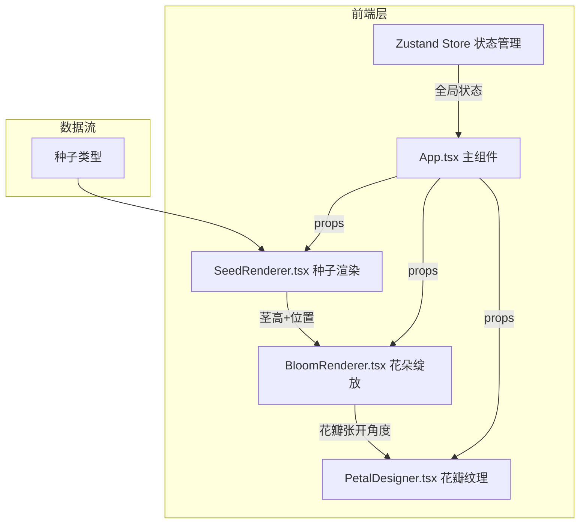
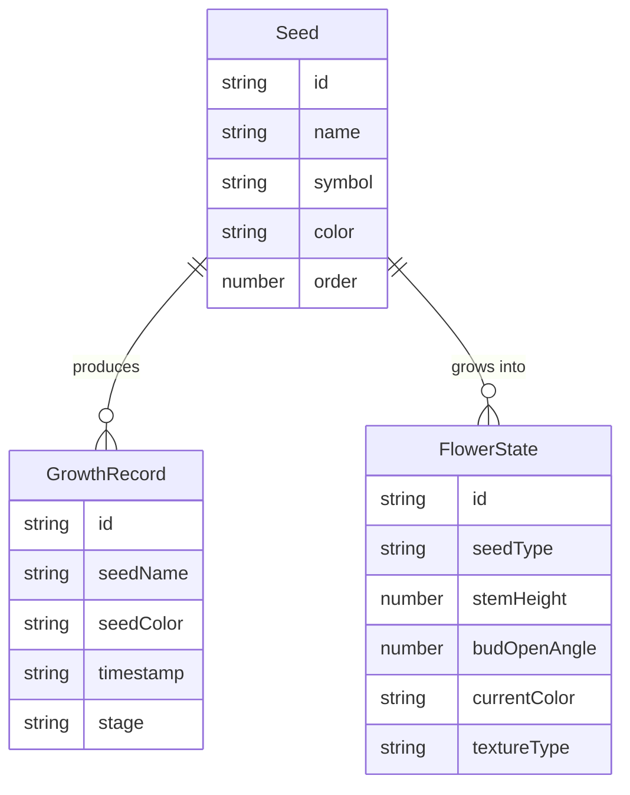

## 1. 架构设计



## 2. 技术说明

- **前端**: React@18 + TypeScript + Vite@5 + framer-motion
- **初始化工具**: vite-init (react-ts模板)
- **后端**: 无
- **数据库**: 无
- **状态管理**: Zustand
- **动画库**: framer-motion (DOM动画) + Canvas2D requestAnimationFrame (画布动画)
- **唯一标识**: uuid

## 3. 路由定义

| 路由 | 用途 |
|------|------|
| / | 主画布页面，包含所有交互功能 |

## 4. API定义

无后端API

## 5. 服务器架构图

不适用

## 6. 数据模型

### 6.1 数据模型定义



### 6.2 数据定义

**Seed种子类型定义（6种）：**
| 编号 | 名称 | 象征 | 颜色 |
|------|------|------|------|
| 1 | 月光百合 | 纯洁 | #6a0dad |
| 2 | 星火蔷薇 | 热情 | #8b2fc9 |
| 3 | 晨露牡丹 | 优雅 | #b060e0 |
| 4 | 霜降兰 | 坚韧 | #d4a017 |
| 5 | 暮光菊 | 温暖 | #e8c020 |
| 6 | 日升莲 | 希望 | #ffd700 |

**调色板6色：** #c77dff、#ff9a9e、#a1c4fd、#ffd6a5、#90e0ef、#ff8c42

**纹理类型：** 条纹(2-4条细线)、波点(6-10个圆形)、晕染(径向渐变)

### 6.3 文件结构与调用关系

```
项目根目录/
├── package.json          # 依赖管理
├── vite.config.js        # 构建配置
├── tsconfig.json         # TypeScript配置
├── index.html            # 入口HTML
└── src/
    ├── main.tsx          # React入口 → 挂载App
    ├── App.tsx           # 主组件 → 管理状态，分发props
    ├── store.ts          # Zustand Store → 全局状态
    ├── types.ts          # TypeScript类型定义
    ├── SeedRenderer.tsx  # 种子渲染 → 接收种子类型，触发生长
    ├── BloomRenderer.tsx # 花朵绽放 → 接收茎参数，渲染花瓣
    ├── PetalDesigner.tsx # 花瓣纹理 → 接收花瓣角度，绘制纹理
    ├── Canvas2D.ts       # Canvas绘制工具函数
    └── constants.ts      # 种子数据、颜色常量
```

**数据流向：**
1. App.tsx读取种子类型 → 传递给SeedRenderer渲染种子动画
2. SeedRenderer完成种子落地 → 向BloomRenderer传递茎高和位置
3. BloomRenderer完成绽放 → 将张开角度传给PetalDesigner
4. PetalDesigner接收角度 → 在Canvas上绘制纹理 → 输出最终花瓣图像
5. Zustand Store管理全局状态（当前种子、生长阶段、历史记录）
