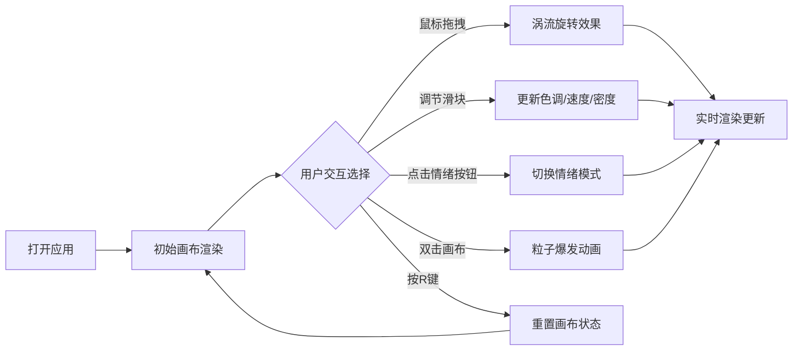

## 1. 产品概述

虚拟情绪色彩风暴生成器是一款面向数字艺术家和创意爱好者的交互式视觉艺术工具，通过用户心跳（模拟）或鼠标移动节奏，控制画布中彩色粒子的旋转、扩散与融合，生成动态的抽象情绪色彩风暴视觉效果。

- **核心价值**：将用户情绪与动作转化为可感知的视觉艺术，提供沉浸式的创意表达体验
- **目标用户**：数字艺术家、设计师、视觉爱好者、普通用户
- **市场定位**：轻量级在线创意生成工具，适合社交媒体分享、艺术创作灵感获取

## 2. 核心功能

### 2.1 用户角色

| 角色 | 注册方式 | 核心权限 |
|------|----------|----------|
| 访客用户 | 无需注册 | 使用全部交互功能，调节参数，生成视觉效果 |

### 2.2 功能模块

1. **主页（画布页）**：全屏色彩风暴画布、浮动控制面板、底部状态栏

### 2.3 页面详情

| 页面名称 | 模块名称 | 功能描述 |
|-----------|-------------|---------------------|
| 主页 | 色彩风暴画布 | 灰白色渐变背景，300+彩色粒子随机散布，支持鼠标拖拽涡流旋转、双击爆发、键盘重置 |
| 主页 | 控制面板 | 色调/速度/密度三滑块调节，四种情绪节奏模式切换，响应式折叠设计 |
| 主页 | 底部状态栏 | 实时显示粒子总数、主色调名称、当前情绪模式 |

## 3. 核心流程

### 3.1 主要用户流程

用户打开应用 → 初始画布展示300个彩色粒子随机浮动 → 用户通过鼠标拖拽产生涡流旋转效果 → 用户通过控制面板调节色调/速度/密度 → 用户选择情绪模式切换视觉风格 → 用户双击画布触发粒子爆发 → 用户按R键重置画布状态

## 4. 用户界面设计

### 4.1 设计风格

- **主色调**：灰白基底（#ece7e1 → #d8dbe8 渐变）
- **粒子色板**：#ff6b6b（红）、#ffd93d（黄）、#6bcb77（绿）、#4d96ff（蓝）、#9b59b6（紫）
- **整体风格**：极简主义、柔和发光、高对比色彩点缀、细腻过渡动画
- **按钮样式**：圆角矩形，选中时填充对应情绪色，未选中半透明白，悬停微放大+阴影，点击微缩小
- **滑块样式**：自定义轨道+滑块，0.3秒cubic-bezier过渡动画
- **字体**：极细sans-serif（font-weight: 100），亚麻色系字体

### 4.2 页面设计概述

| 页面名称 | 模块名称 | UI元素 |
|-----------|-------------|----------|
| 主页 | 画布区域 | 全屏视口、灰白渐变背景、彩色粒子（模糊阴影发光效果）、涡流轨迹 |
| 主页 | 控制面板 | 半透明白底圆角容器（rgba(255,255,255,0.7)，16px圆角，16px内边距）、三个滑块、四个情绪按钮、性能指示灯 |
| 主页 | 状态栏 | 底部中央三行文字、极细字体、#3a3a3a颜色、轻微文字阴影 |
| 主页 | 响应式图标 | <600px时控制面板收缩为48px渐变圆形图标，点击展开 |

### 4.3 响应性

- **设计策略**：桌面优先，移动端自适应
- **断点设计**：600px宽度触发控制面板折叠
- **触控优化**：支持触屏拖拽、双击、双指缩放预留
- **最小支持**：320px宽度

### 4.4 性能约束

- 帧率保持45FPS以上
- 粒子数>500时自动启用性能优化模式（blur: 1px，透明度: 0.6）
- 控制面板绿色指示灯（8px圆点）表示高性能，黄色表示性能下降
