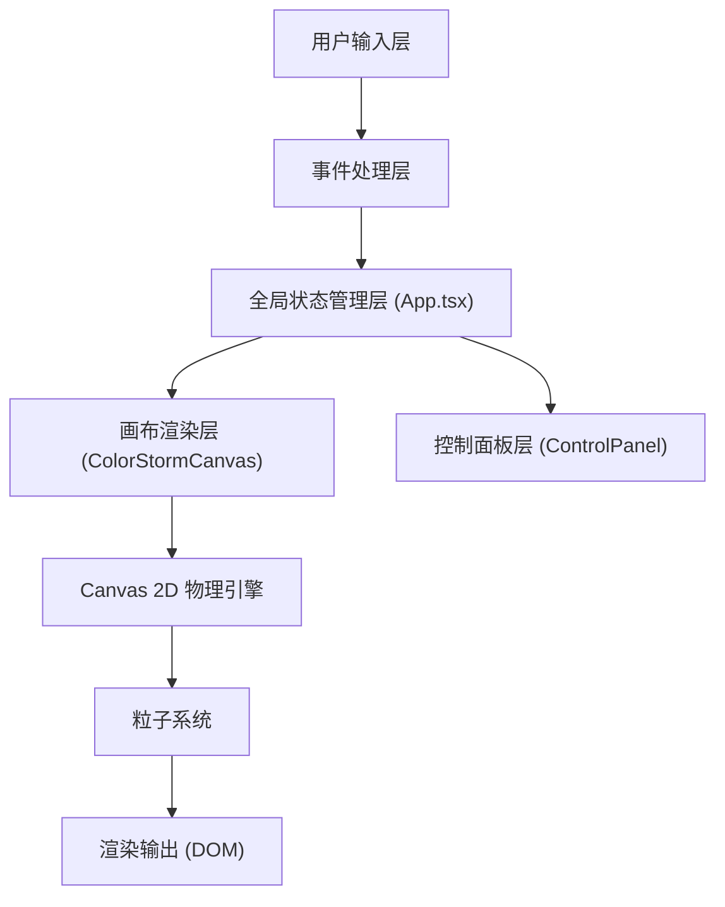

## 1. 架构设计



**数据流向说明**：
- `src/main.tsx` → `src/App.tsx`：根组件注入
- `App.tsx` → `ColorStormCanvas.tsx`：传递配置参数（hue、speed、density、mood）、用户交互事件（鼠标位置、双击事件）
- `App.tsx` → `ControlPanel.tsx`：传递当前参数值、情绪模式状态
- `ControlPanel.tsx` → `App.tsx`：通过回调函数传递用户调节的参数变更
- `ColorStormCanvas.tsx` → `App.tsx`：通过回调返回性能状态、粒子统计数据

## 2. 技术描述

- **前端框架**：React@18 + TypeScript + Vite@5
- **状态管理**：React useState/useCallback（组件内局部状态）
- **动画库**：framer-motion（UI组件动画）、gsap（复杂粒子动画控制）
- **工具库**：uuid（粒子唯一ID生成）
- **渲染技术**：Canvas 2D API（高性能粒子渲染）
- **初始化工具**：vite-init react-ts 模板

## 3. 文件结构定义

| 文件路径 | 职责说明 | 调用关系 |
|---------|---------|---------|
| `package.json` | 项目依赖与脚本配置 | 依赖：react、react-dom、typescript、vite@5、@vitejs/plugin-react、framer-motion、uuid、gsap |
| `vite.config.js` | Vite构建配置，启用React插件，base: './' | 被构建系统调用 |
| `tsconfig.json` | TypeScript严格模式配置，ESNext模块，jsx: react-jsx | 被编译器调用 |
| `index.html` | HTML入口，root div，亚麻字体引入 | 浏览器加载入口 |
| `src/main.tsx` | ReactDOM渲染入口，导入App组件 | 渲染 `App.tsx` 到 `#root` |
| `src/App.tsx` | 应用主组件，全局状态管理，画布容器 | 渲染 `ColorStormCanvas` + `ControlPanel`，管理hue/speed/density/mood状态 |
| `src/components/ColorStormCanvas.tsx` | 核心画布组件，Canvas 2D粒子物理模拟 | 从App接收配置，每帧执行粒子更新+绘制 |
| `src/components/ControlPanel.tsx` | 控制面板组件，滑块+情绪按钮 | 从App接收当前值，通过回调向App传递变更 |
| `src/types/index.ts` | 全局TypeScript类型定义 | 被所有组件引用 |
| `src/utils/colors.ts` | 颜色工具函数（色相→颜色名映射） | 被App和Canvas调用 |
| `src/hooks/useParticleSystem.ts` | 粒子系统逻辑Hook（可选提取） | 被ColorStormCanvas调用 |
| `src/index.css` | 全局样式定义 | 被main.tsx引入 |

## 4. 核心类型定义

```typescript
// 粒子数据结构
interface Particle {
  id: string;
  x: number;
  y: number;
  baseX: number;  // 爆发恢复基准位置
  baseY: number;
  vx: number;     // x方向速度
  vy: number;     // y方向速度
  radius: number; // 直径 4-12px
  color: string;  // 原始颜色
  baseColor: string;
  hue: number;    // 色相偏移
  opacity: number;
  blur: number;   // 模糊阴影
  angle: number;  // 当前角度（用于涡流旋转）
  angularSpeed: number;
}

// 情绪模式
type MoodMode = 'calm' | 'excited' | 'melancholy' | 'joyful' | null;

// 画布配置
interface CanvasConfig {
  hueOffset: number;      // 0-360
  speedMultiplier: number; // 0.1-5.0
  particleCount: number;   // 100-800
  mood: MoodMode;
}

// 鼠标状态
interface MouseState {
  x: number;
  y: number;
  isDragging: boolean;
  moveSpeed: number;  // 像素/帧
}

// 性能状态
type PerformanceLevel = 'high' | 'reduced';
```

## 5. 性能优化策略

### 5.1 Canvas渲染优化
- 使用 `requestAnimationFrame` 控制帧率
- 离屏Canvas缓冲（必要时）
- 粒子数>500时降低阴影质量（blur: 2→1px，opacity: 0.7→0.6）

### 5.2 内存管理
- 粒子对象池复用，避免频繁GC
- 事件监听器及时清理（useEffect cleanup）

### 5.3 重绘优化
- 仅重绘变化区域（全屏画布暂不作局部优化）
- 粒子位置计算使用增量更新而非全量重建

## 6. 响应式适配

| 断点 | 行为 |
|-----|------|
| ≥ 601px | 控制面板完整展开，固定右上角 |
| ≤ 600px | 控制面板收缩为48px圆形渐变图标，点击弹出完整面板 |
| ≤ 320px | 文字字号自适应缩小，确保不溢出 |
