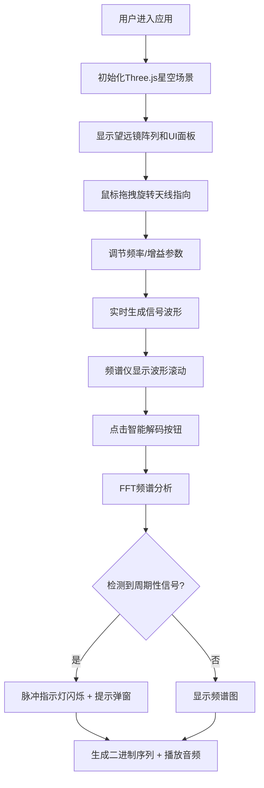

## 1. 产品概述

虚拟宇宙射电望远镜阵列是一个面向天文爱好者和科普教育者的交互式可视化Web应用，让用户能够像专业射电天文学家一样，通过调节虚拟射电望远镜的指向、频率和增益参数，捕获来自深空的射电信号，实时观察信号波形，并尝试解码隐藏的周期性脉冲或疑似智慧信号。

- **目标用户**：天文爱好者、科普教育工作者、学生
- **核心价值**：沉浸式体验射电天文学研究过程，将抽象的射电天文学概念可视化、互动化
- **产品定位**：科普教育工具 + 沉浸式互动体验

## 2. 核心功能

### 2.1 用户角色

| 角色 | 注册方式 | 核心权限 |
|------|----------|----------|
| 访客用户 | 无需注册，直接访问 | 使用全部互动功能，调节望远镜参数，观察信号波形 |

### 2.2 功能模块

1. **深空星空场景**：2000颗恒星背景、银河光晕旋转、全屏渐变背景
2. **射电望远镜阵列**：5个银色抛物面天线组成的半圆弧阵列，可拖拽旋转指向
3. **频谱仪面板**：实时波形显示、脉冲检测指示灯、频率增益调节
4. **信号解码面板**：FFT频谱图、智能解码按钮、摩斯电码二进制序列展示、音频播放
5. **状态监控面板**：信号强度指示条、信噪比读数、雷达扫描动画
6. **交互控制系统**：鼠标拖拽旋转天线、旋钮调节频率、滑块调节增益

### 2.3 页面详情

| 页面名称 | 模块名称 | 功能描述 |
|----------|----------|----------|
| 主界面 | 星空背景 | 2000颗恒星随机分布，银河光晕缓慢旋转，深空渐变背景 |
| 主界面 | 望远镜阵列 | 5个SVG抛物面天线半圆弧排列，随鼠标拖拽旋转指向 |
| 主界面 | 频谱仪 | 右侧面板，实时波形滚动显示，脉冲检测指示灯，2秒时间窗口 |
| 主界面 | 信号解码 | 频谱仪下方，FFT频谱图，智能解码按钮，二进制序列展示 |
| 主界面 | 状态面板 | 左上角，信号强度条、SNR读数、雷达扫描动画 |
| 主界面 | 控制组件 | 左下角频率旋钮、增益滑块，鼠标交互调节 |

## 3. 核心流程

用户打开应用 → 看到深空星空背景和射电望远镜阵列 → 鼠标拖拽星空旋转天线指向 → 调节频率旋钮和增益滑块 → 观察频谱仪上的实时波形变化 → 点击智能解码按钮分析信号 → 查看解码结果和播放音频 → 发现脉冲星信号时弹出提示

## 4. 用户界面设计

### 4.1 设计风格

- **设计主题**：深空科技感 / 赛博朋克天文台风格
- **主色调**：深空黑 #050510、星云紫 #1a0a2e、科技绿 #22c55e、警示红 #ef4444
- **字体**：等宽字体（monospace），营造仪器设备感
- **视觉效果**：毛玻璃半透明面板、微光霓虹边框、雷达扫描动画、信号波形实时滚动
- **按钮风格**：圆角矩形，悬停放大1.05倍，点击下沉回弹

### 4.2 页面设计概览

| 页面名称 | 模块名称 | UI元素 |
|----------|----------|--------|
| 主界面 | 星空背景 | 2000颗粒子恒星、径向渐变银河光晕、全屏深紫渐变 |
| 主界面 | 望远镜阵列 | 5个SVG抛物面天线、半圆弧排列、绿色光束连接线 |
| 主界面 | 频谱仪面板 | 300×400px、深灰背景、绿色边框、波形Canvas、脉冲指示灯 |
| 主界面 | 信号解码面板 | 300×150px、频谱图、蓝色解码按钮、二进制点阵 |
| 主界面 | 状态面板 | 180×100px、毛玻璃效果、信号强度条、SNR读数、雷达动画 |
| 主界面 | 控制组件 | 圆形频率旋钮（50px）、垂直增益滑块（120px） |

### 4.3 响应式设计

- **设计策略**：桌面端优先，移动端自适应
- **断点**：768px
- **移动端布局**：频谱仪和解码面板折叠到星空下方纵向排列，天线阵列缩小为3个横向排列
- **触摸优化**：支持触摸拖拽旋转天线，旋钮和滑块增大触控区域

### 4.4 3D场景指引

- **环境**：深空黑色背景，2000颗Points粒子构成星空
- **光照**：环境光 + 定向光模拟星光，天线金属质感
- **相机动画**：固定视角，用户通过鼠标拖拽控制天线指向而非相机
- **构图**：天线阵列位于屏幕底部，星空占据主要视觉区域，右侧和左上角布置UI面板
- **交互**：鼠标水平拖拽控制方位角（-180°~180°），垂直拖拽控制俯仰角（-30°~30°）
- **后处理**：辉光效果增强科技感，银河光晕使用径向渐变纹理
- **性能预算**：500+粒子实时渲染，FPS稳定55+，CPU占用≤40%

