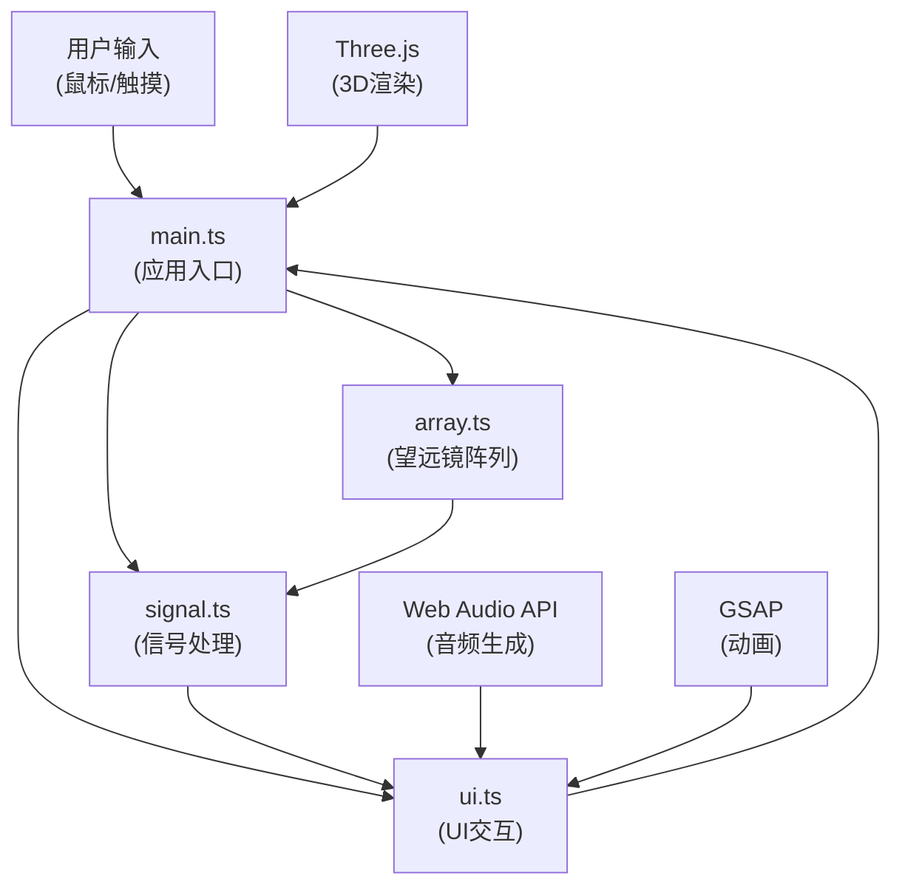

## 1. 架构设计



**架构说明**：
- **main.ts**：应用主控制器，负责初始化、事件绑定、渲染循环调度
- **array.ts**：望远镜阵列模块，管理天线模型、旋转指向、信号强度计算
- **signal.ts**：信号处理模块，波形生成、FFT频谱分析、脉冲检测、智能解码
- **ui.ts**：UI交互模块，DOM元素创建、事件监听、界面更新、音频播放

## 2. 技术选型

- **前端框架**：TypeScript + Three.js（原生，无React/Vue，专注3D渲染性能）
- **构建工具**：Vite@5
- **3D渲染**：three@0.160.0（Points粒子系统、Canvas渲染）
- **动画库**：gsap（补间动画、时间线控制）
- **UI调参**：tweakpane（可选调试面板）
- **音频**：Web Audio API（原生，纯音生成）
- **样式**：原生CSS + CSS变量（毛玻璃效果、CSS动画）

**选型理由**：
- Three.js 原生而非 R3F：项目以 Canvas 渲染为主，UI 为辅，原生 Three.js 性能更优，包体更小
- 无状态管理库：模块间通过 main.ts 调度，直接传递参数，减少抽象层开销
- 原生 Web Audio API：无需额外音频库，满足纯音生成需求

## 3. 模块文件结构

| 文件路径 | 职责 | 关键导出 |
|----------|------|----------|
| `src/main.ts` | 应用入口，初始化场景、渲染循环、事件绑定 | `init()`, `animate()` |
| `src/array.ts` | 望远镜阵列管理，天线创建、指向更新、信号强度计算 | `TelescopeArray` 类 |
| `src/signal.ts` | 信号生成与处理，波形、FFT、脉冲检测、解码 | `SignalProcessor` 类 |
| `src/ui.ts` | UI组件创建与更新，频谱仪、解码面板、状态面板 | `UIManager` 类 |

## 4. 核心数据结构

### 4.1 指向参数

```typescript
interface PointingParams {
  azimuth: number;      // 方位角 -180° ~ 180°
  elevation: number;    // 俯仰角 -30° ~ 30°
  ra: string;           // 赤经 格式: 12h34m56s
  dec: string;          // 赤纬 格式: +45°12'34"
}
```

### 4.2 信号参数

```typescript
interface SignalParams {
  frequency: number;    // 中心频率 0.1 ~ 10 GHz
  gain: number;         // 增益 0 ~ 100 dB
  signalStrength: number; // 信号强度 0 ~ 1
  snr: number;          // 信噪比 dB
}
```

### 4.3 波形数据

```typescript
interface WaveformData {
  samples: Float32Array;  // 波形采样点
  timeWindow: number;     // 时间窗口 秒
  sampleRate: number;     // 采样率
}
```

### 4.4 频谱数据

```typescript
interface SpectrumData {
  frequencies: Float32Array;  // 频率数组
  magnitudes: Float32Array;   // 幅度数组（对数标度）
  peakFreq: number;           // 峰值频率
  peakMag: number;            // 峰值幅度
}
```

## 5. 关键算法

### 5.1 信号波形生成

- 多正弦波叠加：基础噪声 + 载波信号 + 脉冲成分
- 脉冲星信号：1.337秒周期的尖锐高斯脉冲
- 增益控制：幅度缩放，dB 转线性值

### 5.2 FFT 频谱分析

- 使用 Web Audio API 的 `AnalyserNode` 或自定义 FFT
- 频率范围：0 ~ 10 GHz 线性标度
- 幅度：对数标度（dB）

### 5.3 脉冲检测

- 自相关算法检测周期性
- 峰值检测：阈值判定 + 周期验证
- 脉冲周期：1.337 秒（蟹状星云脉冲星模拟）

### 5.4 智能解码

- 检测等间距窄带频率峰
- 生成摩斯电码风格二进制序列
- 载波频率对应音频音调

## 6. 性能优化策略

- **粒子渲染**：Three.js Points + BufferGeometry，单次 draw call
- **波形滚动**：Canvas 2D 偏移绘制，避免全量重绘
- **事件节流**：鼠标拖拽使用 requestAnimationFrame 合并
- **内存管理**：TypedArray 复用，避免频繁 GC
- **CSS 动画**：雷达扫描使用 transform + opacity，触发 GPU 加速

## 7. 性能指标

| 指标 | 目标值 |
|------|--------|
| FPS | ≥ 55 |
| CPU 占用 | ≤ 40% |
| 内存占用 | ≤ 150 MB |
| 波形更新频率 | ≥ 60 Hz |
| 粒子数量 | ≥ 500（恒星 + 光束粒子） |

