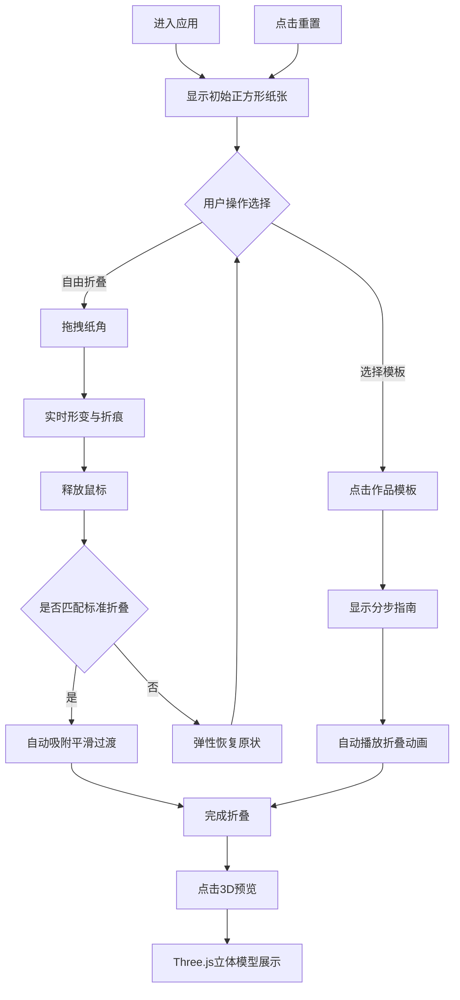

## 1. 产品概述

虚拟折纸工作台是一款面向数字手工艺爱好者的交互式Web应用，用户可通过拖拽和折叠虚拟纸张的边角，实时观察纸张形变与折痕动画，完成折纸作品后可查看立体预览。

- 核心价值：让用户无需物理纸张即可体验折纸乐趣，提供沉浸式的手工交互体验
- 目标用户：折纸爱好者、手工创作者、教育场景用户

## 2. 核心功能

### 2.1 用户角色

| 角色 | 注册方式 | 核心权限 |
|------|----------|----------|
| 普通用户 | 无需注册，直接使用 | 体验所有折纸功能，选择作品模板，查看3D预览 |

### 2.2 功能模块

1. **工作台画布**：虚拟纸张渲染、拖拽交互、折痕动画、形变计算
2. **作品模板面板**：预设折纸作品选择、分步折叠指南展示、自动播放动画序列
3. **3D预览模块**：Three.js立体模型渲染、视角旋转交互、纸纹理贴图
4. **状态与计时系统**：计时器、折叠步骤计数、重置功能
5. **个性化设置**：纸张颜色选择、工具提示

### 2.3 页面详情

| 页面名称 | 模块名称 | 功能描述 |
|----------|----------|----------|
| 主工作台 | 纸张画布 | 400px正方形虚拟纸张，四角可拖拽柄，实时形变与折痕动画 |
| 主工作台 | 作品面板 | 右侧半透明卡片，纸鹤/纸船/青蛙三种模板，点击显示分步指南 |
| 主工作台 | 3D预览 | 右下角按钮切换Three.js立体模型，可拖拽旋转视角 |
| 主工作台 | 状态显示 | 左上角计时器、右下角步骤数、左下角重置按钮 |
| 主工作台 | 颜色选择 | 底部7色色块，点击切换纸张颜色，带工具提示 |

## 3. 核心流程

用户进入应用后，工作台显示初始正方形纸张。用户可选择：
- 直接拖拽纸角进行自由折叠
- 点击右侧作品模板，按指南逐步折叠
- 折叠完成后点击3D预览查看立体效果
- 随时重置纸张状态

## 4. 用户界面设计

### 4.1 设计风格

- **主色调**：深木色背景（#3e2723 ~ #5d4037），浅米色纸张（#f5f0e1），棕色交互元素（#8d6e63）
- **按钮样式**：圆角8px，悬停放大1.05倍，带0.2px外发光效果
- **字体**：数字使用等宽字体，正文使用优雅无衬线字体
- **布局**：工作台画布居中（占宽70%），右侧面板200px宽，底部色块行
- **图标风格**：简洁SVG图标，统一线条风格

### 4.2 页面设计概览

| 页面名称 | 模块名称 | UI元素 |
|----------|----------|--------|
| 主工作台 | 纸张画布 | 深木纹背景、正方形纸张、四角拖拽柄、虚线边框、折痕实线 |
| 主工作台 | 作品面板 | 半透明卡片（#1e1e1e70）、圆角12px、内间距12px、步骤说明文字（#bcaaa4，14px） |
| 主工作台 | 3D预览 | 按钮（#8d6e63，悬停#a1887f，120x40px，圆角8px），3D场景（环境光+左侧光源） |
| 主工作台 | 状态显示 | 计时器（#bdbdbd，16px等宽，MM:SS格式），步骤数（#78909c），重置按钮（SVG刷新图标，#90a4ae） |
| 主工作台 | 颜色选择 | 7个20x20px色块（2px圆角），工具提示（#212121背景，白色12px文字，延时0.3s） |

### 4.3 响应式设计

- **桌面端（>768px）**：画布居中70%宽度，右侧面板200px，底部横向色块
- **移动端（≤768px）**：画布100%宽度，右侧面板折叠为底部横向滑动面板（高100px），色块移至右上角垂直排列（宽40px）

### 4.4 3D场景指引

- **环境**：柔和环境光模拟室内自然光，左侧方向光营造立体感
- **光照**：AmbientLight（强度0.6）+ DirectionalLight（左侧，强度0.8）
- **相机**：PerspectiveCamera，支持鼠标拖拽旋转（垂直-30°~60°，水平无限制）
- **材质**：根据折痕序列生成几何模型，Canvas生成纸纹图案作为贴图
- **性能**：模型面数控制在2000以内，确保Chrome 80+流畅运行

## 5. 动画与交互

- **折叠动画**：framer-motion spring物理动画（刚度120，阻尼15）
- **3D过渡**：1.2s淡入 + 0.95→1.0缩放
- **待机动画**：纸张每90秒旋转一周（0.1°/帧），4s周期呼吸脉动（1.001倍缩放）
- **吸附过渡**：0.5s ease-in-out平滑过渡
- **恢复动画**：0.3s带bounce弹性效果
- **悬停效果**：所有操作按钮放大1.05倍 + #8d6e63外发光
