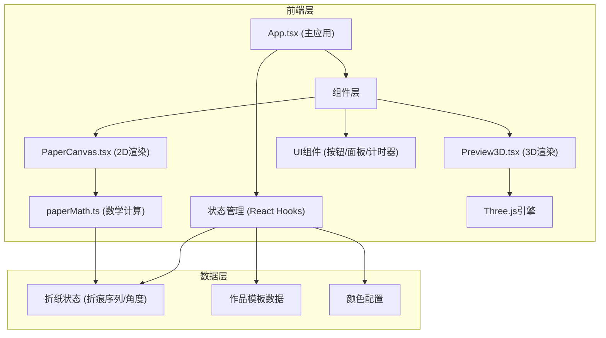

## 1. 架构设计



## 2. 技术描述

- **前端框架**：React 18 + TypeScript 5 + Vite 5
- **构建工具**：Vite 5，启用@vitejs/plugin-react
- **动画库**：framer-motion（物理动画）、gsap（精细动画控制）
- **3D渲染**：three@0.160.0
- **数学工具**：原生Float32Array矩阵运算，无额外数学库
- **状态管理**：React Hooks（useState、useRef、useEffect、useCallback）
- **图标工具**：lucide-react

## 3. 目录结构

```
├── package.json
├── vite.config.js
├── tsconfig.json
├── index.html
├── src/
│   ├── main.tsx              # React挂载入口
│   ├── App.tsx               # 主应用组件，状态管理与事件分发
│   ├── components/
│   │   ├── PaperCanvas.tsx   # 2D Canvas纸张渲染组件
│   │   ├── Preview3D.tsx     # Three.js 3D预览组件
│   │   ├── WorkPanel.tsx     # 右侧作品选择面板
│   │   ├── ColorPicker.tsx   # 底部颜色选择器
│   │   ├── Timer.tsx         # 计时器组件
│   │   ├── StepCounter.tsx   # 步骤计数器组件
│   │   └── ResetButton.tsx   # 重置按钮组件
│   ├── utils/
│   │   ├── paperMath.ts      # 折纸数学计算（纯函数）
│   │   └── templates.ts      # 折纸作品模板数据
│   ├── types/
│   │   └── index.ts          # TypeScript类型定义
│   └── styles/
│       └── global.css        # 全局样式（木纹背景、响应式布局）
```

## 4. 数据流向与调用关系

```
用户交互 (DOM事件)
    ↓
App.tsx (useState管理折纸状态)
    ├→ 折痕序列 creaseSequence: Crease[]
    ├→ 折叠角度 foldAngles: number[]
    ├→ 当前纸张颜色 paperColor: string
    ├→ 当前作品 selectedTemplate: Template | null
    ├→ 当前步骤 currentStep: number
    ├→ 是否3D预览 is3DMode: boolean
    └→ 计时器 timer: number
    ↓
├→ PaperCanvas.tsx (接收props: creases, angles, color, template, step)
│   └→ 调用 paperMath.ts 计算顶点坐标与形变矩阵
│       └→ canvas 2D API 绘制
├→ Preview3D.tsx (接收props: creases, angles, color)
│   └→ Three.js 生成3D模型
└→ UI组件 (接收props: 显示数据 + 回调)
```

## 5. 核心类型定义

```typescript
// 2D点坐标
interface Point2D {
  x: number;
  y: number;
}

// 折痕定义
interface Crease {
  id: string;
  start: Point2D;
  end: Point2D;
  angle: number;      // 折叠角度（弧度）
  type: 'mountain' | 'valley';
}

// 折纸作品模板
interface Template {
  id: string;
  name: string;
  nameEn: string;
  steps: TemplateStep[];
}

interface TemplateStep {
  id: number;
  description: string;
  crease: Crease;
  duration: number;
}

// 折纸全局状态
interface PaperState {
  vertices: Float32Array;   // 纸张顶点数组
  creases: Crease[];         // 折痕序列
  isAnimating: boolean;
  baseColor: string;
}
```

## 6. 性能优化策略

- **Canvas渲染**：使用requestAnimationFrame，折叠计算控制在每帧0.5ms以内
- **矩阵运算**：采用Float32Array进行高效数值计算
- **3D模型**：面数控制在2000以内，使用BufferGeometry
- **动画**：framer-motion硬件加速属性（transform、opacity）
- **状态更新**：避免不必要的重渲染，使用useMemo/useCallback

## 7. 响应式布局实现

- CSS媒体查询：`@media (max-width: 768px)`
- 工作台画布：`width: 70%` → `width: 100%`
- 右侧面板：`position: fixed; right: 0; width: 200px` → `position: fixed; bottom: 0; left: 0; height: 100px; overflow-x: auto`
- 颜色选择器：底部横向排列 → 右上角垂直排列（`flex-direction: column`）
