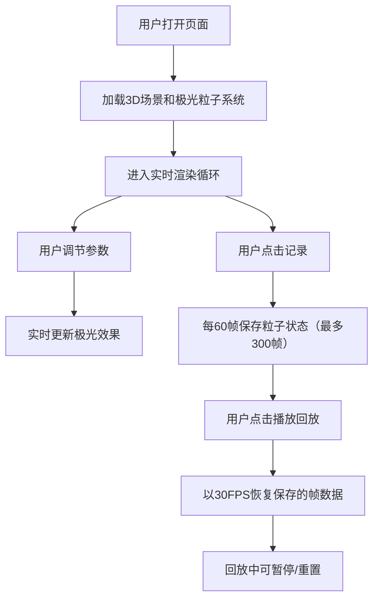

## 1. 产品概述

本应用是一个基于WebGL的虚拟极光舞动与地磁脉动交互可视化系统，让用户模拟极地观测者的视角，实时观赏极光帷幕的动态变幻。通过调整地磁扰动强度、太阳风速度和观测倾角等参数，用户可以观察极光色彩变化、粒子运动和整体形态演变，并记录回放专属极光动画。

- **目标用户**：天文爱好者、教育工作者、科学可视化爱好者
- **核心价值**：沉浸式极光体验、科学参数可视化、可记录的个性化动画回放

---

## 2. 核心功能

### 2.1 用户角色
| 角色 | 注册方式 | 核心权限 |
|------|---------|---------|
| 访客用户 | 无需注册 | 观赏极光、调节参数、记录和回放动画 |

### 2.2 功能模块

1. **3D极光场景**：星空背景、雪山剪影、极光帷幕、粒子雨效果
2. **参数控制面板**：地磁扰动强度、太阳风速度、观测倾角、暂停/继续
3. **动画录制回放**：关键帧记录、播放控制、速度调节、重置

### 2.3 页面详情
| 页面名称 | 模块名称 | 功能描述 |
|---------|---------|---------|
| 主页面 | 3D场景渲染 | 实时渲染8000个极光粒子、3000颗闪烁星星、雪山剪影、下落粒子雨 |
| 主页面 | 控制面板 | Tweakpane半透明毛玻璃风格面板，包含三个调节滑块和控制按钮 |
| 主页面 | 回放控制 | 记录、播放、暂停、重置功能，支持播放速度调节 |

---

## 3. 核心流程

---

## 4. 用户界面设计

### 4.1 设计风格
- **主色调**：深夜空 `#0a0e1a` → 极光绿 `#0a2a1a` 渐变背景
- **强调色**：极光绿 `#00ff88`、亮青色 `#00ffcc`、紫粉色 `#ff00ee`
- **极光色带**：底部嫩绿色 `#00ff88` → 中部青蓝色 `#00ddff` → 顶部紫粉色 `#ff00ee`
- **按钮风格**：圆角8px，毛玻璃半透明效果，0.3s淡入过渡，点击缩放到0.95倍
- **字体**：等宽科幻字体，清晰易读
- **布局风格**：全屏3D画布，右下角浮动控制面板

### 4.2 页面设计概述
| 页面名称 | 模块名称 | UI元素 |
|---------|---------|--------|
| 主页面 | 3D画布 | 全屏WebGL渲染，星空、雪山、极光、粒子雨叠加 |
| 主页面 | 控制面板 | 背景`rgba(10,14,26,0.7)`，1px `#00ff88` 边框，圆角8px，滑块120x6px |
| 主页面 | 移动适配 | 宽度<768px时折叠为图标按钮，点击展开全屏浮层 |

### 4.3 响应式设计
- **桌面优先**：控制面板固定在右下角（32px间距）
- **平板适配**：缩小面板尺寸，调整滑块长度
- **移动适配**（<768px）：面板折叠为圆形图标按钮，点击展开为全屏浮层，支持滑动关闭

### 4.4 3D场景指导
- **环境氛围**：深夜星空，低对比度，冷色调为主，极光提供动态色彩光源
- **光照设置**：环境光 + 极光粒子自发光，无额外定向光
- **相机设置**：PerspectiveCamera，视场角75°，初始位置(0, 0, 100)，观测倾角可调-15°~+45°
- **构图焦点**：极光帷幕位于场景中央偏上，雪山作为地平线锚点
- **交互动画**：极光水平摆动（贝塞尔曲线）、粒子脉动透明度、星星闪烁、粒子雨抛物线下落
- **后处理效果**：轻微辉光效果增强极光发光感
- **性能预算**：粒子更新<3ms/帧，稳定60FPS
