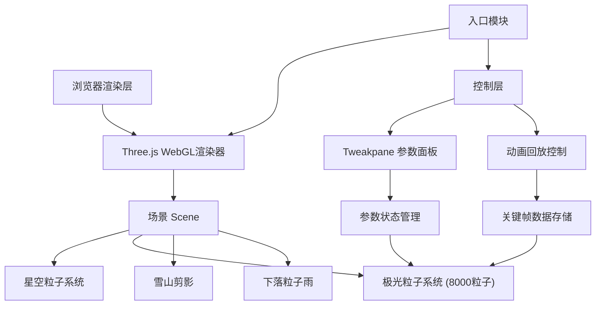

## 1. 架构设计



## 2. 技术描述

- **前端框架**：原生 TypeScript + Three.js 0.160.0
- **构建工具**：Vite 5
- **动画库**：GSAP（用于参数平滑过渡和微交互）
- **UI控制面板**：Tweakpane
- **类型支持**：@types/three

## 3. 模块文件结构

| 文件路径 | 职责 |
|---------|------|
| `src/main.ts` | 主入口：初始化Three.js场景、相机、渲染器，启动动画循环 |
| `src/aurora.ts` | 极光系统：BufferGeometry粒子系统、贝塞尔曲线分布、风场扰动、颜色渐变、粒子雨 |
| `src/controls.ts` | 控制面板：Tweakpane集成、参数调节（地磁/太阳风/倾角）、暂停控制 |
| `src/recorder.ts` | 回放系统：关键帧记录、状态保存、播放控制、速度调节 |
| `index.html` | 入口HTML：黑色背景、挂载点 |
| `vite.config.js` | Vite配置：TypeScript插件、base路径 |
| `tsconfig.json` | TypeScript配置：严格模式、ES2020 |

## 4. 核心数据结构

### 4.1 极光粒子状态
```typescript
interface ParticleState {
  positions: Float32Array;  // 3*N 粒子位置数组
  colors: Float32Array;     // 3*N 粒子颜色数组 (RGB)
  alphas: Float32Array;     // N   粒子透明度数组
}
```

### 4.2 控制面板参数
```typescript
interface ControlParams {
  geomagneticIntensity: number;  // 地磁扰动强度 0.1-2.0
  solarWindSpeed: number;        // 太阳风速度 1-5
  observationTilt: number;       // 观测倾角 0-90度
  isPaused: boolean;             // 暂停状态
}
```

### 4.3 回放记录
```typescript
interface RecordedFrame {
  timestamp: number;
  particleState: ParticleState;
}
```

## 5. 性能优化策略

### 5.1 渲染层
- **BufferGeometry**：使用单个BufferGeometry管理8000个粒子，减少draw call
- **TypedArray**：使用Float32Array直接操作GPU缓冲区，避免GC开销
- **Custom Shader**：顶点着色器处理透明度脉动和基础位置偏移，减少CPU计算
- **实例化渲染**：粒子雨使用少量独立对象，控制总量

### 5.2 计算层
- **分帧计算**：粒子更新每帧耗时<3ms，使用向量化操作
- **预计算曲线**：贝塞尔曲线采样点预计算，运行时仅插值
- **内存预分配**：所有TypedArray初始化时分配固定大小，避免运行时扩容

### 5.3 回放层
- **预加载全部帧**：300帧数据全部加载到内存后再播放，避免IO卡顿
- **增量更新**：回放时直接替换BufferAttribute的array，避免重建几何体
