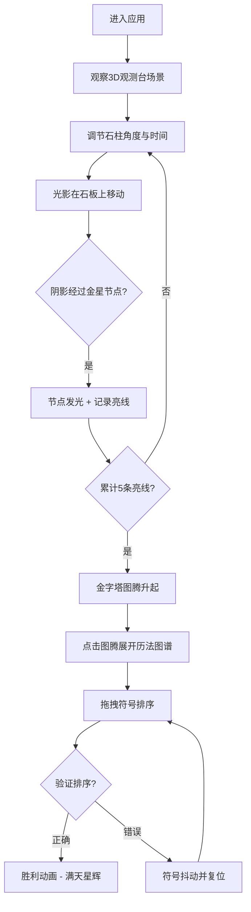

## 1. 产品概述

虚拟玛雅天文台金星历法解谜交互应用，让用户以玛雅祭司的身份，通过调节观测台石柱角度和观测时间，实时观察光影在石板上的移动轨迹，解开隐藏的金星历法谜题。

- 主要用途：天文考古科普与互动解谜体验
- 目标用户：天文爱好者、历史文化爱好者、解谜游戏玩家
- 核心价值：以沉浸式3D交互方式重现玛雅天文台的金星观测，寓教于乐

## 2. 核心功能

### 2.1 用户角色

| 角色 | 注册方式 | 核心权限 |
|------|----------|----------|
| 访客用户 | 无需注册 | 完整体验天文台交互、解谜、历法图谱浏览 |

### 2.2 功能模块

1. **3D 观测台场景**：玛雅风格观测台、四根石柱、历法石板、实时光影投射
2. **控制面板**：石柱角度调节滑块、时间进度滑块、验证/重置按钮
3. **光影计算**：根据柱角度和时间计算太阳投影位置与长度
4. **解谜系统**：金星合日节点检测、亮线连接、金字塔图腾升起
5. **金星历法图谱**：20 个玛雅神灵符号圆环、拖拽排序、胜利动画

### 2.3 页面详情

| 页面名称 | 模块名称 | 功能描述 |
|----------|----------|----------|
| 主页面 | 3D 观测台场景 | 展示玛雅天文台3D场景，石柱随角度旋转，光影实时移动，节点触发金色发光效果 |
| 主页面 | 控制面板 | 正北石柱角度滑块（0-180度）、观测时间进度滑块（0-1440分钟）、验证猜想按钮、重置历法按钮 |
| 主页面 | 解谜反馈 | 金星合日节点发光、弧形亮线连接、金字塔图腾升起动画、金色粒子效果 |
| 主页面 | 金星历法图谱 | 20个玛雅符号圆环、日期与金星相位描述、拖拽排序、胜利/错误动画 |

## 3. 核心流程

用户进入页面 → 观察3D观测台场景与控制面板 → 调节石柱角度和时间进度 → 观察光影在历法石板上移动 → 阴影末端经过隐藏节点时触发"金星合日" → 累计5条亮线后金字塔图腾升起 → 点击图腾展开金星历法图谱 → 拖拽符号排序 → 验证正确播放胜利动画 / 错误则抖动复位

## 4. 用户界面设计

### 4.1 设计风格

- **主色调**：玛雅红（#cc2936）、老金色（#d4a017）
- **背景色**：玛雅天空蓝（#3a86ff）→ 黄昏紫（#8338ec）渐变
- **观测台**：玛雅土黄（#8b5e34）→ 深赭石（#4a2c16）渐变
- **石板**：浅灰麻石色（#c2b280），深棕色纹路（#5c3a21）
- **石柱**：粗粝砂岩色（#a68a64），带斑点纹理
- **字体**：圆角衬线风格，古朴典雅
- **整体氛围**：神秘古雅的玛雅文明风格，带有祭祀仪式感

### 4.2 页面设计概述

| 页面名称 | 模块名称 | UI元素 |
|----------|----------|--------|
| 主页面 | 3D场景区域 | 占页面80%高度，渐变天空背景，观测台居中，光影实时计算 |
| 主页面 | 控制面板区域 | 占页面20%高度，水平居中，玛雅红主题滑块与按钮 |
| 主页面 | 解谜反馈 | 金色光晕节点、弧形亮线、金字塔图腾旋转上升、200粒子金色粒子效果 |
| 主页面 | 金星历法图谱 | 20个玛雅符号环形排列、可拖拽、日期/相位标签、胜利粒子动画 |

### 4.3 响应式

- 桌面端优先设计，主场景与控制面板上下布局
- 控制面板保持固定比例，滑块随容器宽度自适应
- 3D场景保持固定视角比例

### 4.4 3D场景指引

- **环境**：渐变天空背景（玛雅天空蓝到黄昏紫），地平线在30%高度
- **光照**：模拟太阳光随时间变化方位和强度
- **相机**：正南方向视角，距离中心600px，固定视角
- **构图**：四根石柱围成长宽400px的方形区域，中央为历法石板
- **交互**：石柱旋转、光影投射、节点发光动画、图腾升起动画
- **后处理**：金色光晕效果、粒子系统
- **性能**：稳定55FPS以上，使用Raycaster计算投影

