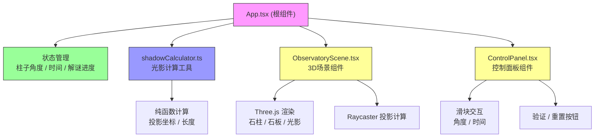

## 1. 架构设计



**数据流向**：
1. App 维护全局状态（柱角度、时间、解谜进度）
2. ControlPanel 用户交互 → 触发事件 → 更新 App 状态
3. App 调用 shadowCalculator → 计算光影数据
4. App 将光影数据 + 状态传递给 ObservatoryScene
5. ObservatoryScene 使用 Three.js 渲染 → Raycaster 计算实际投影 → 回调光影坐标给 App

## 2. 技术描述

- **前端框架**：React 18 + TypeScript
- **构建工具**：Vite 5 + @vitejs/plugin-react
- **3D渲染**：Three.js 0.160.0
- **动画库**：framer-motion、gsap
- **工具库**：uuid
- **状态管理**：React useState / useRef（组件内状态）
- **音频**：Web Audio API（鼓声效果）

## 3. 路由定义

| 路由 | 用途 |
|------|------|
| / | 主页面 - 天文台交互与解谜 |

## 4. 文件结构

```
src/
├── components/
│   ├── ObservatoryScene.tsx    # 3D观测台场景组件
│   └── ControlPanel.tsx        # 控制面板组件
├── utils/
│   └── shadowCalculator.ts     # 光影计算纯函数
├── App.tsx                     # 根组件
├── main.tsx                    # 入口文件
└── index.css                   # 全局样式
```

## 5. 数据模型

### 5.1 类型定义

```typescript
// 光影计算结果
interface ShadowResult {
  x: number;      // 投影X坐标（相对于石板中心）
  y: number;      // 投影Y坐标
  length: number; // 影子长度
}

// 金星节点
interface VenusNode {
  id: string;
  angle: number;  // 在历法环上的角度位置
  radius: number; // 距离中心的半径
  activated: boolean;
}

// 玛雅历法符号
interface MayaSymbol {
  id: string;
  name: string;        // 神灵名称，如 Imix'
  dayNumber: number;   // 第几天 (1-20)
  venusPhase: 'morning' | 'evening' | 'invisible'; // 金星相位
  position: number;    // 当前排序位置
}

// 游戏状态
interface GameState {
  pillarAngle: number;     // 石柱角度 0-180
  timeProgress: number;    // 时间进度 0-1440 分钟
  activatedNodes: string[]; // 已激活节点ID列表
  isPuzzleSolved: boolean;  // 谜题是否解开
  isAtlasOpen: boolean;     // 历法图谱是否展开
  symbolOrder: string[];    // 符号排序ID列表
}
```

### 5.2 核心函数签名

```typescript
// shadowCalculator.ts
function calculateShadow(
  pillarAngle: number,  // 石柱旋转角度（度）
  timeMinutes: number,  // 当天时间（分钟，0-1440）
  pillarHeight: number, // 石柱高度
  pillarWidth: number   // 石柱宽度
): ShadowResult;

// ObservatoryScene Props
interface ObservatorySceneProps {
  pillarAngle: number;
  timeProgress: number;
  shadowData: ShadowResult;
  activatedNodes: string[];
  isPuzzleSolved: boolean;
  onShadowUpdate: (result: ShadowResult) => void;
  onTotemClick: () => void;
}

// ControlPanel Props
interface ControlPanelProps {
  pillarAngle: number;
  timeProgress: number;
  onPillarAngleChange: (angle: number) => void;
  onTimeChange: (time: number) => void;
  onVerify: () => void;
  onReset: () => void;
  puzzleSolved: boolean;
}
```

## 6. 性能优化策略

1. **Three.js 优化**：
   - 使用 BufferGeometry 替代 Geometry
   - 复用材质和几何体
   - 阴影贴图尺寸适中
   - 每帧只更新必要的矩阵变换

2. **动画优化**：
   - 使用 requestAnimationFrame 统一动画循环
   - 粒子系统使用实例化渲染
   - 节点发光使用 ShaderMaterial

3. **React 优化**：
   - 使用 useMemo 缓存计算结果
   - 使用 useCallback 避免不必要的重渲染
   - 3D场景使用 ref 管理，避免 React 重渲染触发 Three.js 重建

4. **帧率目标**：稳定 55FPS 以上
