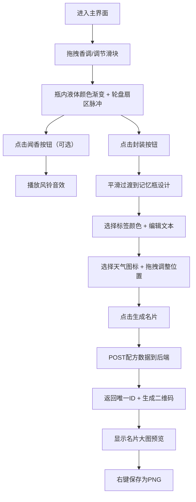

## 1. 产品概述

虚拟嗅觉调香师与香氛记忆瓶 - 一个沉浸式的创意Web应用，让用户化身调香师，通过混合5种经典香调精油（柑橘、花香、木质、辛香、麝香），调配独特香氛并封装进带有个性化标签的"记忆瓶"中，记录心情与天气，最终生成可分享的复古香氛名片。

- **目标用户**：香氛爱好者、创意工作者、喜欢记录生活点滴的用户
- **核心价值**：将抽象的嗅觉体验视觉化，创造富有仪式感的香氛记忆保存方式

---

## 2. 核心功能

### 2.1 用户角色

| 角色 | 注册方式 | 核心权限 |
|------|----------|----------|
| 普通用户 | 无需注册 | 调配香氛、设计记忆瓶、生成并保存香氛名片 |

### 2.2 功能模块

1. **香调混合工作台**：锥形瓶可视化、香调拖拽滴入、浓度滑块调节、液体颜色渐变、粒子烟雾效果、香氛轮盘图、闻香音效
2. **记忆瓶设计台**：药剂瓶展示、彩色标签选择与编辑、主题/心情文本输入、天气图标选择、拖拽布局调整
3. **名片生成器**：复古明信片排版、二维码生成、PNG导出保存

### 2.3 页面详情

| 页面名称 | 模块名称 | 功能描述 |
|----------|----------|----------|
| 主工作台 | 锥形瓶渲染区 | SVG绘制玻璃锥形瓶，半透明带高光，瓶内液体高度随浓度变化 |
| 主工作台 | 香调拖拽栏 | 5种彩色香调小圆瓶，支持拖拽到锥形瓶口触发滴入动画 |
| 主工作台 | 浓度滑块组 | 5个0-5级滑块，对应5种香调，拖动实时更新液体颜色 |
| 主工作台 | 粒子系统 | Canvas渲染瓶口烟雾粒子，颜色随混合色变化，路径受风影响 |
| 主工作台 | 香氛轮盘图 | Canvas绘制5扇区饼图，滴入后扇区亮起并脉冲动画 |
| 主工作台 | 闻香按钮 | 点击播放Web Audio API生成的随机风铃音调 |
| 记忆瓶设计 | 药剂瓶展示 | 带软木塞的SVG药剂瓶，瓶体显示最终混合色 |
| 记忆瓶设计 | 标签编辑器 | 8色标签底色选择，显示十六进制色值，3行可编辑文本 |
| 记忆瓶设计 | 天气图标组 | 晴/多云/雨/雪四种SVG图标，带微动效 |
| 记忆瓶设计 | 拖拽布局 | 标签、文本、天气图标可拖拽调整位置 |
| 名片生成 | 名片预览 | 复古明信片风格，整合瓶身、标签、天气、签名 |
| 名片生成 | 二维码 | 根据后端返回ID生成带链接的二维码 |
| 名片生成 | PNG导出 | 支持右键保存为图片 |

---

## 3. 核心流程

用户从进入页面开始，首先在工作台上通过拖拽或滑块调配香氛，满意后点击封装进入设计阶段，编辑标签内容与选择天气图标，最后生成名片并保存分享。

---

## 4. 用户界面设计

### 4.1 设计风格

- **主背景**：纸质感米白 `#fafafa` + 极淡网格线 `#eeeeee`（间距20px）
- **主界面渐变**：浅玫瑰粉 `#fce4ec` → 淡薰衣草紫 `#e8eaf6`
- **香调五色**：柑橘橙 `#ff9800`、花粉 `#f48fb1`、木棕 `#8d6e63`、辛红 `#d32f2f`、麝灰 `#78909c`
- **按钮反馈**：悬浮时 `translateY(-2px)` + 阴影从 `0 2px 4px` 变为 `0 4px 12px rgba(0,0,0,0.15)`
- **排版风格**：优雅衬线体（标题）+ 简洁无衬线体（正文），营造手工调香工作室氛围
- **整体调性**：温柔、治愈、复古、精致的手作美学

### 4.2 页面设计概述

| 页面名称 | 模块名称 | UI元素 |
|----------|----------|--------|
| 主工作台 | 顶部香调栏 | 5个直径25px彩色小圆瓶，悬浮轻微上浮 |
| 主工作台 | 左侧锥形瓶 | SVG半透明玻璃质感，瓶颈细长，瓶高300px |
| 主工作台 | 右侧轮盘图 | 半径120px圆形，5扇区，亮起时脉冲光晕 |
| 主工作台 | 底部滑块区 | 5组滑块，每组带分子式SVG图标与香调名称 |
| 主工作台 | 控制按钮 | 闻香/封装按钮，圆角设计，渐变边框 |
| 记忆瓶设计 | 中央药剂瓶 | SVG绘制，软木塞棕色，瓶身220px高 |
| 记忆瓶设计 | 侧边标签 | 120×80px，8色可选，显示HEX色值 |
| 记忆瓶设计 | 文本编辑区 | 3行输入框（主题15字/心情20字/日期自动） |
| 记忆瓶设计 | 天气图标栏 | 4个30×30px图标，选中态带发光效果 |
| 名片生成 | 预览卡片 | 圆角16px，复古明信片，细微噪点纹理 |

### 4.3 响应式设计

- **策略**：桌面优先（Desktop-first），移动端自适应
- **断点**：768px
- **移动端布局**：锥形瓶与轮盘图垂直堆叠，控制区移至下方，单列滚动
- **触控优化**：拖拽区域扩大热区，滑块触控高度增加至44px

---

### 4.4 交互动效细节

1. **滴入动画**：圆形液体从拖拽位置落下 → 溅入瓶中 → 涟漪扩散（0.8s）
2. **液体渐变**：RGB颜色加权平均混合，CSS transition 0.4s缓动
3. **扇区脉冲**：滴入后 `scale(1.0→1.08→1.0)` + `opacity(0.6→1.0→0.8)` 循环2次
4. **烟雾粒子**：每秒2-3个，半径3-5px，贝塞尔曲线路径上升消散
5. **页面过渡**：封装时0.6s `ease-in-out` 渐变切换
6. **天气动效**：晴天太阳缓慢旋转（10s/圈），云朵轻微漂移，雨滴下落循环
