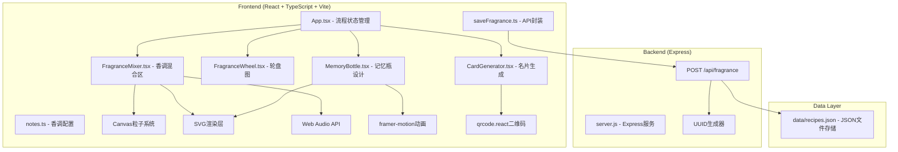
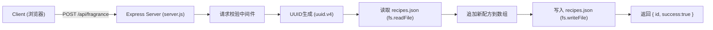
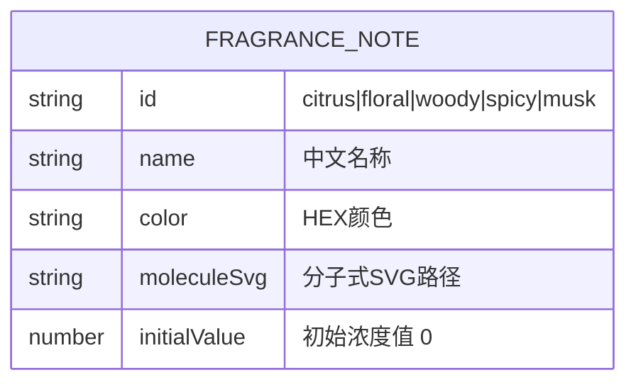
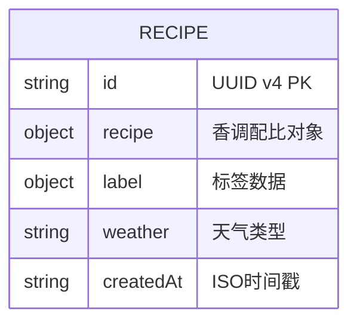

## 1. 架构设计



---

## 2. 技术说明

- **前端框架**：React@18 + TypeScript@5 + Vite@5
- **构建工具**：Vite 5，启用 `@vitejs/plugin-react`，base 路径 `/`
- **状态管理**：React Hooks（useState/useReducer/useRef），无额外状态库
- **动画库**：framer-motion（页面过渡、元素动效、拖拽）
- **二维码**：qrcode.react（根据后端返回ID生成链接二维码）
- **后端服务**：Express@4 + cors + uuid
- **数据存储**：本地JSON文件 `data/recipes.json`（数组格式，初始 `[]`）
- **音频引擎**：原生 Web Audio API（OscillatorNode 生成风铃音效）
- **图形渲染**：SVG（瓶身、标签、图标）+ Canvas（粒子系统、轮盘图）
- **响应式**：原生 CSS Media Queries，断点 768px

---

## 3. 路由定义

| 路由 | 用途 |
|------|------|
| `/` | 单页应用主入口，所有状态由App组件内部管理（mixer / bottle / card三阶段） |
| `/api/fragrance` | POST接口，保存配方并返回唯一ID |

---

## 4. API 定义

### POST /api/fragrance

**Request Body (TypeScript):**
```typescript
interface SaveFragranceRequest {
  recipe: {
    citrus: number;     // 0-5
    floral: number;     // 0-5
    woody: number;      // 0-5
    spicy: number;      // 0-5
    musk: number;       // 0-5
  };
  label: {
    color: string;          // 标签底色HEX
    mixedColor: string;     // 混合色HEX
    title: string;          // 主题 15字
    mood: string;           // 心情 20字
    date: string;           // 日期 YYYY-MM-DD
  };
  weather: 'sunny' | 'cloudy' | 'rainy' | 'snowy';
}
```

**Response Body:**
```typescript
interface SaveFragranceResponse {
  id: string;           // UUID v4
  success: boolean;
  message: string;
}
```

**错误响应:**
```typescript
interface ErrorResponse {
  success: false;
  message: string;
  error?: string;
}
```

---

## 5. 服务器架构图



---

## 6. 数据模型

### 6.1 香调配置 (notes.ts)



### 6.2 配方存储 (recipes.json)



### 6.3 数据示例

```json
[
  {
    "id": "a1b2c3d4-1234-5678-90ab-cdef01234567",
    "recipe": {
      "citrus": 3,
      "floral": 5,
      "woody": 2,
      "spicy": 0,
      "musk": 4
    },
    "label": {
      "color": "#fce4ec",
      "mixedColor": "#e8b4d0",
      "title": "春日花园",
      "mood": "温暖而愉悦的午后",
      "date": "2026-06-11"
    },
    "weather": "sunny",
    "createdAt": "2026-06-11T07:35:00.000Z"
  }
]
```

---

## 7. 项目文件结构

```
auto231/
├── package.json                    # 项目依赖与脚本
├── vite.config.js                  # Vite构建配置
├── tsconfig.json                   # TypeScript配置（严格模式，ES2020）
├── index.html                      # 入口HTML
├── server.js                       # Express后端服务
├── data/
│   └── recipes.json                # 配方数据存储（初始 []）
└── src/
    ├── App.tsx                     # 主应用（三阶段状态机）
    ├── main.tsx                    # React入口（可选，Vite默认）
    ├── index.css                   # 全局样式
    ├── components/
    │   ├── FragranceMixer.tsx      # 香调混合工作台
    │   ├── FragranceWheel.tsx      # 香氛轮盘图（Canvas）
    │   ├── MemoryBottle.tsx        # 记忆瓶设计台
    │   └── CardGenerator.tsx       # 香氛名片生成器
    ├── api/
    │   └── saveFragrance.ts        # POST API封装
    └── data/
        └── notes.ts                # 5种香调配置数据
```

---

## 8. 性能优化策略

| 场景 | 优化方案 |
|------|----------|
| 滑块拖动60fps | 使用 `requestAnimationFrame` + Canvas分层渲染，避免重排 |
| 粒子系统更新 | 对象池复用粒子，每帧绘制控制在<2ms |
| 颜色混合计算 | 预计算RGB权重表，使用整数运算避免浮点开销 |
| 页面过渡 | framer-motion GPU加速（transform/opacity），不触发layout |
| SVG渲染 | 使用 `memo` 包裹纯展示组件，避免不必要的re-render |
| 响应式断点 | CSS Media Queries + CSS变量，避免JS监听resize |

---

## 9. 启动说明

```bash
# 安装依赖
npm install

# 同时启动前后端
npm run start
# 等价于 concurrently "npm run dev" "npm run server"
#   - 前端 Vite: http://localhost:5173
#   - 后端 Express: http://localhost:3001
```
