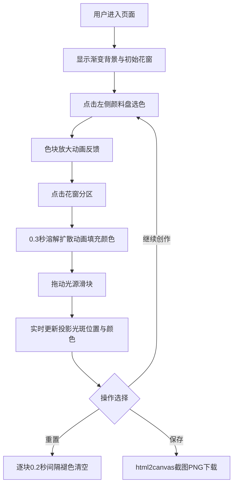

## 1. 产品概述

虚拟花窗玻璃拼贴与光影投射交互应用，让用户在浏览器中化身中世纪彩绘玻璃匠，通过拼贴彩色玻璃碎片并调节虚拟光源，创作出独特的花窗艺术作品并观察光影效果。

- **核心目的**：提供沉浸式的花窗艺术创作体验，结合交互拼贴与光影投射技术
- **目标用户**：艺术爱好者、教育用户、创意工作者
- **产品价值**：低门槛的数字艺术创作工具，兼具教育意义与审美价值

## 2. 核心功能

### 2.1 功能模块

1. **主创作页面**：花窗拼贴区域、颜料盘、光源控制、重置与保存功能
2. **花窗拼贴系统**：12分区玫瑰花窗SVG、颜色填充动画
3. **光影投射系统**：光源参数调节、实时投影渲染
4. **作品导出系统**：PNG截图保存

### 2.2 页面详情

| 页面名称 | 模块名称 | 功能描述 |
|-----------|-------------|---------------------|
| 主创作页面 | 渐变背景 | 从深石灰色(#3d3d3d)到暖象牙白(#fff8e7)的垂直渐变 |
| 主创作页面 | 玫瑰花窗 | 直径600px圆形，12个花瓣形分区，点击填充颜色 |
| 主创作页面 | 颜料盘 | 左侧4x3网格，12种颜色块，30px见方，点击放大反馈 |
| 主创作页面 | 光源控制 | 右侧高度角(10°-90°)和方位角(0°-360°)滑块，平滑数值显示 |
| 主创作页面 | 重置按钮 | 花窗左上角半透明圆形按钮(40px)，逐块褪色清空 |
| 主创作页面 | 保存按钮 | 右下角圆角矩形按钮，导出PNG截图 |
| 主创作页面 | 投影光斑 | 花窗后方墙面区域，随光源参数实时渲染彩色光斑 |

## 3. 核心流程

## 4. 用户界面设计

### 4.1 设计风格

- **主色调**：深石灰色(#3d3d3d) → 暖象牙白(#fff8e7)渐变背景
- **玻璃色板**：12种彩色玻璃色系（红、蓝、绿、黄、紫、橙等）
- **按钮风格**：重置按钮半透明圆形(40px)，保存按钮圆角矩形
- **字体**：优雅的衬线字体搭配现代无衬线字体
- **布局风格**：三栏式布局——左颜料盘、中花窗投影、右光源控制
- **动画风格**：流畅的溶解扩散、渐入渐出、弹性缩放

### 4.2 页面设计概览

| 页面名称 | 模块名称 | UI元素 |
|-----------|-------------|-------------|
| 主创作页面 | 渐变背景 | 垂直线性渐变，#3d3d3d → #fff8e7 |
| 主创作页面 | 玫瑰花窗 | SVG圆形(600px)，12花瓣分区，黑色细铅条轮廓，半透明玻璃模板 |
| 主创作页面 | 颜料盘 | 4x3网格色块(30px)，悬停高光，选中放大缩放动画 |
| 主创作页面 | 光源控制 | 自定义滑块，数值实时显示，高度角/方位角标签 |
| 主创作页面 | 投影区域 | 花窗后方墙面，高斯模糊光斑，饱和度降低40% |
| 主创作页面 | 重置按钮 | 半透明圆形(40px)，悬停透明度提升 |
| 主创作页面 | 保存按钮 | 圆角矩形，深色背景浅色文字，悬停阴影 |

### 4.3 响应式设计

- **桌面优先**：核心针对桌面端优化
- **触控适配**：滑块支持触摸拖动，色块触控反馈
- **最小尺寸**：支持最低1024x768分辨率

### 4.4 性能要求

- 动画帧率稳定在55fps以上
- 交互响应延迟低于100ms
- 使用CSS transforms和opacity实现高性能动画
