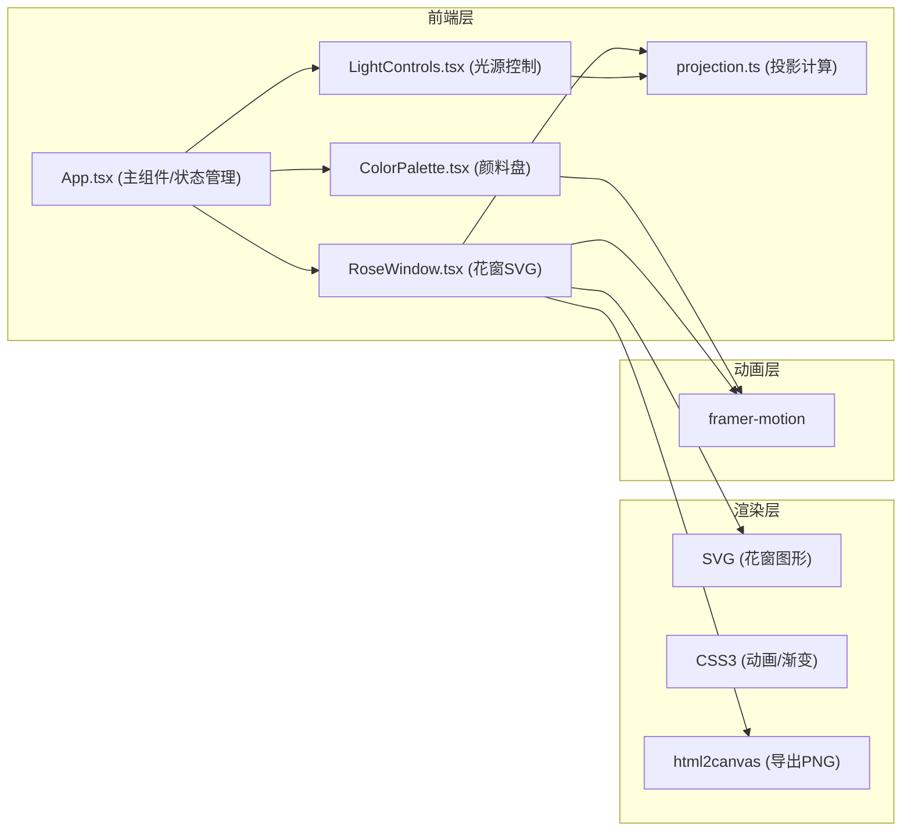

## 1. 架构设计



## 2. 技术描述

- **前端框架**：React@18 + TypeScript@5
- **构建工具**：Vite@5 + @vitejs/plugin-react
- **动画库**：framer-motion（流畅的交互动画与过渡效果）
- **导出工具**：html2canvas（DOM截图为PNG）
- **工具库**：uuid（分区唯一标识）
- **状态管理**：React useState/useCallback（轻量级状态，无需额外状态库）
- **样式方案**：CSS Modules / 内联样式（framer-motion驱动动画）
- **SVG渲染**：原生SVG绘制花窗图形与分区

## 3. 项目文件结构

```
auto241/
├── package.json
├── index.html
├── tsconfig.json
├── vite.config.js
├── src/
│   ├── App.tsx              # 主组件，状态管理与布局
│   ├── components/
│   │   ├── ColorPalette.tsx # 颜料盘组件
│   │   ├── RoseWindow.tsx   # 花窗SVG组件
│   │   └── LightControls.tsx# 光源控制滑块
│   └── utils/
│       └── projection.ts    # 投影计算工具函数
└── .trae/
    └── documents/
        ├── prd.md
        └── tech-arch.md
```

## 4. 数据模型

### 4.1 核心类型定义

```typescript
// 花窗分区颜色数据
interface WindowSection {
  id: string;        // 分区唯一ID
  index: number;     // 分区索引 0-11
  color: string | null; // 填充的玻璃颜色
}

// 光源参数
interface LightParams {
  altitude: number;  // 高度角 10-90 度
  azimuth: number;   // 方位角 0-360 度
}

// 投影光斑数据
interface ProjectionSpot {
  id: string;
  x: number;         // 投影X偏移(px)
  y: number;         // 投影Y偏移(px)
  color: string;     // 投影颜色(饱和度-40%)
  opacity: number;   // 投影透明度
  blur: number;      // 边缘模糊半径(px)
}

// 12色颜料盘
const GLASS_COLORS = [
  '#C41E3A', '#1E3A8A', '#059669', '#D97706',
  '#7C3AED', '#DC2626', '#0891B2', '#65A30D',
  '#EA580C', '#9333EA', '#0284C7', '#BE123C'
];
```

## 5. 核心算法

### 5.1 花窗分区生成算法
- 使用极坐标将圆形均匀划分为12个花瓣形扇区
- 每个扇区由两条径向线和两条圆弧（内/外）围成
- SVG path 命令组合实现花瓣形状

### 5.2 投影计算算法
- **位置偏移**：基于方位角(azimuth)计算X/Y方向偏移向量，结合高度角(altitude)正弦值计算投影距离
- **颜色处理**：将RGB颜色的饱和度降低40%（转换HSL→降低S→转回RGB）
- **模糊程度**：随高度角降低（光源更斜）而增加模糊半径

### 5.3 动画策略
- 颜色填充：framer-motion AnimatePresence + opacity/scale 溶解扩散
- 重置动画：staggerChildren 0.2秒间隔逐块褪色
- 滑块交互：whileHover/whileTap 微震动反馈

## 6. 性能优化方案

- **CSS硬件加速**：所有动画使用 transform 和 opacity 属性，触发GPU合成层
- **SVG优化**：避免不必要的重绘，使用 will-change 提示
- **防抖节流**：滑块拖动使用 requestAnimationFrame 同步更新投影
- **组件记忆化**：React.memo 包装子组件，避免无关重渲染
- **帧率监控**：目标稳定 55fps+，动画使用 transform3d 启用硬件加速
