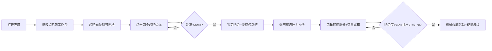

## 1. 产品概述
虚拟蒸汽朋克机械齿轮啮合与能量传导模拟游戏。用户扮演机械工坊工程师，通过拖拽连接不同材质尺寸的齿轮、调节蒸汽压力，构建传动链条，观察真实物理响应，最终驱动机械心脏模型跳动。

- 核心价值：沉浸式蒸汽朋克美学 + 齿轮啮合物理仿真 + 创意工坊玩法
- 目标用户：机械爱好者、蒸汽朋克文化粉丝、物理模拟游戏玩家

## 2. 核心特性

### 2.1 功能模块
1. **工坊工作台**：800x600金属工作台，支持齿轮放置、拖拽、啮合
2. **齿轮库系统**：5种材质齿轮（铜质/黄铜/铁质/青铜/银质），拖拽放置、磁吸对齐
3. **齿轮啮合系统**：点击齿轮边缘锁定啮合，齿数比联动旋转，淡蓝色传动链
4. **蒸汽压力控制**：滑块调节压力（0-100），驱动齿轮转速线性增长
5. **热量累积系统**：摩擦生热、热晕粒子、过热振动效果
6. **机械心脏模型**：SVG心脏通过预设5齿轮链条连接，啮合度达标后规律跳动+能量波纹
7. **性能优化系统**：离屏Canvas缓存、粒子动态缩减、60fps稳定运行

### 2.2 页面详情
| 页面名称 | 模块名称 | 功能描述 |
|---------|---------|---------|
| 工坊主页 | 背景层 | 深铜色到机械灰渐变全屏背景 |
| 工坊主页 | 工作台 | 800x600钢灰色金属工作台+拉丝纹理+四角铆钉 |
| 工坊主页 | 齿轮库 | 左侧垂直条5种齿轮，支持HTML5拖拽+磁吸对齐 |
| 工坊主页 | 控制面板 | 右侧浮动面板（framer-motion动画），蒸汽压力滑块+按钮 |
| 工坊主页 | 齿轮渲染 | Canvas物理引擎，碰撞检测+啮合同步+粒子系统 |
| 工坊主页 | HUD显示 | 蒸汽压力值、啮合度百分比、热量指示条 |
| 工坊主页 | 机械心脏 | 中央SVG心脏，跳动动画+能量波纹扩散 |

## 3. 核心流程
用户从齿轮库拖拽齿轮到工作台 → 齿轮磁吸到网格 → 点击两个齿轮边缘锁定啮合 → 调节蒸汽压力滑块 → 观察齿轮联动与热量累积 → 啮合度>60%且压力40-70 → 机械心脏开始跳动

## 4. 用户界面设计

### 4.1 设计风格
- **主色调**：铜色#b87333、黄铜#c5a55a、铁灰#4d4d4d
- **点缀色**：蒸汽白#f5f5f0、管道红#8b0000、橙黄#d4a017、淡蓝#87ceeb、粉红#ff6b6b
- **背景渐变**：深铜色#4a2e1b → 机械灰#2a2a2a
- **按钮风格**：金属质感圆角，hover亮度提升1.3（0.2s），点击下沉0.95（0.1s）
- **字体**：机械风格数字字体，蒸汽朋克装饰性标题
- **布局**：三栏布局（左齿轮库-中工作台-右控制面板），工作台居中
- **动画**：framer-motion面板滑入滑出，啮合闪光，心脏跳动缩放，能量波纹扩散

### 4.2 页面设计概述
| 页面名称 | 模块名称 | UI元素 |
|---------|---------|--------|
| 工坊主页 | 齿轮库 | 深皮革纹理背景(#3e2723→#4e342e)、垂直排列齿轮预览、拖拽ghost效果 |
| 工坊主页 | 工作台 | 钢灰色#6b6b6b、间隔2px平行细线拉丝纹理(透明度0.15)、四角半圆铆钉(#3a2a1a半径15px) |
| 工坊主页 | 控制面板 | 浮动面板、framer-motion滑入、蒸汽滑块蓝→红渐变、按钮金属质感 |
| 工坊主页 | HUD | 左上角橙黄压力值、右上角啮合度%、中央热量条绿→红 |
| 工坊主页 | 齿轮渲染 | 高光渐变齿轮、中心铆钉、淡蓝传动链、橙→红热晕粒子 |
| 工坊主页 | 机械心脏 | SVG心形铜质外壳、中心凸轮轴、缩放1.0→1.05跳动、粉红#ff6b6b波纹 |

### 4.3 响应式
- Desktop优先设计，最小尺寸1024x768，齿轮缩放保持物理比例
- 窗口resize时自动适配布局比例
