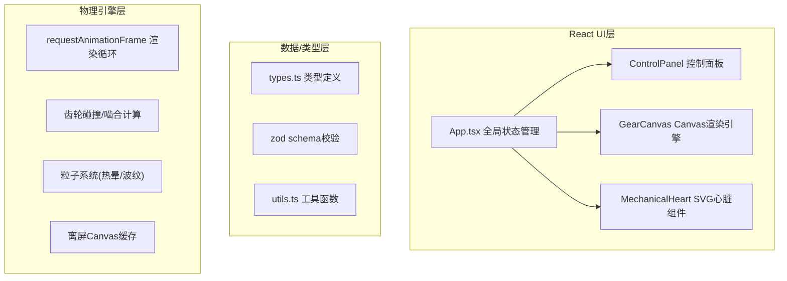

## 1. 架构设计
纯前端React应用，Canvas负责物理渲染，React管理UI状态，framer-motion处理动画，zod做数据校验



## 2. 技术说明
- 前端：React@18 + TypeScript@5 + Vite@5 + @vitejs/plugin-react
- 动画：framer-motion@11 + CSS3动画 + requestAnimationFrame
- 渲染：HTML5 Canvas 2D + SVG
- 数据：zustand全局状态（可选，按用户要求用React useState/useReducer
- 校验：zod Schema校验
- ID生成：uuid
- 无后端，纯前端模拟

## 3. 路由定义
| 路由 | 用途 |
|------|------|
| / | 工坊主页面 |

## 4. 文件结构
```
├── package.json
├── vite.config.js
├── tsconfig.json
├── index.html
└── src/
    ├── main.tsx          # ReactDOM入口
    ├── App.tsx           # 主应用组件
    ├── types.ts         # 类型定义
    ├── utils.ts         # 工具函数
    └── components/
        ├── GearCanvas.tsx     # Canvas渲染引擎
        ├── ControlPanel.tsx   # 控制面板+齿轮库
        └── MechanicalHeart.tsx  # 机械心脏SVG
```

## 5. 核心类型定义

```typescript
// Gear 齿轮
interface Gear {
  id: string;
  type: 'copper' | 'brass' | 'iron' | 'bronze' | 'silver';
  x: number;
  y: number;
  diameter: number;
  teeth: number;
  color: string;
  rotation: number;
  angularVelocity: number;
  meshedWith: string[];
  baseSpeed: number;
}

// Particle 粒子
interface Particle {
  id: string;
  x: number;
  y: number;
  vx: number;
  vy: number;
  life: number;
  maxLife: number;
  size: number;
  color: string;
  type: 'heat' | 'ripple';
}

// MeshConnection 啮合连接
interface MeshConnection {
  gearAId: string;
  gearBId: string;
  ratio: number;
}

// GameState 全局状态
interface GameState {
  gears: Gear[];
  steamPressure: number;
  connections: MeshConnection[];
  heatLevel: number;
  meshPercentage: number;
  isPanelOpen: boolean;
  heartBeatActive: boolean;
}
```

## 6. 物理引擎说明

### 6.1 齿轮啮合计算
- 两齿轮中心距 = (dA/2 + dB/2) 判定碰撞
- 点击两齿轮边缘距离<20px触发锁定
- 齿数比计算：ωA/ωB = TB/TA（反比关系）
- 角度同步：rotationB = rotationA * (TA/TB) * direction

### 6.2 蒸汽压力驱动
- 基础转速 = pressure / 10 * 0.5 rad/s
- 啮合齿轮按齿数比联动
- 热量累积 = 转速 * 时间系数 - 自然冷却

### 6.3 粒子系统
- 热晕粒子数 = min(转速*0.5, 30)，齿轮>12且链条>3时上限10
- 粒子生命周期 ≤ 1.5s
- 大小 2px → 0px 渐变消失

### 6.4 性能优化
- 齿轮静态纹理缓存到离屏Canvas
- 仅更新旋转矩阵不重绘齿轮细节
- 粒子池复用避免GC
- requestAnimationFrame循环中仅执行必要计算

## 7. 机械心脏触发条件
- 总啮合度 > 60%
- 蒸汽压力 ∈ [40, 70]
- 跳动频率：60-80 BPM，根据压力线性映射
- 缩放动画：1.0 → 1.05，持续0.2s
- 粉红#ff6b6b能量波纹向外扩散
