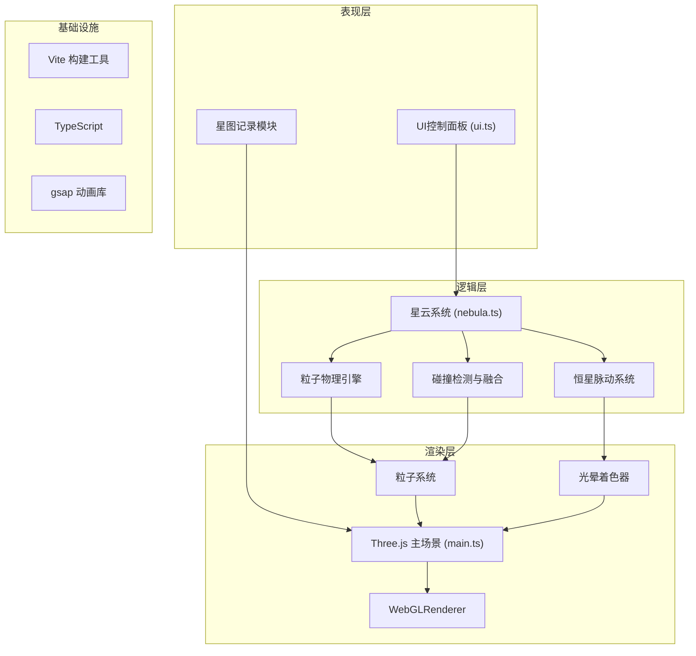

## 1. 架构设计
纯前端3D可视化项目，采用模块化分层架构。



## 2. 技术描述
- 前端框架：Three.js @0.160.0 + TypeScript + Vite @5
- 动画库：gsap 用于平滑参数过渡
- 构建工具：Vite 5.x，启用 TypeScript 插件
- 无后端、无数据库，纯前端单页应用

## 3. 文件结构
| 文件路径 | 职责 |
|----------|------|
| `package.json` | 项目依赖与脚本配置 |
| `vite.config.js` | Vite 构建配置，TypeScript 插件，base='/' |
| `tsconfig.json` | TypeScript 严格模式，target ES2020，module ESNext |
| `index.html` | 入口页面，挂载 id 为 app 的 div |
| `src/main.ts` | 初始化 Three 场景、相机、渲染器，主循环与性能监控 |
| `src/nebula.ts` | 尘埃云粒子生成、碰撞检测、融合动画、恒星生成逻辑 |
| `src/ui.ts` | 控制面板 DOM 元素创建、滑块事件绑定、参数同步 |

## 4. 核心数据模型

### 4.1 粒子数据结构
```typescript
interface Particle {
  position: THREE.Vector3;
  velocity: THREE.Vector3;
  size: number;
  baseOpacity: number;
  color: THREE.Color;
  targetColor: THREE.Color;
  nebulaId: number; // 0=左云, 1=右云
  isStellarWind: boolean;
  life: number; // 0-1, 恒星风粒子寿命
  maxLife: number;
}
```

### 4.2 星云配置
```typescript
interface NebulaConfig {
  density: number;      // 0.5 - 3.0
  collisionSpeed: number; // 0.2 - 2.0
  pulseFrequency: number; // 0.2 - 2.0
}
```

### 4.3 恒星状态
```typescript
interface StarState {
  exists: boolean;
  position: THREE.Vector3;
  pulsePhase: number;
  pulseRadius: number; // 40 - 80
  coreDensity: number;
  collisionCount: number;
}
```

## 5. 性能优化策略
1. **粒子池化**：复用粒子对象，避免频繁创建销毁
2. **视锥剔除**：远距离粒子降低更新频率（每2帧更新一次）
3. **粒子总数上限**：1200个，超过时自动降低远距离粒子绘制频率
4. **Geometry 合并**：使用 Points + BufferGeometry 批量渲染
5. **帧率监控**：main.ts 中集成性能监控，低于30fps时自动降质
6. **颜色插值优化**：预计算颜色渐变，避免每帧实时混合计算

## 6. 关键技术实现点
1. **碰撞检测**：基于两云中心点距离 + 粒子空间密度采样
2. **颜色融合**：粒子在重叠区域时颜色从原色向混合色(#7b1fa2)过渡
3. **恒星生成阈值**：核心区域粒子密度超过阈值时触发生成
4. **脉动效果**：使用正弦函数驱动光晕半径与亮度变化
5. **恒星风喷射**：脉动峰值时沿径向发射小粒子，带初速度与衰减
6. **拖拽交互**：Raycaster 检测星云命中，鼠标位置映射到世界坐标
7. **星图截图**：使用 renderer.domElement.toDataURL() 捕获画面，Canvas 合成信息卡片
