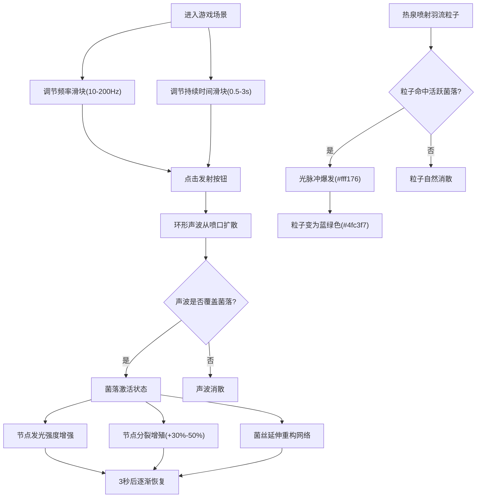

## 1. 产品概述

虚拟深海热泉硫磺菌群落与声波喂养模拟游戏，让用户扮演深海微生物生态学家，通过发射不同频率的声波脉冲刺激硫磺菌群落生长，观察生态系统的能量传导与共生反馈。

- 核心目标：沉浸式体验深海热泉生态系统的微观世界，寓教于乐地展示声波对微生物群落的影响
- 目标用户：对海洋生物学、生态学、交互艺术感兴趣的学生、研究人员和爱好者

## 2. 核心功能

### 2.1 用户角色

| 角色 | 注册方式 | 核心权限 |
|------|----------|----------|
| 生态学家 | 无需注册，直接进入 | 调节声波参数、发射声波脉冲、观察菌落响应 |

### 2.2 功能模块

1. **主场景页面**：深海热泉喷口渲染、硫磺菌群落分布、全局背景渐变
2. **声波控制面板**：频率滑块(10Hz-200Hz)、持续时间滑块(0.5s-3s)、发射按钮
3. **热泉喷口系统**：SVG岩石喷口、Canvas粒子羽流、声波环形动画、频率响应
4. **硫磺菌群落系统**：菌丝节点网络、分裂生长、发光强度变化、拓扑结构演变
5. **能量传导反馈**：羽流粒子与活跃菌落的交互、光脉冲爆发、粒子颜色变化

### 2.3 页面详情

| 页面名称 | 模块名称 | 功能描述 |
|----------|----------|----------|
| 主场景 | 深海背景 | 从#0b0e14到#c89b3c的全屏垂直渐变，营造深海热泉氛围 |
| 主场景 | 热泉喷口 | SVG绘制灰色岩石圆柱(高300px，下方中央)，顶部喷射半透明橙色粒子羽流(30-60粒子，透明度0.2-0.7) |
| 主场景 | 声波发射 | 以喷口为中心的环形扩散波(#45a29e→#66fcf1渐变，半径30px→300px) |
| 主场景 | 硫磺菌丛 | 喷口周围3-6个菌丛，每丛8-15个菌丝节点(圆形6-12px，#f0e68c)通过细线连接 |
| 控制面板 | 频率滑块 | 范围10Hz-200Hz，步长1Hz，宽200px，半透明玻璃效果，悬停放大1.1倍 |
| 控制面板 | 持续时间滑块 | 范围0.5s-3s，宽200px，圆角矩形玻璃背景 |
| 控制面板 | 发射按钮 | 60px×30px圆角矩形，半透明玻璃效果，点击触发声波 |
| 交互系统 | 菌落分裂 | 声波覆盖时节点数增加30%-50%，透明度随频率升高增加，3秒后恢复 |
| 交互系统 | 菌丝延伸 | 激活后随机3-5节点向外延伸新菌丝线(#ffd54f，线宽1px，长30-80px) |
| 交互系统 | 能量反馈 | 活跃菌落(5秒内)被羽流粒子命中时爆发光脉冲(#fff176，半径20px，0.5s)，粒子变蓝绿(#4fc3f7) |

## 3. 核心流程

用户进入游戏后，首先观察到深海热泉喷口及其周围的硫磺菌群落。用户通过调节下方的频率和持续时间滑块来设定声波参数，然后点击发射按钮。声波以环形方式从喷口扩散，接触到的菌落会被激活：节点发光、分裂增殖、菌丝延伸。同时，热泉持续喷射羽流粒子，当粒子与活跃菌落相遇时，会触发额外的光脉冲能量反馈。用户可以反复调整参数并发射声波，观察不同频率对菌落生态的影响。

## 4. 用户界面设计

### 4.1 设计风格

- **主色调**：深海黑(#0b0e14)、硫磺黄(#c89b3c)、金黄(#f0e68c/#ffd54f/#fff176)、蓝绿(#45a29e/#66fcf1/#4fc3f7)、橙红(粒子羽流)
- **按钮风格**：圆角矩形，半透明玻璃磨砂效果(backdrop-filter: blur)，边框1px半透明白色，悬停时scale(1.1)和平滑颜色过渡(0.3s)
- **字体**：全局使用monospace等宽字体，营造科学仪器的专业感
- **布局风格**：单页全屏沉浸设计，喷口居下中央，控制面板水平排列在喷口正下方
- **视觉风格**：深海暖色调光影，流光溢彩的粒子与发光效果，模拟真实深海热泉口的生物发光奇观

### 4.2 页面设计概览

| 页面名称 | 模块名称 | UI元素 |
|----------|----------|--------|
| 主场景 | 背景渐变 | 垂直渐变#0b0e14→#c89b3c，全屏无滚动 |
| 主场景 | 热泉喷口SVG | 灰色渐变岩石圆柱(底部宽顶部窄)，顶部开口有发光内圈 |
| 主场景 | 粒子Canvas | 覆盖全屏的透明Canvas层，2-6px粒子带10px拖尾 |
| 主场景 | 菌落SVG层 | 透明SVG覆盖层，circle节点+path连线，悬停scale(1.1) |
| 主场景 | 声波动画 | SVG环形扩散，透明度递减，渐变填充 |
| 控制面板 | 滑块容器 | 水平flex排列，半透明白色玻璃背景，圆角8px，padding 16px |
| 控制面板 | 滑块标签 | monospace小字体，黄色文字，显示当前数值 |
| 控制面板 | 发射按钮 | 橙黄色渐变文字，白色半透明边框，悬停背景变实 |

### 4.3 响应式设计

- **设计优先**：Desktop-first，以1920×1080为基准设计
- **移动适配**：使用vmin/vw单位确保元素在小屏上按比例缩放，滑块宽度自适应为屏幕宽度的60%
- **触摸优化**：按钮最小点击区域44×44px，滑块增加触摸区域，双击触发声波作为快捷操作

### 4.4 性能预算

- **帧率目标**：≥30fps，理想60fps
- **粒子上限**：≤80个羽流粒子
- **节点上限**：≤200个菌丝节点总数
- **动画驱动**：单一requestAnimationFrame循环集中管理，避免多个定时器
- **内存优化**：粒子对象池复用，节点超出上限时移除最老节点，动画完成立即清理引用
