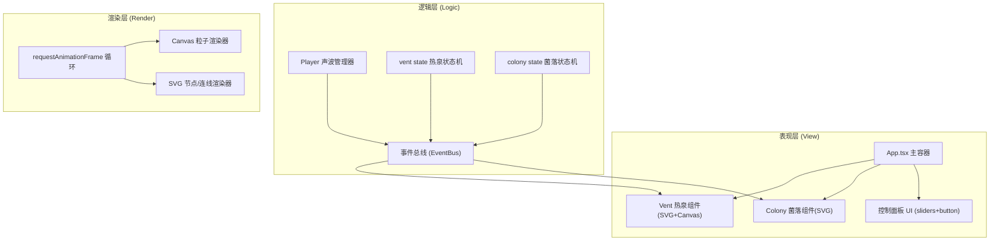
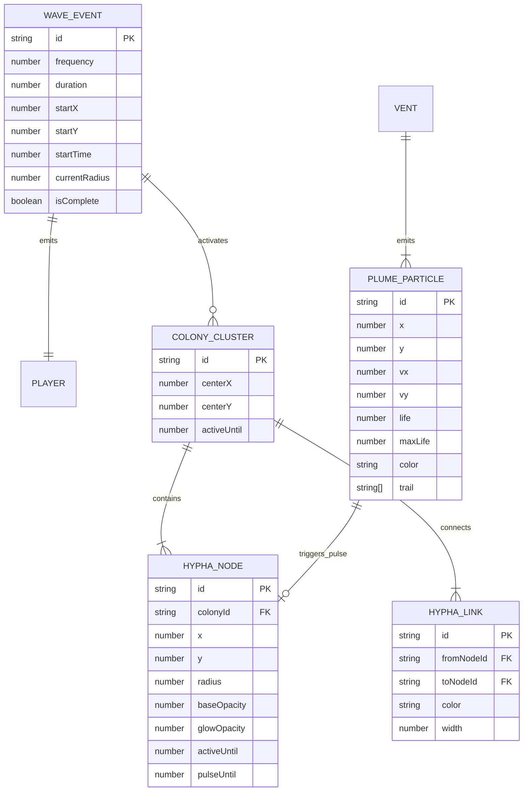

## 1. 架构设计



## 2. 技术栈说明

- **前端框架**：React@18 + TypeScript@5 + Vite@5
- **构建工具**：Vite@5 + @vitejs/plugin-react
- **动画库**：framer-motion@11 (UI过渡) + gsap@3 (时间线动画)
- **音频引擎**：howler@2 (可选的声波音效)
- **3D库**：three@0.160.0 (预留，当前使用Canvas 2D实现粒子)
- **工具库**：uuid@9 (唯一ID生成)
- **包管理器**：npm
- **初始化方式**：`npm init vite-init@latest . -- --template react-ts --force`

## 3. 路由定义

| 路由 | 用途 |
|------|------|
| / | 主场景：深海热泉硫磺菌群落模拟器单页应用 |

单页应用无多路由跳转，所有交互在同一画布内完成。

## 4. 文件结构与模块定义

```
project-root/
├── package.json              # 依赖声明与脚本
├── vite.config.js            # Vite构建配置(React插件，base='/')
├── tsconfig.json             # TS严格模式，target:ESNext，moduleResolution:bundler
├── index.html                # HTML入口，div#root，全局样式清零
└── src/
    ├── main.tsx              # ReactDOM.createRoot渲染App
    ├── App.tsx               # 主容器组件，布局+事件总线+状态协调
    ├── player.ts             # Player类：声波发射与频率管理
    ├── vent.tsx              # Vent组件：热泉喷口SVG + Canvas粒子羽流
    ├── colony.tsx            # Colony组件：菌丝节点SVG网络
    └── types/                # (可选) 共享类型定义
        └── index.ts
```

### 模块职责

#### player.ts — 声波管理器 (纯逻辑类，无JSX)
- 导出 `Player` 类
- 属性：`frequency: number`，`duration: number`，`listeners: Map<string, Function[]>`
- 方法：
  - `constructor()` — 初始化事件监听表
  - `setFrequency(freq: number)` — 设置当前频率
  - `setDuration(dur: number)` — 设置持续时间
  - `emitWave(freq?: number, dur?: number)` — 触发wave:emitted事件
  - `on(event: string, cb: Function)` — 订阅事件
  - `off(event: string, cb: Function)` — 取消订阅
- 事件类型：
  - `'wave:emitted'` → payload: `{ frequency, duration, timestamp, centerX, centerY }`
  - `'wave:progress'` → payload: `{ radius, progress }`
  - `'wave:complete'` → payload: `{ frequency, duration }`

#### vent.tsx — 热泉喷口组件
- 导出 `Vent` React.FC组件
- Props接口：
  ```typescript
  interface VentProps {
    centerX: number;       // 喷口中心X(相对画布)
    centerY: number;       // 喷口顶部Y坐标
    width?: number;        // 喷口底部宽度
    height?: number;       // 喷口高度(默认300)
    intensity: number;     // 喷发强度0-1，影响粒子速度/数量
    frequency: number;     // 当前声波频率，影响颜色
    waves: WaveEvent[];    // 当前进行中的声波列表
    onVentReady?: (info) => void;  // 喷口初始化回调
  }
  ```
- 内部结构：
  - SVG层：绘制岩石圆柱、喷口内圈发光
  - Canvas层(useRef)：独立粒子系统，粒子对象池
  - useEffect：监听waves数组，当新声波加入时改变intensity和色调
- 粒子系统：Particle类，position/velocity/lifetime/trail[]，Canvas2D绘制拖尾

#### colony.tsx — 硫磺菌群落组件
- 导出 `Colony` React.FC组件
- Props接口：
  ```typescript
  interface ColonyProps {
    waves: WaveEvent[];                // 进行中的声波
    ventCenter: { x: number; y: number }; // 喷口坐标，用于距离判定
    plumes: PlumeParticle[];           // 热泉羽流粒子快照，用于能量反馈
  }
  ```
- 内部数据结构：
  ```typescript
  interface HyphaNode {
    id: string;
    x: number; y: number;
    colonyId: string;
    radius: number;       // 6-12px
    baseOpacity: number;  // 0.4-0.8
    glowOpacity: number;  // 激活时叠加
    activeUntil: number;  // 时间戳，活跃截止时间
    pulseUntil: number;   // 光脉冲截止时间
  }
  interface HyphaLink {
    id: string;
    from: string;  // nodeId
    to: string;    // nodeId或colonyId
    color: string;
    width: number;
    createdAt: number;
  }
  interface ColonyCluster {
    id: string;
    centerX: number; centerY: number;
    nodes: HyphaNode[];
    links: HyphaLink[];
    activeUntil: number;
  }
  ```
- 核心逻辑(useEffect监听waves变化)：
  1. 对每个wave计算覆盖范围内的colony
  2. 命中colony时：节点分裂(30%-50%新增)、glowOpacity增强、activeUntil=now+5s
  3. 随机选3-5节点延伸新links，连接最近节点或其他colony
- 渲染：SVG `<circle>` 节点 + `<path>` 连线，发光用filter: url(#glow)

#### App.tsx — 主应用容器
- 布局：全屏flex-col，背景渐变，相对定位叠放Canvas→SVG菌落→SVG喷口→UI控件
- 状态：
  - `frequency: number` (10-200)
  - `duration: number` (0.5-3)
  - `activeWaves: WaveEvent[]`
  - `plumeParticles: PlumeParticle[]` (从vent同步的只读快照)
  - `ventIntensity: number`
- 职责：
  - 创建Player实例(useRef)
  - 订阅Player的wave事件，更新activeWaves
  - 渲染Vent组件与Colony组件并传递waves
  - 渲染两个滑块与发射按钮(framer-motion做hover:scale(1.1))
  - 单一requestAnimationFrame循环驱动所有动画帧

## 5. 核心数据模型



## 6. 性能优化策略

1. **React.memo**：Vent、Colony、滑块子组件均用React.memo包裹，props浅比较减少重渲染
2. **useMemo/useCallback**：计算衍生数据(如节点SVG元素列表)、事件处理函数均缓存
3. **单一rAF循环**：App.tsx中统一管理一个requestAnimationFrame，通过ref传递给Vent/Colony各自的更新函数，避免多rAF竞争
4. **对象池**：羽流粒子使用对象池复用，移除的粒子reset属性而非销毁
5. **Canvas分层**：粒子系统在独立Canvas(独立ref)上绘制，避免与SVG重排耦合
6. **节点裁剪**：Colony总节点数≥200时，FIFO移除最早分裂出的节点
7. **事件节流**：滑块onChange用throttle(16ms)避免高频状态更新
8. **清理机制**：组件卸载时取消rAF、清除Howler实例、移除Player监听器
