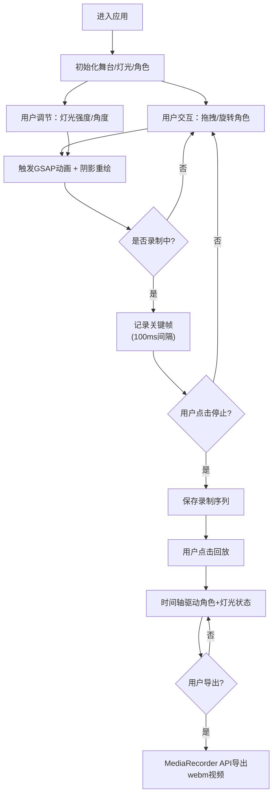

## 1. 产品概述

虚拟皮影戏交互表演与自动录播应用，让民间艺术爱好者通过数字化方式复现传统皮影戏体验。用户可通过拖拽和旋转彩绘兽皮剪影角色，配合背景幕布与灯光调节，实时演绎经典民间故事片段，并自动生成带有唱词字幕的表演影片。

- **核心目标**：传承非遗文化，让传统皮影戏以现代化数字交互形式重焕生机
- **目标用户**：民间艺术爱好者、教育工作者、文化创意从业者
- **市场价值**：打造非遗数字化体验平台，降低皮影戏表演门槛，支持教学、创作与分享

## 2. 核心功能

### 2.1 用户角色

| 角色 | 注册方式 | 核心权限 |
|------|----------|----------|
| 表演用户 | 无需注册，直接使用 | 自由操控角色、调节灯光、录制表演、回放导出 |

### 2.2 功能模块

1. **皮影舞台**：半透明丝质幕布背景、深棕色木纹边框、双点光源系统
2. **角色管理**：3个经典皮影角色（唐僧/孙悟空/猪八戒），SVG多关节绘制
3. **交互控制**：角色拖拽移动、两指旋转、边界限制、角度指示圆环
4. **灯光系统**：主灯（暖黄）+副灯（冷白），强度/角度可调，动态阴影投射
5. **表演录制**：关键帧记录（100ms/帧）、录制时长显示、脉冲录制按钮
6. **回放导出**：时间轴回放、速度调节（0.5x/1x/2x）、轨道拖动跳转、webm视频导出

### 2.3 页面详情

| 页面名称 | 模块名称 | 功能描述 |
|----------|----------|----------|
| 主表演舞台 | 幕布渲染区 | Canvas绘制木纹边框，SVG渐变幕布背景，居中80%宽70%高 |
| 主表演舞台 | 灯光控制面板 | 左侧固定宽120px毛玻璃面板，主灯/副灯强度+角度滑块 |
| 主表演舞台 | 角色层 | 3个可交互皮影角色，姓名悬浮标签，拖拽旋转交互 |
| 主表演舞台 | 阴影层 | 基于灯光参数实时计算的半透明椭圆阴影投射到幕布 |
| 主表演舞台 | 录制控制条 | 底部固定高60px控制条，录制/停止/回放/速度/导出按钮组 |
| 主表演舞台 | 录制指示器 | 右上角MM:SS红色时长显示，左下角脉冲圆形录制按钮 |

## 3. 核心流程

用户进入应用 → 看到初始舞台（幕布+灯光+三个角色）→ 拖动/旋转角色调整位置 → 调节主副灯强度和角度营造氛围 → 点击红色录制按钮开始表演（关键帧每100ms记录）→ 实时表演演绎故事片段 → 再次点击停止录制 → 点击回放按钮按时间轴重演（可调速/拖动跳转）→ 满意后导出为带背景音乐的webm视频文件。

## 4. 用户界面设计

### 4.1 设计风格

- **主色调**：旧绢黄(#e8d5b7)、深赭石(#8d6e63)、柔白(#fff8e7)、墨黑(#212121)
- **辅助色**：主灯暖黄(#ffd54f)、副灯冷白(#e3f2fd)、角色色(唐僧#ffcc80/悟空#ffe082/八戒#ef9a9a)
- **按钮风格**：圆形/圆角方形，毛玻璃质感，hover放大1.1倍+上浮5px，点击弹性缩放0.2s
- **字体**：标题用Ma Shan Zheng（毛笔书法感），正文用Noto Serif SC（宋体衬线），营造古籍典雅氛围
- **布局风格**：全屏沉浸式舞台居中，左右侧控制面板浮动，底部控制条固定
- **装饰元素**：Canvas绘制木纹边框纹理，径向渐变背景，半透明毛玻璃面板，微噪点质感

### 4.2 页面设计概览

| 页面名称 | 模块名称 | UI元素 |
|----------|----------|--------|
| 主表演舞台 | 背景层 | radial-gradient(#f5f0e0 → #d4c4a8)，全屏铺满 |
| 主表演舞台 | 幕布层 | 80%宽70%高居中，linear-gradient(#f5e6c8 → #d4a574)半透明，2px木纹边框，5px间隔 |
| 主表演舞台 | 灯光面板 | 左侧120px宽毛玻璃background:rgba(255,248,231,0.7)，box-shadow内阴影，滑块步长1%/1° |
| 主表演舞台 | 角色层 | SVG多关节(头/身/四肢)，150px高，下方#3e2723半透明姓名标签，选中时20px半径#bcaaa4角度指示圆环 |
| 主表演舞台 | 阴影层 | 幕布上半透明黑色椭圆，模糊半径10px@50%/20px@100%，位置随灯光角度偏移 |
| 主表演舞台 | 录制按钮 | 左下角直径40px红色圆，脉冲闪烁动画(scale+opacity) |
| 主表演舞台 | 时长显示 | 右上角红色MM:SS字体，录制时显示 |
| 主表演舞台 | 底部控制条 | 高60px居中，按钮组(播放/暂停/速度/进度条/导出)，GSAP交互动画 |

### 4.3 响应式设计

- **设计优先**：Desktop-first（桌面端优先）
- **断点**：768px
- **<768px适配**：幕布和控制面板纵向堆叠布局，控制面板改为顶部/底部自适应高度，角色尺寸缩放0.7倍，触控交互优先
- **触控优化**：两指捏合旋转手势，触摸事件优先，触控热区≥44x44px

### 4.4 动画规范

- **角色拖拽**：GSAP ease:"power2.out"缓动跟随，延迟≤50ms
- **角色旋转**：0.1s平滑插值过渡
- **按钮hover**：scale:1.1 + y:-5px，时长0.2s
- **按钮点击**：elastic缩放反馈，0.2s
- **录制按钮**：脉冲闪烁 @keyframes pulse(scale 1~1.2, opacity 1~0.6)
- **页面入场**：幕布渐显 + 角色依次从底部fadeInUp交错(stagger:0.1s)
