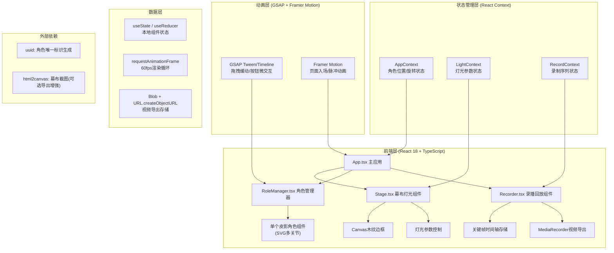

## 1. 架构设计



## 2. 技术描述

- **前端框架**：React 18 + TypeScript 5（严格模式）
- **构建工具**：Vite 5 + @vitejs/plugin-react（React JSX 自动转换 react-jsx）
- **动画库**：GSAP 3（高性能拖拽缓动、时间轴动画链）+ Framer Motion（页面入场、脉冲动画）
- **唯一标识**：uuid v9
- **截图工具**：html2canvas（辅助视频导出）
- **视频导出**：浏览器原生 MediaRecorder API（webm格式）
- **样式方案**：原生 CSS Modules + CSS 变量（无需额外CSS框架，保持精简）
- **初始化方式**：vite-init 模板 react-ts

## 3. 路由定义

| 路由 | 用途 |
|------|------|
| / | 皮影戏主表演舞台（单页应用，无多路由） |

## 4. 数据类型定义

```typescript
// 角色状态
interface RoleState {
  id: string;           // uuid生成
  name: '唐僧' | '孙悟空' | '猪八戒';
  color: string;        // #ffcc80 / #ffe082 / #ef9a9a
  x: number;            // 位置X (100-700px)
  y: number;            // 位置Y (100-500px)
  rotation: number;     // 旋转角度 (0-360°)
  joints: {             // 4个关节相对位置
    head: { offsetX: number; offsetY: number; rotation: number };
    body: { offsetX: number; offsetY: number; rotation: number };
    leftArm: { offsetX: number; offsetY: number; rotation: number };
    rightArm: { offsetX: number; offsetY: number; rotation: number };
    leftLeg: { offsetX: number; offsetY: number; rotation: number };
    rightLeg: { offsetX: number; offsetY: number; rotation: number };
  };
}

// 灯光参数
interface LightState {
  id: 'main' | 'secondary';
  x: number;            // 位置X
  y: number;            // 位置Y
  intensity: number;    // 强度 (0-100%)
  angle: number;        // 角度 (0-360°)
  color: string;        // #ffd54f / #e3f2fd
  name: string;         // 主灯 / 副灯
}

// 关键帧（录制用）
interface KeyFrame {
  timestamp: number;    // ms 相对录制开始
  roles: RoleState[];   // 所有角色快照
  lights: LightState[]; // 所有灯光快照
}

// 录制状态
interface RecordState {
  isRecording: boolean;
  isPlaying: boolean;
  startTime: number | null;
  duration: number;     // ms
  keyframes: KeyFrame[];
  playbackSpeed: 0.5 | 1 | 2;
  currentPlaybackTime: number;
}

// 阴影参数（计算用）
interface ShadowParams {
  offsetX: number;
  offsetY: number;
  blurRadius: number;   // 10px@50% ~ 20px@100%
  opacity: number;
}
```

## 5. 组件文件结构与调用关系

```
src/
├── App.tsx                 [顶层容器]
│   ├── 初始化Context/状态
│   ├── 编排Stage + RoleManager + Recorder布局
│   └── 数据流向：交互事件→状态更新→GSAP动画→阴影重绘
│
├── Stage.tsx               [幕布灯光组件]
│   ├── 接收：LightState[]灯光参数
│   ├── 渲染：Canvas木纹边框 + SVG渐变幕布 + 阴影投射层
│   └── 回调：onLightChange调整参数→通知App重算阴影
│
├── RoleManager.tsx         [角色管理器]
│   ├── 接收：RoleState[]角色数组 + 边界限制
│   ├── 渲染：3个皮影RoleSVG组件 + 姓名标签 + 角度指示圆环
│   ├── 交互：鼠标/触控拖拽(mousedown→mousemove→mouseup)、两指捏合旋转
│   ├── GSAP：拖拽缓动power2.out、旋转0.1s平滑插值
│   └── 方法：addAnimation(timestamp, roleState) → 记录关键帧
│
├── Recorder.tsx            [录播回放组件]
│   ├── 接收：当前RoleState/LightState快照
│   ├── 录制：setInterval 100ms采集关键帧推入keyframes数组
│   ├── 回放：按playbackSpeed遍历keyframes + requestAnimationFrame插值
│   ├── 导出：captureStream() + MediaRecorder导出video/webm
│   └── UI：录制按钮(脉冲)、时长显示MM:SS、回放控制、速度切换、进度轨道
│
├── components/
│   ├── RoleSVG.tsx         [单个皮影角色SVG]
│   │   ├── 头(椭圆+五官)、身(长袍轮廓)、四肢(矩形+关节圆)
│   │   ├── transform-origin中心旋转
│   │   └── height=150px固定
│   ├── LightControl.tsx    [单个灯光控制面板]
│   │   ├── 滑块：intensity(0-100 step1)、angle(0-360 step1)
│   │   └── 光源图标指示当前角度
│   ├── RecordButton.tsx    [录制脉冲按钮]
│   ├── PlaybackControls.tsx [回放控制条]
│   └── WoodTextureCanvas.tsx [木纹边框canvas]
│
├── hooks/
│   ├── useDrag.ts          [拖拽Hook：边界限制+GSAP缓动]
│   ├── usePinchRotate.ts   [捏合旋转Hook：两指触控手势]
│   ├── useRecord.ts        [录制Hook：关键帧采集+时间轴管理]
│   └── useShadowCalc.ts    [阴影计算Hook：灯光→角色→阴影参数]
│
├── utils/
│   ├── shadowMath.ts       [阴影位置/模糊数学计算]
│   ├── frameInterpolation.ts [关键帧线性插值]
│   ├── timeFormat.ts       [MM:SS格式化]
│   └── exportVideo.ts      [MediaRecorder封装]
│
├── types/
│   └── index.ts            [上述所有TypeScript类型定义]
│
├── styles/
│   ├── variables.css       [CSS颜色/尺寸变量]
│   ├── global.css          [全局重置+字体+径向渐变背景]
│   └── glass.css           [毛玻璃面板样式类]
│
├── main.tsx                [入口]
└── vite-env.d.ts           [Vite类型声明]
```

## 6. 数据流向详细说明

**用户交互数据流：**
```
鼠标/触控事件
    ↓ (useDrag / usePinchRotate)
RoleManager捕获指针ID → 计算deltaX/deltaY/角度差
    ↓ (GSAP to() ease: "power2.out")
平滑更新RoleState.x/y/rotation（边界clamp 100-700 / 100-500）
    ↓ (App Context Provider)
Stage组件订阅角色状态 + useShadowCalc根据灯光计算阴影参数
    ↓ (CSS filter: blur + transform)
幕布上实时渲染半透明椭圆阴影
    ↓ (isRecording ?)
Recorder.addAnimation() 每100ms push关键帧 → keyframes[]
```

**回放数据流：**
```
用户点击播放按钮
    ↓
useRecord设置isPlaying=true, currentPlaybackTime=0
    ↓ (requestAnimationFrame循环)
按playbackSpeed递增currentPlaybackTime → 二分查找最近关键帧
    ↓ (frameInterpolation线性插值)
计算中间态RoleState/LightState → 更新App Context
    ↓ (与交互数据流后半段相同)
GSAP动画 + 阴影渲染同步重演
    ↓ (同时 captureStream())
MediaRecorder采集canvas+audio → 最终Blob下载webm
```

## 7. 性能优化策略

| 优化点 | 方案 | 目标指标 |
|--------|------|----------|
| 帧率 | requestAnimationFrame渲染 + GSAP硬件加速transform/opacity | 55-60FPS |
| 拖拽响应 | pointerEvents + passive event listener + 节流 | ≤50ms延迟 |
| 录制开销 | 浅拷贝对象快照 + 增量diff存储(可选RLE压缩) | ≤10ms/帧 |
| 阴影计算 | CSS filter blur(GPU合成) vs Canvas阴影(按需切换) | 0重排 |
| 导出编码 | MediaRecorder硬件加速+offscreen canvas(可用时) | ≤30s/3min视频 |
| 内存 | 关键帧窗口化缓存+导出时流式写入 | <500MB峰值 |

## 8. 配置文件规范

- **package.json**：dependencies含react/react-dom/typescript/vite@5/@vitejs/plugin-react/framer-motion/uuid/html2canvas/gsap，scripts.dev="vite"
- **vite.config.js**：plugins:[react()]，base:'/'
- **tsconfig.json**：strict:true，jsx:"react-jsx"，moduleResolution:"bundler"
- **index.html**：<div id="root"></div>，<link rel="stylesheet" href="/src/styles/global.css">
