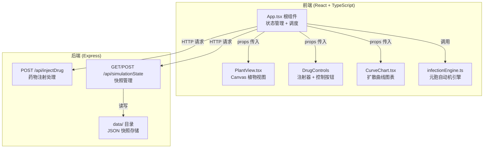

## 1. 架构设计



## 2. 技术栈说明

- **前端框架**：React 18 + TypeScript
- **构建工具**：Vite 5 + @vitejs/plugin-react
- **后端框架**：Express 4
- **动画库**：framer-motion
- **数据校验**：zod
- **文件处理**：multer
- **图像处理**：sharp
- **唯一标识**：uuid
- **状态管理**：React useState/useReducer（轻量场景，无需 zustand）

## 3. 项目文件结构

```
.
├── package.json
├── vite.config.js
├── tsconfig.json
├── index.html
├── src/
│   ├── App.tsx              # 根组件，全局状态管理
│   ├── components/
│   │   ├── PlantView.tsx    # 植物横截面可视化
│   │   ├── DrugControls.tsx # 药物注射控制组件
│   │   ├── CurveChart.tsx   # 扩散曲线图表
│   │   └── Toast.tsx        # Toast 提示组件
│   └── utils/
│       └── infectionEngine.ts # 病原体扩散模拟引擎
├── server/
│   └── index.js             # Express 后端服务
└── data/                    # 快照存储目录
```

### 数据流向

1. **模拟循环**：App.tsx → 调用 infectionEngine.simulateStep() → 获取新浓度矩阵 → 传递给 PlantView 渲染
2. **药物注射**：DrugControls → 用户点击 → 发送 POST /api/injectDrug → 返回药物浓度 → 更新状态
3. **快照管理**：控制按钮 → 调用后端 API → 读写 data/ 目录下的 JSON 文件
4. **曲线数据**：App.tsx 维护历史数据数组 → 传递给 CurveChart 渲染

## 4. API 定义

### 4.1 POST /api/injectDrug

**请求体：**
```typescript
interface InjectDrugRequest {
  x: number;           // 注射点 x 坐标（相对中心的像素偏移）
  y: number;           // 注射点 y 坐标
  concentration: number; // 药物浓度 0.1-0.8 mg/mL
  radius: number;      // 扩散初始半径
}
```

**响应：**
```typescript
interface InjectDrugResponse {
  drugMatrix: number[][]; // 50×50 药物浓度矩阵
  timestamp: number;
}
```

### 4.2 GET /api/simulationState

获取所有快照列表。

**响应：**
```typescript
interface SnapshotListResponse {
  snapshots: {
    id: string;
    timestamp: number;
    name: string;
  }[];
}
```

### 4.3 POST /api/simulationState

保存当前快照。

**请求体：**
```typescript
interface SaveSnapshotRequest {
  infectionMatrix: number[][];
  drugMatrix: number[][];
  curveData: {
    time: number;
    infectionRate: number;
    withDrug: boolean;
  }[];
  simulationTime: number;
}
```

**响应：**
```typescript
interface SaveSnapshotResponse {
  id: string;
  success: boolean;
}
```

### 4.4 GET /api/simulationState/:id

加载指定快照。

**响应：**
```typescript
interface LoadSnapshotResponse {
  id: string;
  infectionMatrix: number[][];
  drugMatrix: number[][];
  curveData: any[];
  simulationTime: number;
  success: boolean;
}
```

## 5. 核心数据模型

### 5.1 浓度矩阵

```typescript
// 50×50 网格，每个单元格存储浓度值 0-1
type ConcentrationMatrix = number[][];
```

### 5.2 模拟状态

```typescript
interface SimulationState {
  infectionMatrix: ConcentrationMatrix;
  drugMatrix: ConcentrationMatrix;
  simulationTime: number;  // 秒
  isRunning: boolean;
  selectedConcentration: number;
}
```

### 5.3 曲线数据点

```typescript
interface CurveDataPoint {
  time: number;           // 时间（秒）
  infectionRate: number;  // 感染面积占比（0-1）
}
```

## 6. 性能约束

- 模拟引擎步进：≤ 5ms（50×50 网格）
- UI 帧率：≥ 55fps
- Canvas 渲染：requestAnimationFrame 驱动
- 数据更新周期：每 50ms 一次模拟步进
