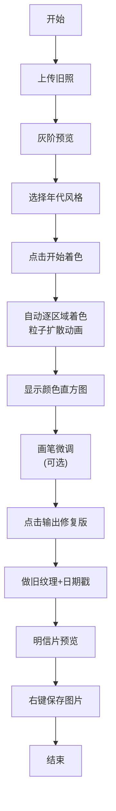

## 1. 产品概述

虚拟古旧相片自动着色与褪色记忆修复应用，让用户化身老照片修复师，通过上传黑白或褪色老照片，应用自动识别照片主体区域并根据历史时代色彩风格进行逐步着色，支持手动画笔微调，最终输出带有做旧纹理与日期戳的修复版照片。

- **核心价值**：为用户提供沉浸式的复古照片修复体验，结合自动着色算法与手动微调，还原历史照片的色彩记忆
- **目标用户**：怀旧爱好者、家谱研究者、设计师、对老照片修复感兴趣的普通用户

## 2. 核心功能

### 2.1 功能模块

1. **照片上传模块**：支持拖拽/点击上传 JPEG/PNG 图片，胶片转动加载动画，灰阶渲染预览
2. **年代风格选择模块**：1920s暖棕、1950s复古红绿、1980s暖黄偏紫三种年代色彩风格
3. **自动着色模块**：按区域（天空、植被、人物皮肤、建筑）逐步着色，粒子化扩散效果
4. **调色盘与画笔模块**：12种年代色块，蘸水笔光标，局部色相/饱和度微调，颜色晕染效果
5. **输出模块**：做旧纹理叠加、时间戳水印、明信片邮戳预览、支持右键另存

### 2.2 页面详情

| 页面名称 | 模块名称 | 功能描述 |
|---------|---------|---------|
| 主工作区 | 中央画板 | 640x480 SVG 画板，浅木纹边框，泛黄锈迹角贴，灰阶/彩色渲染 |
| 主工作区 | 调色盘区域 | 12种年代色块，4x3网格，点击光晕效果，使用时闪烁指示 |
| 主工作区 | 底部控制栏 | 上传旧照、开始着色、年代风格选择三个凹陷铜质按钮 |
| 主工作区 | 左侧笔触控制 | 笔触大小滑块（8px/16px/32px），蘸水笔光标切换 |
| 主工作区 | 颜色直方图 | 右下角动态柱状图，显示各颜色占比 |
| 上传模态框 | 胶片取景框 | 黑色圆角矩形，毛玻璃透光，拖拽/选择上传 |
| 输出预览 | 明信片邮戳 | 做旧效果、时间戳、铅笔文字，支持右键另存 |

## 3. 核心流程

用户上传黑白老照片 → 选择年代风格 → 点击开始着色 → 自动逐区域粒子化着色 → 用户用调色盘画笔微调局部 → 点击输出修复版 → 生成做旧纹理与日期戳 → 明信片预览并保存

## 4. 用户界面设计

### 4.1 设计风格

- **主色调**：旧纸米色 #f5e6d3 作为背景主色，深赭石褐 #8b5e3c 作为强调色
- **设计主题**：复古胶片 & 旧纸张美学，沉浸式老照片修复工作室氛围
- **按钮风格**：凹陷旧铜质风格，按下时机械咔嗒感，轻微下沉效果
- **字体方向**：衬线字体营造复古感，搭配手写风格字体增添人情味
- **布局风格**：中央画板式布局，两侧工具栏，底部操作区，类似暗房工作桌
- **质感层次**：木纹边框、泛黄锈迹、纸张纹理、毛玻璃效果多层叠加

### 4.2 页面设计概览

| 页面名称 | 模块名称 | UI 元素 |
|---------|---------|---------|
| 主工作区 | 背景 | 米色到赭石渐变，CSS伪元素叠加SVG噪点纹理 |
| 主工作区 | 中央画板 | 640x480 SVG，8px浅木纹边框，四角泛黄锈迹贴图 |
| 主工作区 | 调色盘 | 4x3网格色块，30px见方，点击半透明光晕溢出 |
| 主工作区 | 底部按钮 | 凹陷铜质按钮，悬停阴影隆起，点击scale缩放 |
| 主工作区 | 左側滑块 | 笔触大小调节，复古刻度样式 |
| 主工作区 | 直方图 | 右下角动态柱状图，高度跳动动画 |
| 上传模态框 | 取景框 | 黑色圆角矩形，四周毛玻璃透光 |
| 输出预览 | 明信片 | 邮戳边框，铅笔文字，做旧纹理 |

### 4.3 响应式

- **桌面优先**：768px 以上屏幕完整显示所有功能
- **尺寸约束**：宽高铺满可视区但不超过 100vh
- **交互适配**：桌面端鼠标精细操作，暂不考虑移动端触控

### 4.4 动效设计

- **着色动画**：6秒缓慢渐变，水彩颜料洇开粒子效果（3-5秒）
- **笔触晕染**：水滴状向外扩散，松开后1秒内边缘向内收拢
- **按钮交互**：悬停阴影隆起（box-shadow + 模糊 #8b5e3c40），点击 scale 0.95
- **过渡缓动**：统一 ease-out，持续时间 0.3s
- **调色盘反馈**：选中色块周期性闪烁
- **加载动画**：模拟胶片转动效果
