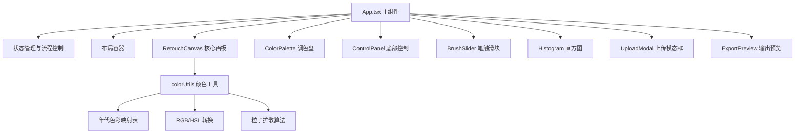

## 1. 架构设计

纯前端单页应用，采用 React 组件化架构，以 Canvas/SVG 为核心渲染层，结合 framer-motion 实现流畅动画效果。



## 2. 技术描述

- **前端框架**：React 18 + TypeScript 5
- **构建工具**：Vite 5
- **动画库**：framer-motion
- **文件上传**：react-dropzone
- **图片导出**：html2canvas
- **工具库**：uuid
- **样式方案**：styled-components / CSS Modules + framer-motion 动画

## 3. 文件结构

| 文件路径 | 用途说明 |
|---------|---------|
| `package.json` | 项目依赖与脚本配置 |
| `index.html` | 入口 HTML 文件，viewport meta 与全屏布局 |
| `tsconfig.json` | TypeScript 严格模式配置 |
| `vite.config.js` | Vite 基础配置，React 插件 |
| `src/App.tsx` | 主组件，组合布局与状态管理，协调着色流程 |
| `src/components/RetouchCanvas.tsx` | 核心画板组件，灰阶渲染、自动着色、笔触微调 |
| `src/components/ColorPalette.tsx` | 调色盘组件，12种年代色块 |
| `src/components/ControlPanel.tsx` | 底部控制面板，上传/着色/风格选择 |
| `src/components/UploadModal.tsx` | 上传模态框，胶片取景框样式 |
| `src/components/ExportPreview.tsx` | 输出预览，明信片邮戳样式 |
| `src/components/Histogram.tsx` | 颜色直方图组件 |
| `src/components/BrushSlider.tsx` | 笔触大小滑块 |
| `src/utils/colorUtils.ts` | 颜色处理工具，年代映射、色彩转换、粒子算法 |

## 4. 核心数据模型

### 4.1 照片状态

```typescript
interface PhotoState {
  originalImage: HTMLImageElement | null;
  grayscaleData: ImageData | null;
  coloredData: ImageData | null;
  isColored: boolean;
  colorProgress: number;
}
```

### 4.2 年代风格

```typescript
type EraStyle = '1920s' | '1950s' | '1980s';

interface EraColorPalette {
  sky: string;
  vegetation: string;
  skin: string;
  building: string;
  accentColors: string[];
}
```

### 4.3 笔触状态

```typescript
interface BrushState {
  size: 8 | 16 | 32;
  color: string;
  isActive: boolean;
  selectedColorIndex: number | null;
}
```

## 5. 核心算法说明

### 5.1 灰阶转换
- 使用标准亮度公式：`Gray = 0.299*R + 0.587*G + 0.114*B`
- 通过 Canvas getImageData 处理像素

### 5.2 区域识别与着色
- 基于亮度阈值分割天空（高亮）、植被（中绿调）、皮肤（中暖调）、建筑（中低亮）
- 使用 mask 层叠加颜色，支持透明度混合
- 粒子扩散效果：以随机游走方式向周围像素渗透

### 5.3 笔触晕染
- 鼠标路径记录，圆形笔触
- 高斯模糊式扩散算法
- 松开后 1 秒内边缘收拢效果

### 5.4 做旧效果
- 随机细纹生成（Perlin noise 简化版）
- 深色噪点叠加
- 半透明时间戳水印

## 6. 性能优化策略

- **Canvas 离屏渲染**：使用双缓冲机制，减少重绘
- **requestAnimationFrame**：所有动画统一帧调度
- **像素批处理**：着色算法按区块处理，避免单帧计算量过大
- **内存管理**：及时释放 ImageData，避免内存泄漏
- **帧率目标**：50fps 以上，主流浏览器 Chrome/Firefox/Edge 兼容
