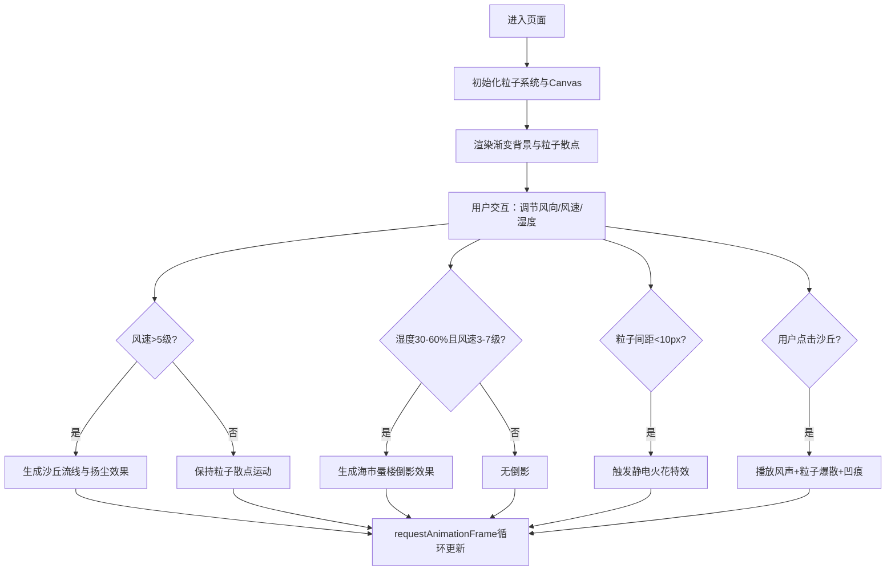

## 1. 产品概述

虚拟沙漠风暴粒子迁徙与海市蜃楼折射交互可视化项目，让用户以大气物理学家的视角，在无尽沙海中追踪气流，通过调节气象参数观察沙粒粒子运动、沙丘形成与海市蜃楼现象的科学模拟体验。

- 核心价值：将抽象的大气物理学概念转化为直观的视觉交互体验
- 目标用户：气象爱好者、科学教育工作者、数字艺术爱好者

## 2. 核心功能

### 2.1 用户角色
| 角色 | 注册方式 | 核心权限 |
|------|----------|----------|
| 普通用户 | 无需注册 | 完整使用所有交互功能 |

### 2.2 功能模块
1. **沙漠粒子系统**：上千沙粒粒子实时渲染、随机旋转动画、风力驱动运动
2. **沙丘流线可视化**：风速>5级时贝塞尔曲线连接邻近粒子，波峰粒子聚集与扬尘效果
3. **海市蜃楼折射**：特定温湿度条件下生成扭曲倒影、正弦波纹扰动、雾化边缘过渡
4. **静电火花特效**：粒子近距离碰撞触发、风速影响触发概率、冷却时间机制
5. **交互控制面板**：SVG风向标拖拽旋转、风速/湿度滑动条调节
6. **点击交互反馈**：沙粒风声播放、粒子爆散动画、环形凹痕效果

### 2.3 页面详情
| 页面名称 | 模块名称 | 功能描述 |
|----------|----------|----------|
| 主场景 | 渐变背景 | 沙地#d4a373到天空#7a8b99的垂直渐变，地平线位于30%处 |
| 主场景 | 粒子层 | 1500+沙粒粒子，尺寸2-5px，三色渐变，随机旋转 |
| 主场景 | 沙丘流线 | 贝塞尔曲线连接邻近粒子，波峰聚集密度>100/㎡ |
| 主场景 | 海市蜃楼 | 地平线上方50px处倒影区域，像素反转拉伸+波纹扰动 |
| 主场景 | 静电火花 | 距离<10px触发亮白色星形光晕，300-600ms持续 |
| 控制面板 | 风向标 | SVG箭头，0-360度拖拽旋转，初始随机方向 |
| 控制面板 | 风速滑动条 | 1-10级调节，渐变轨道，磨砂玻璃质感 |
| 控制面板 | 湿度滑动条 | 0-100%调节，渐变轨道，磨砂玻璃质感 |

## 3. 核心流程

用户进入页面后，首先看到全屏沙漠渐变背景与随机分布的沙粒粒子。通过拖拽风向标改变风向，调节风速和湿度控制粒子运动状态。当参数满足条件时，自动触发沙丘流线、海市蜃楼等视觉效果。点击沙丘区域可产生爆散动画和风声反馈。

## 4. 用户界面设计

### 4.1 设计风格
- **主色调**：沙漠暖色系 #d4a373、#c48c47、#b57a3a
- **对比色**：苍穹冷蓝色 #7a8b99
- **特效色**：亮白色 #ffffff（火花）、深棕色 #6d4c2a（凹痕）
- **控件风格**：磨砂玻璃质感，背景模糊10px，边框透明度0.2
- **按钮反馈**：点击时scale缩放到0.95再弹性弹回
- **字体**：采用现代无衬线字体，标题20px，标签14px，数值16px

### 4.2 页面设计概述
| 页面名称 | 模块名称 | UI元素 |
|----------|----------|----------|
| 主场景 | 背景层 | 垂直渐变、地平线分割、全屏Canvas |
| 主场景 | 粒子层 | 离屏Canvas计算、主Canvas绘制、旋转动画 |
| 主场景 | 特效层 | 贝塞尔曲线、波纹扰动、星形光晕、雾化渐变 |
| 控制面板 | 容器 | 右上角固定定位、磨砂玻璃背景、圆角12px、内边距20px |
| 控制面板 | 风向标 | SVG箭头、拖拽手柄、角度指示器 |
| 控制面板 | 滑动条 | 渐变轨道（浅沙→深沙）、圆形滑块、数值显示 |

### 4.3 响应性
- 桌面端优先设计，控制面板固定右上角
- 移动端自适应布局，控制面板改为底部抽屉式
- Canvas自动适配窗口大小，粒子密度根据屏幕尺寸动态调整
- 拖拽和滑动操作支持触摸设备

### 4.4 性能优化
- 双Canvas架构：离屏Canvas用于粒子计算，主Canvas用于绘制
- requestAnimationFrame驱动，目标60FPS
- AudioWorklet处理白噪声生成，不阻塞主线程
- 空间分区算法优化粒子碰撞检测（O(n log n)）
- 粒子数动态调整，确保1500粒子时交互延迟<16ms
