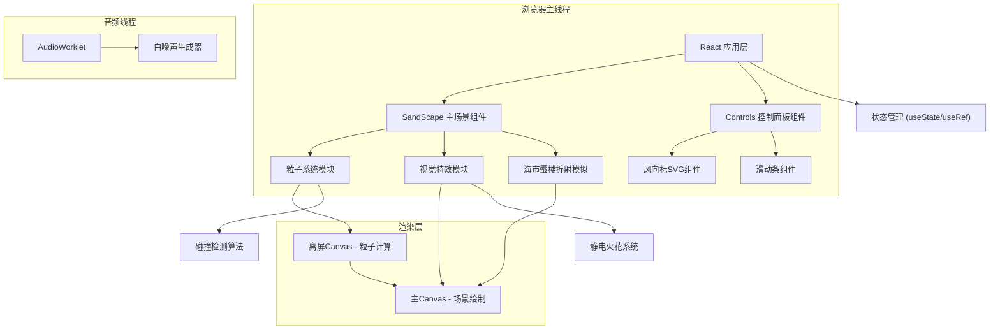

## 1. 架构设计



## 2. 技术描述

- **前端框架**：React@18 + TypeScript@5 + Vite@5
- **UI动效**：framer-motion@11
- **状态管理**：React Hooks (useState, useRef, useEffect, useCallback)
- **图形渲染**：HTML5 Canvas 2D API + 离屏Canvas
- **音频处理**：Web Audio API + AudioWorklet
- **工具库**：uuid@9
- **构建工具**：Vite@5，build.target: esnext

## 3. 核心技术决策

### 3.1 双Canvas渲染架构
- **离屏Canvas**：用于粒子位置计算、碰撞检测、贝塞尔曲线生成
- **主Canvas**：负责最终场景合成绘制，包括背景渐变、粒子、特效层
- **优势**：计算与绘制分离，减少主线程阻塞，提升渲染效率

### 3.2 粒子系统优化
- 空间分区网格（Spatial Partitioning Grid）：将画布划分为10x10px网格，碰撞检测仅检查相邻网格
- 对象池模式：预分配粒子对象数组，避免频繁GC
- requestAnimationFrame时间戳插值：确保不同帧率下运动速度一致

### 3.3 海市蜃楼实现
- getImageData像素采样：获取远处沙丘轮廓像素数据
- 像素矩阵变换：垂直反转 + 缩放(1.2-1.5x) + 正弦波位移
- 线性渐变蒙版：实现雾化边缘过渡效果

### 3.4 音频处理
- AudioWorklet：在独立线程生成低频白噪声，频率100-400Hz循环调制
- 避免使用ScriptProcessorNode（已废弃）
- 音频上下文懒加载：用户首次交互时初始化

## 4. 目录结构

```
project-root/
├── package.json
├── vite.config.js
├── tsconfig.json
├── index.html
└── src/
    ├── main.tsx
    ├── components/
    │   ├── SandScape.tsx      # 主场景组件
    │   └── Controls.tsx       # 控制面板组件
    └── utils/
        ├── particleSystem.ts  # 粒子系统工具函数
        └── audioUtils.ts      # 音频工具函数
```

## 5. 数据模型

### 5.1 粒子数据结构
```typescript
interface Particle {
  id: string;
  x: number;
  y: number;
  vx: number;
  vy: number;
  size: number;           // 2-5px
  color: string;          // #d4a373 | #c48c47 | #b57a3a
  rotation: number;       // 0-360度
  rotationSpeed: number;  // 随机小幅度
  humidity: number;       // 0-100，影响重量
  bounceHeight: number;   // 扬尘弹跳高度
  scatterVelocity?: { vx: number; vy: number }; // 爆散速度
}
```

### 5.2 静电火花数据结构
```typescript
interface Spark {
  id: string;
  x: number;
  y: number;
  size: number;           // 8-15px
  opacity: number;        // 0.6-0.9
  createdAt: number;      // 时间戳
  duration: number;       // 300-600ms
}
```

### 5.3 凹痕数据结构
```typescript
interface Crater {
  id: string;
  x: number;
  y: number;
  radius: number;
  createdAt: number;
  duration: number;       // 2000ms
}
```

### 5.4 控制状态
```typescript
interface ControlState {
  windDirection: number;  // 0-360度
  windSpeed: number;      // 1-10级
  humidity: number;       // 0-100%
}
```

## 6. 关键算法

### 6.1 粒子运动更新
```
风向向量 = (cos(θ), sin(θ))
风力 = 风速 × 0.5
湿度阻力 = 1 - (湿度 × 0.005)
速度 = (速度 + 风向向量 × 风力) × 湿度阻力
位置 += 速度 × 时间增量
```

### 6.2 沙丘流线检测
```
对每个粒子P：
  寻找距离 < 30px 的邻近粒子
  使用三次贝塞尔曲线连接 P → P1 → P2
  曲线控制点偏移量 = sin(时间 × 0.001) × 5px
```

### 6.3 碰撞检测与火花触发
```
基础概率 = 0.005
风速加成 = (风速 - 1) × 0.15
触发概率 = 基础概率 × (1 + 风速加成)
冷却时间 = 1000-2000ms（同一位置）
```

### 6.4 海市蜃楼波纹
```
像素位移 = sin(像素Y × 0.02 + 时间 × 0.003) × 8px
缩放系数 = 1.2 + sin(时间 × 0.001) × 0.3
透明度蒙版 = 线性渐变(0 → 0.5)
```

## 7. 性能指标

| 指标 | 目标值 |
|------|--------|
| 帧率 | 60 FPS |
| 最大粒子数 | 1500 |
| 交互延迟 | < 16ms |
| 内存占用 | < 100MB |
| 主线程阻塞 | < 8ms/帧 |
