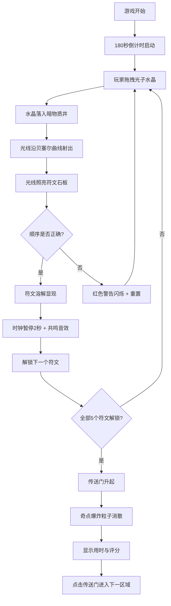

## 1. 产品概述

暗物质引力透镜解谜游戏是一款基于物理概念的太空主题益智游戏，玩家扮演深空探险物理学家，通过向暗物质井抛射不同质量的光子水晶，利用引力透镜效应扭曲光线路径来照亮隐藏的神秘符文，最终破解传送门密码通往下一星域。

- 核心玩法：拖拽抛射光子水晶 → 观察引力透镜扭曲光线 → 按正确顺序照亮符文 → 解锁传送门
- 目标用户：喜爱益智解谜、太空科幻题材的玩家
- 产品价值：寓教于乐，通过游戏化方式展示引力透镜物理效应，提供沉浸式太空探索体验

## 2. 核心功能

### 2.1 用户角色
| 角色 | 注册方式 | 核心权限 |
|------|---------|---------|
| 玩家 | 无需注册 | 完整游戏体验 |

### 2.2 功能模块
1. **星空背景系统**：Canvas 绘制渐变星空背景与闪烁恒星
2. **暗物质井系统**：SVG 漏斗形暗物质井，含奇点、吸积盘、引力透镜效果
3. **光子水晶系统**：可拖拽的三色水晶（红/蓝/绿），带发光效果和磁性吸附
4. **光线追踪系统**：贝塞尔曲线模拟引力透镜扭曲的光线路径
5. **符文石板系统**：5个 ASCII 符文，按正确顺序照亮后逐像素溶解显现
6. **弹药架系统**：管理水晶数量，时空回收功能
7. **宇宙时钟系统**：180秒倒计时，解锁符文时暂停并播放音效
8. **传送门系统**：全部符文解锁后升起传送门，显示评分
9. **音效系统**：Web Audio API 生成多种音效

### 2.3 页面详情
| 页面名称 | 模块名称 | 功能描述 |
|---------|---------|----------|
| 游戏主界面 | 星空背景 | Canvas 绘制深空渐变背景，300颗闪烁恒星 |
| 游戏主界面 | 暗物质井 | SVG 漏斗形井，奇点旋转，吸积盘发光 |
| 游戏主界面 | 光子水晶 | 三色菱形水晶，拖拽交互，磁性吸附 |
| 游戏主界面 | 光线效果 | 贝塞尔曲线轨迹，引力透镜弯曲效果 |
| 游戏主界面 | 符文石板 | 5个隐藏符文，溶解动画显现，粒子爆破效果 |
| 游戏主界面 | 宇宙时钟 | 圆形 SVG 计时器，荧光绿指针，180秒倒计时 |
| 游戏主界面 | 弹药架 | 半透明面板，三色水晶库存，时空回收按钮 |
| 游戏主界面 | 传送门 | 椭圆环状传送门，能量漩涡，评分展示 |

## 3. 核心流程

**详细流程说明：**
1. 游戏开始，宇宙时钟从180秒开始倒数
2. 玩家从右下角弹药架拖拽光子水晶到暗物质井上方释放
3. 水晶被吸入井口后，井底向上射出对应颜色的扭曲光线
4. 光线经过引力透镜效应弯曲，照射到中上方的符文石板
5. 当水晶颜色顺序与符文所需密码匹配时，符文逐像素溶解显现
6. 每个符文解锁时，时钟暂停2秒并播放低频共鸣音效
7. 顺序错误时符文短暂闪红警告并重置当前进度
8. 水晶不足时可使用"时空回收"按钮回收未击中的水晶，但消耗10秒时间
9. 全部5个符文解锁后，传送门从符文位置升起，奇点球爆炸消散
10. 显示最终用时与评分等级（S/A/B/C），玩家点击传送门结束游戏

## 4. 用户界面设计

### 4.1 设计风格
- **主题**：暗黑太空科幻风格，神秘深邃的宇宙氛围
- **主色调**：宇宙深空黑 `#0a0b1c`、星云紫 `#2c1a4a`
- **强调色**：荧光青绿 `#00ffcc`、铜金色 `#ff6f00`
- **水晶色**：光子红 `#ff5555`、光子蓝 `#5599ff`、光子绿 `#55ff88`
- **按钮风格**：发光描边按钮，悬停时增强发光效果
- **字体**：展示字体使用 Orbitron（科幻风格），正文字体使用 JetBrains Mono
- **布局风格**：全屏沉浸式，游戏元素环绕分布
- **动效风格**：缓动函数 ease-in-out/spring，粒子爆破效果，溶解动画

### 4.2 页面设计概述
| 页面名称 | 模块名称 | UI 元素 |
|---------|---------|---------|
| 游戏主界面 | 星空背景 | 渐变背景（#0a0b1c → #2c1a4a），300颗随机大小闪烁白点 |
| 游戏主界面 | 暗物质井 | 左下角，漏斗形 SVG，紫色网格井壁，20px 旋转奇点，吸积盘发光 |
| 游戏主界面 | 弹药架 | 右下角，180x360px 半透明面板，铜色发光边框，三色水晶各5颗 |
| 游戏主界面 | 宇宙时钟 | 顶部中央，半径80px圆形，0-180秒刻度，荧光绿发光指针 |
| 游戏主界面 | 符文石板 | 中上方水平排列，5个64x64px SVG 网格符文，初始隐藏 |
| 游戏主界面 | 传送门 | 屏幕中央升起，椭圆环（400x280px），能量漩涡纹理，橙金渐变 |

### 4.3 响应式设计
- 桌面优先设计，适配 1200x800 到 1920x1080 分辨率
- 使用 vw/vh 单位和 transform: scale() 进行整体缩放
- 保持游戏区域布局比例和元素相对位置不变
- 确保所有交互区域在各种分辨率下可点击/可拖拽

### 4.4 动效与交互细节
- **水晶拖拽**：跟随鼠标移动，距离井口 <50px 时磁性吸附
- **拖拽失败**：未落入有效区域时回弹动画返回弹药架
- **光线射出**：贝塞尔曲线路径，透明度 0.4，颜色与水晶对应
- **符文显现**：从左上到右下逐像素溶解，用时1.2秒，伴随 #00ffcc 光晕扩散
- **符文警告**：顺序错误时红色闪烁警告
- **时钟暂停**：解锁符文时暂停2秒，指针发光明灭
- **传送门升起**：从符文位置向上展开，能量漩涡旋转加速
- **奇点爆炸**：传送门展开时奇点球爆裂成发光粒子消散
- **粒子效果**：符文解锁时20-30个粒子向四周飞散，生命周期0.5秒
