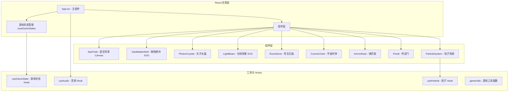

## 1. 架构设计



## 2. 技术描述

- **前端框架**：React 18 + TypeScript 5
- **构建工具**：Vite 5 + @vitejs/plugin-react
- **动画库**：framer-motion（React 动画库，支持 spring/ease-in-out 缓动）
- **状态管理**：自定义 Hook useGameState + useReducer（数据单向流动）
- **音效库**：howler.js（封装 Web Audio API）
- **工具库**：uuid（唯一标识）、zod（数据验证）
- **图形渲染**：SVG（游戏元素） + Canvas 2D（星空背景、粒子系统）
- **样式方案**：内联样式 + CSS 变量（游戏主题配色）

### 技术选型理由
- **framer-motion**：提供强大的 React 动画能力，支持拖拽、弹簧动画、缓动函数，完美满足游戏交互需求
- **SVG + Canvas 混合**：SVG 适合交互游戏元素（拖拽、发光效果），Canvas 适合高性能粒子和星空背景
- **自定义 Hook 状态管理**：游戏状态集中管理，dispatch 模式保证数据单向流动
- **howler.js**：简化 Web Audio API 操作，确保低延迟音效播放

## 3. 文件结构

```
src/
├── App.tsx                  # 主组件，游戏状态机，布局管理
├── main.tsx                 # React 入口
├── index.css                # 全局样式、CSS 变量
├── hooks/
│   ├── useGameState.ts      # 游戏状态管理 Hook
│   ├── useAudio.ts          # 音效管理 Hook
│   └── useParticle.ts       # 粒子系统 Hook
├── components/
│   ├── StarField.tsx        # 星空背景 (Canvas)
│   ├── DarkMatterWell.tsx   # 暗物质井 (SVG)
│   ├── PhotonCrystal.tsx    # 光子水晶 (SVG + 拖拽)
│   ├── LightBeam.tsx        # 光线效果 (SVG 贝塞尔曲线)
│   ├── RuneStone.tsx        # 符文石板 (SVG + 溶解动画)
│   ├── CosmicClock.tsx      # 宇宙时钟 (SVG)
│   ├── AmmoRack.tsx         # 弹药架 (SVG + 面板)
│   ├── Portal.tsx           # 传送门 (SVG + 动画)
│   └── ParticleEffect.tsx   # 粒子效果 (Canvas)
├── utils/
│   ├── gameUtils.ts         # 游戏工具函数
│   └── audioUtils.ts        # 音效生成工具
├── types/
│   └── gameTypes.ts         # TypeScript 类型定义
└── data/
    └── runes.ts             # 符文数据配置
```

## 4. 数据模型与状态

### 4.1 游戏状态类型定义

```typescript
// 水晶颜色类型
type CrystalColor = 'red' | 'blue' | 'green';

// 符文状态
interface Rune {
  id: string;
  symbol: string;        // ASCII 字符
  requiredSequence: CrystalColor[];  // 解锁所需颜色顺序
  currentProgress: number;           // 当前解锁进度 (0-3)
  isUnlocked: boolean;
  position: { x: number; y: number };
}

// 光线信息
interface LightBeam {
  id: string;
  color: CrystalColor;
  startPoint: { x: number; y: number };
  controlPoint: { x: number; y: number };
  endPoint: { x: number; y: number };
  createdAt: number;
  duration: number;
}

// 游戏状态
interface GameState {
  phase: 'idle' | 'playing' | 'paused' | 'won' | 'lost';
  timeRemaining: number;      // 剩余时间 (秒)
  totalTime: number;          // 总时间 180s
  crystals: Record<CrystalColor, number>;  // 各颜色水晶数量
  runes: Rune[];              // 符文列表
  currentRuneIndex: number;   // 当前需要解锁的符文索引
  lightBeams: LightBeam[];    // 当前活动的光线
  particles: Particle[];      // 粒子列表
  score: number;
  grade: 'S' | 'A' | 'B' | 'C' | null;
  isTimePaused: boolean;      // 时钟是否暂停
  pauseEndTime: number;       // 暂停结束时间戳
}

// 游戏 Action 类型
type GameAction =
  | { type: 'START_GAME' }
  | { type: 'TICK_TIME'; payload: number }
  | { type: 'FIRE_CRYSTAL'; payload: { color: CrystalColor } }
  | { type: 'RECYCLE_CRYSTALS' }
  | { type: 'UNLOCK_RUNE'; payload: { runeId: string } }
  | { type: 'FAIL_RUNE'; payload: { runeId: string } }
  | { type: 'ADD_LIGHT_BEAM'; payload: LightBeam }
  | { type: 'REMOVE_LIGHT_BEAM'; payload: { id: string } }
  | { type: 'WIN_GAME' }
  | { type: 'LOSE_GAME' };
```

### 4.2 评分规则
- **S 级**：≤ 180 秒内完成
- **A 级**：120-150 秒内完成
- **B 级**：150-170 秒内完成
- **C 级**：170-180 秒内完成

## 5. 核心技术实现方案

### 5.1 拖拽与磁性吸附
- 使用 framer-motion 的 drag 功能实现水晶拖拽
- 在 onDrag 事件中计算水晶与暗物质井口的距离
- 距离 < 50px 时触发磁性吸附，使用 spring 动画平滑吸入
- 拖拽释放时检测是否在有效区域内，否则回弹动画返回

### 5.2 引力透镜光线效果
- 使用 SVG path 的贝塞尔曲线（quadraticCurveTo）模拟光线弯曲
- 根据水晶颜色和质量调整曲线控制点位置
- 动画使用 framer-motion 的 pathLength 或 strokeDashoffset 实现光线射出效果
- 光线透明度 0.4，带发光滤镜（feGaussianBlur）

### 5.3 符文溶解动画
- 使用 SVG clipPath 和 mask 实现逐像素溶解效果
- 溶解方向从左上到右下，总时长 1.2 秒
- 配合 framer-motion 的 stagger 动画实现像素级渐变
- 解锁时伴随粒子爆炸效果（20-30个粒子，生命周期 0.5 秒）

### 5.4 粒子系统
- 使用 Canvas 2D 绘制高性能粒子
- 粒子类型：符文解锁粒子、奇点爆炸粒子、传送门能量粒子
- 使用 requestAnimationFrame 维持 60fps 帧率
- 粒子池化技术减少 GC 压力

### 5.5 音效系统
- 使用 Web Audio API / howler.js 生成程序化音效
- 水晶发射：800Hz 三角波，0.15秒
- 符文解锁：120Hz 正弦波，1秒
- 失败警告：短促方波
- 传送门激活：复合音效，频率渐变

## 6. 性能优化策略

- **Canvas 星空背景**：使用 requestAnimationFrame 批量绘制，离屏缓存
- **SVG 元素复用**：使用 use 元素复用图形定义
- **粒子池化**：对象池复用粒子对象，减少 GC
- **动画降级**：检测到低帧率时减少粒子数量和动画复杂度
- **虚拟列表**：符文数量固定（5个），无需虚拟化
- **CSS 变量**：主题色统一管理，避免重排重绘

## 7. 构建配置

- **Vite 5**：快速开发服务器，热更新
- **路径别名**：@/ 指向 src/ 目录
- **TypeScript 严格模式**：启用 strict、noImplicitAny、strictNullChecks
- **目标 ES2020**：支持现代浏览器特性
- **生产构建**：代码分割、Tree Shaking、压缩
