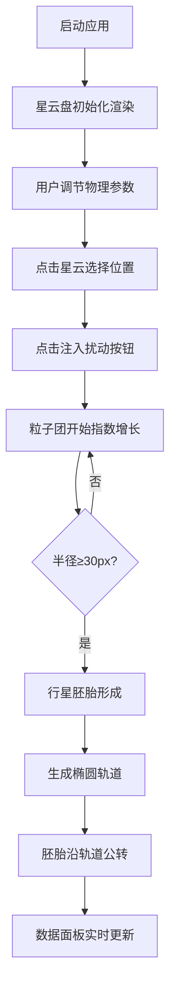

## 1. 产品概述

虚拟星云行星形成交互可视化应用，为行星形成研究者提供沉浸式模拟环境，通过调节星云物理参数观察气体与尘埃在引力作用下凝聚成行星胚胎的过程，实时追踪行星轨道演化与星云盘结构变化。

- 核心目标：模拟星云环境下行星形成的物理过程，提供直观的可视化交互体验
- 目标用户：天文研究者、科学教育工作者、太空探索爱好者
- 产品价值：将复杂的天体物理过程转化为可交互的可视化体验，辅助教学与研究

## 2. 核心功能

### 2.1 用户角色

| 角色 | 注册方式 | 核心权限 |
|------|----------|----------|
| 研究者 | 无需注册 | 调节物理参数、注入扰动、观察行星形成过程 |

### 2.2 功能模块

1. **星云可视化主界面**：5000粒子星云盘渲染、3D视角旋转、深空渐变背景
2. **物理参数控制面板**：气体密度滑块、温度梯度滑块、旋转速度滑块
3. **扰动注入与行星形成**：点击星云注入扰动、粒子团指数增长、行星胚胎形成判定
4. **轨道演化系统**：椭圆轨道生成、行星公转、引力约束可视化
5. **实时数据监测**：参数显示、胚胎状态追踪、数据自动刷新

### 2.3 页面详情

| 页面名称 | 模块名称 | 功能描述 |
|---------|----------|----------|
| 主界面 | 星云画布 | Canvas渲染5000个半透明粒子构成的旋转星云盘，支持鼠标拖拽旋转视角 |
| 主界面 | 控制面板 | 左侧浮动毛玻璃面板，三个滑块控制气体密度、温度梯度、旋转速度，与数值框联动 |
| 主界面 | 数据面板 | 右下角实时显示物理参数、胚胎数量、每个胚胎的半径和轨道半径 |
| 主界面 | 交互系统 | 点击星云选择位置，注入扰动按钮触发行星形成过程 |

## 3. 核心流程

用户打开应用 → 观察默认星云盘旋转 → 调节物理参数（密度/温度/速度）→ 点击星云盘中目标位置 → 点击"注入扰动"按钮 → 观察粒子团增长 → 行星胚胎形成（半径≥30px）→ 轨道自动生成 → 胚胎沿轨道公转 → 实时数据面板更新状态

## 4. 用户界面设计

### 4.1 设计风格

- **主色调**：星云紫黑（#0d0221）到深空蓝（#0a2e5a）渐变背景
- **辅助色**：暖橙色（#ff6f00）、冷蓝色（#0288d1）、浅蓝色（#81d4fa）
- **文字颜色**：浅蓝色（#81d4fa）、白色（#ffffff）
- **按钮样式**：暖橙色渐变背景（#ff6f00 → #ff8f00），圆角，悬停放大1.05倍并增加阴影
- **字体**：现代无衬线字体，标题加粗，正文清晰易读
- **控件效果**：半透明毛玻璃效果（background: rgba(255,255,255,0.1)），backdrop-filter 模糊

### 4.2 页面设计概述

| 页面名称 | 模块名称 | UI元素 |
|---------|----------|--------|
| 主界面 | 星云画布 | 全屏Canvas，5000粒子星云盘，从内部暖橙到外部冷蓝渐变，透明度0.3-0.8，大小2-6px |
| 主界面 | 控制面板 | 左侧固定宽度280px，毛玻璃背景，三个滑块组，每个滑块配数值输入框，底部注入扰动按钮 |
| 主界面 | 数据面板 | 右下角固定宽度320px高度150px，白色文字14px，每秒刷新数据 |
| 主界面 | 行星胚胎 | 颜色随密度温度动态变化，形成后周围出现环状间隙，椭圆轨道公转 |

### 4.3 响应式设计

- **桌面端（≥768px）**：控制面板固定左侧，主画布占据剩余空间，数据面板固定右下角
- **移动端（<768px）**：控制面板折叠为顶部抽屉式，点击展开，画布全屏显示，数据面板适配宽度
- **触摸优化**：支持触摸滑动旋转视角，触摸选择位置，滑块触摸友好

### 4.4 动效设计

- **星云旋转**：星云盘绕中心垂直轴缓慢旋转，角速度0.2rad/s
- **粒子团增长**：指数增长动画，平滑过渡
- **轨道运动**：行星胚胎沿椭圆轨道平滑公转，周期5-15秒
- **控件动画**：framer-motion实现弹性动画（spring stiffness 300, damping 20）
- **悬停反馈**：按钮悬停放大1.05倍，阴影增强
- **帧率保证**：所有动画不低于30fps，单帧渲染不超过30ms
