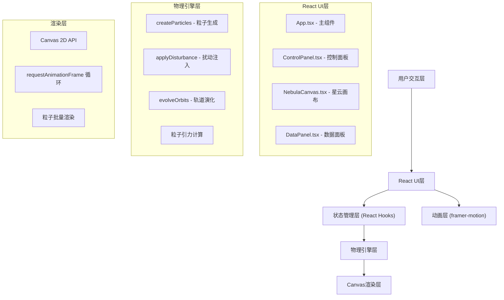
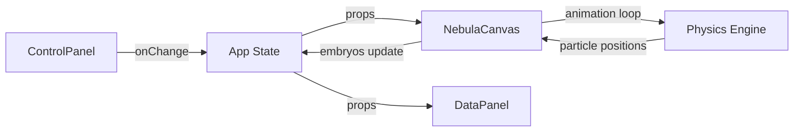

## 1. 架构设计



## 2. 技术描述

- **前端框架**：React@18 + TypeScript + Vite@5
- **构建工具**：Vite@5，启用React插件，端口3000
- **状态管理**：React Hooks (useState, useRef, useEffect)
- **动画库**：framer-motion，弹性动画 spring: { stiffness: 300, damping: 20 }
- **渲染技术**：Canvas 2D API，5000粒子批量渲染
- **工具库**：uuid（唯一标识）、zod（类型验证）
- **性能优化**：
  - Canvas离屏渲染优化
  - 粒子位置计算使用双精度浮点数
  - 单帧渲染时间控制在30ms以内
  - 帧率不低于30fps

## 3. 目录结构

```
project/
├── package.json
├── vite.config.js
├── tsconfig.json
├── index.html
└── src/
    ├── main.tsx          # React入口
    ├── App.tsx           # 主组件，状态管理
    ├── types/
    │   └── index.ts      # 类型定义
    ├── components/
    │   ├── ControlPanel.tsx   # 左侧控制面板
    │   ├── NebulaCanvas.tsx   # 星云画布
    │   └── DataPanel.tsx      # 右下角数据面板
    └── utils/
        └── nebulaPhysics.ts   # 物理引擎
```

## 4. 核心类型定义

```typescript
// Particle - 星云粒子
interface Particle {
  id: string;
  x: number;
  y: number;
  z: number;
  radius: number;
  color: string;
  opacity: number;
  angle: number;
  distance: number;
  speed: number;
}

// PlanetEmbryo - 行星胚胎
interface PlanetEmbryo {
  id: string;
  x: number;
  y: number;
  radius: number;
  color: string;
  orbitSemiMajorAxis: number;
  orbitEccentricity: number;
  orbitAngle: number;
  orbitSpeed: number;
  isFormed: boolean;
}

// ControlState - 控制参数
interface ControlState {
  gasDensity: number;      // 0-100, default 50
  temperatureGradient: number; // -50 to +50, default 0
  rotationSpeed: number;   // 0.5-3.0, default 1.0
}

// SelectedPosition - 选中的注入位置
interface SelectedPosition {
  x: number;
  y: number;
}
```

## 5. 物理引擎算法

### 5.1 粒子生成算法
- 生成5000个粒子，分布在星云盘内
- 粒子距离中心的距离遵循正态分布
- 颜色从内部暖橙（#ff6f00）向外过渡到冷蓝（#0288d1）
- 粒子大小2-6px，透明度0.3-0.8
- 初始角速度与距离成反比（开普勒定律近似）

### 5.2 扰动增长算法
- 每帧增长量 = 密度/100 × 温度梯度系数 × 0.1px
- 温度梯度系数：当温度梯度为正时增长加速，负时减缓
- 指数增长公式：r(t) = r0 × e^(k×t)
- 当半径≥30px时，判定为行星胚胎形成

### 5.3 轨道计算
- 半长轴：100-200px随机
- 离心率：0.1-0.5随机
- 公转周期：与星云旋转速度联动，5-15秒一圈
- 位置计算使用双精度浮点数：
  - x = a × cos(θ) × (1 - e²) / (1 + e × cos(θ))
  - y = b × sin(θ) × (1 - e²) / (1 + e × cos(θ))

### 5.4 星云盘间隙形成
- 行星胚胎形成后，清除轨道附近的粒子
- 间隙宽度 = 胚胎半径 × 2
- 间隙内外粒子重新分布，形成清晰的环结构

## 6. 性能优化策略

1. **Canvas渲染优化**
   - 使用requestAnimationFrame实现流畅动画
   - 粒子批量绘制，减少API调用
   - 离屏Canvas预渲染粒子纹理

2. **计算优化**
   - 粒子位置计算使用TypedArray优化
   - 引力计算使用空间分区（网格法）减少O(n²)复杂度
   - 轨道计算使用双精度浮点数避免累积误差

3. **内存管理**
   - 粒子对象池复用，避免频繁GC
   - 胚胎数量限制为5个，超过后最早的胚胎被替换
   - 及时清理不再使用的事件监听器

## 7. 数据模型

### 7.1 状态数据流



### 7.2 状态验证（zod）

```typescript
import { z } from 'zod';

const ControlStateSchema = z.object({
  gasDensity: z.number().min(0).max(100),
  temperatureGradient: z.number().min(-50).max(50),
  rotationSpeed: z.number().min(0.5).max(3.0),
});

const PlanetEmbryoSchema = z.object({
  id: z.string().uuid(),
  x: z.number(),
  y: z.number(),
  radius: z.number().min(5).max(100),
  color: z.string(),
  isFormed: z.boolean(),
});
```
