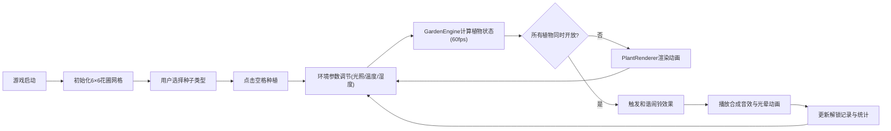

## 1. 产品概述
虚拟生物节律花园与生态闹钟游戏是一款基于植物生物节律的交互式教育娱乐应用，让用户通过种植不同生物钟类型的植物，探索昼夜节律对生命体的影响，最终构建和谐的植物群落以解锁自然闹铃。
- 核心目标：通过游戏化方式科普生物钟知识，提供沉浸式的自然交互体验
- 目标用户：生物钟研究者、自然爱好者、寻求独特闹铃体验的用户

## 2. 核心功能

### 2.1 功能模块
1. **花园种植区**：6×6网格花圃，7种植物种子选择与种植交互
2. **环境控制面板**：光照周期、温度、湿度调节滑块
3. **生物钟模拟器**：植物昼夜节律自动计算与动画呈现
4. **声波粒子系统**：植物盛开时的声波可视化与和声合成
5. **生态闹铃系统**：和谐闹铃触发机制与自定义闹铃设置
6. **数据统计与图鉴**：植物波形图、解锁记录与植物百科

### 2.2 页面详情

| 页面名称 | 模块名称 | 功能描述 |
|-----------|-------------|---------------------|
| 主游戏界面 | 花园种植区 | 6×6网格布局，点击空格种植种子，显示植物生长状态与开合动画 |
| 主游戏界面 | 种子选择栏 | 7种植物种子卡片，显示植物名称、节律类型与理想环境参数 |
| 主游戏界面 | 环境控制面板 | 光照周期滑块(4-24小时)、温度双滑块(10-40°C)、湿度双滑块(20-90%) |
| 主游戏界面 | 声波可视化层 | Canvas绘制声波粒子弧线动画，叠加形成和声效果 |
| 主游戏界面 | 闹铃触发效果 | 彩色扩散光晕动画，自然音效合成播放 |
| 主游戏界面 | 数据统计栏 | 底部滚动波形图，植物开放度实时曲线，解锁图鉴统计 |
| 图鉴弹窗 | 植物百科 | 每种植物的理想光照周期、温湿度范围、节律曲线说明 |

## 3. 核心流程

### 3.1 主要用户流程
用户进入游戏后，首先看到6×6的空花圃。选择左侧的植物种子，点击花圃空格进行种植。通过调整右侧的光照周期、温度和湿度滑块，观察植物的开放与闭合变化。当所有植物同时盛开时，触发和谐闹铃效果。用户可设置闹铃时间，到达时刻花园自动同步植物开放。底部波形图实时显示所有植物的生物节律曲线。

### 3.2 状态流转图

## 4. 用户界面设计

### 4.1 设计风格
- **主色调**：莫兰迪色系，背景#2d3436，花圃网格#636e72，文字#dfe6e9
- **色彩体系**：植物盛开色采用自然色系（向日葵黄、夜来香紫、茉莉粉等），休眠状态为灰调
- **动画风格**：framer-motion spring缓动(stiffness=100, damping=20)，持续1.2秒
- **字体**：采用优雅的衬线与无衬线组合，标题使用Playfair Display，正文使用Lato
- **布局**：CSS Grid + Flexbox混合布局，全屏无滚动，三栏结构（种子栏|花圃|控制面板）

### 4.2 页面设计概要

| 页面名称 | 模块名称 | UI元素 |
|-----------|-------------|-------------|
| 主游戏界面 | 种子选择栏 | 左侧垂直排列种子卡片，悬停放大效果，选中高亮边框 |
| 主游戏界面 | 花圃网格 | 中央6×6方格，min(100px, 1fr)自适应，悬停格高亮，种植后显示植物Canvas |
| 主游戏界面 | 控制面板 | 右侧滑块组，实时数值标签，刻度标记，拖动时背景色渐变 |
| 主游戏界面 | 波形统计栏 | 底部固定区域，横向滚动折线图，显示时间-开放度曲线 |
| 闹铃触发 | 光晕效果 | 屏幕中央径向渐变光圈，半径0→800px，透明度0.8→0，持续2秒 |

### 4.3 响应式设计
- **桌面端**：三栏布局（左20% | 中60% | 右20%），底部统计栏15%高度
- **平板端**：两列布局，种子栏与控制栏合并到底部，花圃占主要区域
- **移动端**：单列布局，花圃居中，控制元素可折叠抽屉式交互

### 4.4 交互细节
- 种子卡片：hover时scale(1.05)，selected时边框发光，spring动画
- 花圃格子：empty时hover显示半透明预览，planted时显示植物
- 滑块：拖动时背景色相随数值变化0.5秒过渡，数值标签实时更新
- 植物开合：花瓣由中心向外展开/收拢，颜色灰→鲜艳渐变，1.2秒完成
- 温度过高(>35°C)：花瓣向内卷曲动画，颜色偏棕
- 湿度过低(<30%)：叶片下垂抖动效果，颜色偏黄
