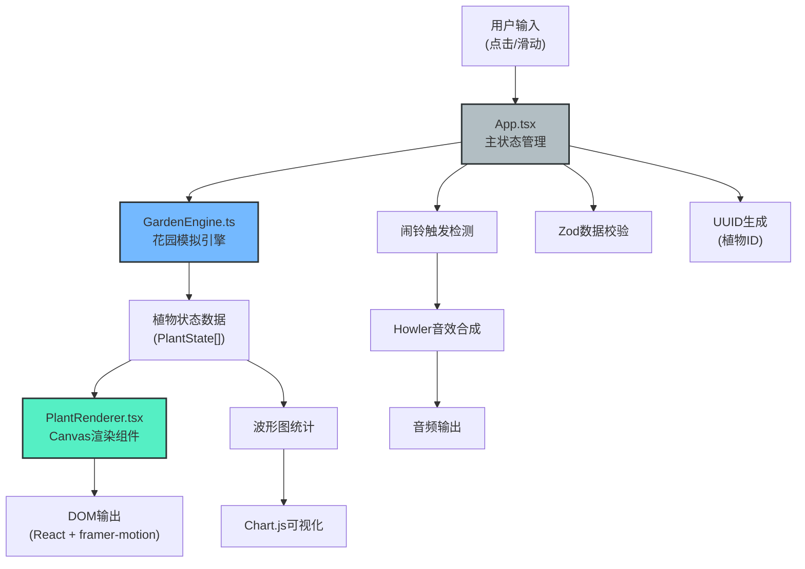

## 1. 架构设计



**文件调用关系与数据流向：**
1. [index.html](file:///e:/solo/VersionFast/tasks/auto264/index.html) → 加载 [main.tsx](file:///e:/solo/VersionFast/tasks/auto264/src/main.tsx)
2. [main.tsx](file:///e:/solo/VersionFast/tasks/auto264/src/main.tsx) → 挂载 [App.tsx](file:///e:/solo/VersionFast/tasks/auto264/src/App.tsx) 根组件
3. [App.tsx](file:///e:/solo/VersionFast/tasks/auto264/src/App.tsx) → 接收用户输入 → 调用 [GardenEngine.ts](file:///e:/solo/VersionFast/tasks/auto264/src/GardenEngine.ts) 更新植物状态
4. [GardenEngine.ts](file:///e:/solo/VersionFast/tasks/auto264/src/GardenEngine.ts) → 计算每帧植物状态 → 返回给 [App.tsx](file:///e:/solo/VersionFast/tasks/auto264/src/App.tsx)
5. [App.tsx](file:///e:/solo/VersionFast/tasks/auto264/src/App.tsx) → 将状态数据传递给 [PlantRenderer.tsx](file:///e:/solo/VersionFast/tasks/auto264/src/PlantRenderer.tsx)
6. [PlantRenderer.tsx](file:///e:/solo/VersionFast/tasks/auto264/src/PlantRenderer.tsx) → Canvas绘制植物与声波动画
7. [styles.css](file:///e:/solo/VersionFast/tasks/auto264/src/styles.css) → 全局样式应用于所有组件

## 2. 技术栈说明

| 技术 | 版本 | 用途 |
|------|------|------|
| React | ^18.2.0 | 前端框架，组件化开发 |
| react-dom | ^18.2.0 | React DOM渲染 |
| TypeScript | ^5.4.0 | 类型安全的JavaScript |
| Vite | ^5.0.0 | 构建工具，开发服务器 |
| @vitejs/plugin-react | ^4.2.0 | Vite React插件支持 |
| framer-motion | ^11.0.0 | React动画库，spring缓动效果 |
| uuid | ^9.0.0 | 生成唯一植物ID |
| howler | ^2.2.4 | 音频播放与音效合成 |
| zod | ^3.22.0 | 运行时数据类型校验 |

### 初始化与构建配置
- **构建工具**：Vite 5 + @vitejs/plugin-react
- **TypeScript配置**：严格模式，target ES2020，moduleResolution bundler
- **启动命令**：`npm run dev` → 启动Vite开发服务器
- **生产构建**：`npm run build` → 输出到dist目录

## 3. 核心数据模型

### 3.1 TypeScript类型定义

```typescript
// 植物节律类型
type CircadianType = 'morning' | 'night' | 'dusk' | 'dawn' | 'midday' | 'noon' | 'full_day';

// 植物种子定义
interface PlantSeed {
  id: string;
  name: string;
  type: CircadianType;
  bloomStart: number;      // 开花开始时间(小时)
  bloomDuration: number;   // 开花持续时长(小时)
  maxSize: number;         // 最大花朵尺寸
  color: string;           // 盛开颜色
  frequency: number;       // 声波频率(Hz)
  idealLight: number;      // 理想光照周期
  idealTemp: [number, number];  // 理想温度范围
  idealHumidity: [number, number]; // 理想湿度范围
  description: string;
}

// 植物实例状态
interface PlantState {
  id: string;
  seedId: string;
  gridX: number;
  gridY: number;
  plantedAt: number;       // 种植时间戳
  openness: number;        // 开放度 0-1
  targetOpenness: number;  // 目标开放度
  size: number;            // 当前尺寸
  colorSaturation: number; // 颜色饱和度
  health: number;          // 健康度 0-1
  petalCurve: number;      // 花瓣卷曲度(-1~1, 负为内卷)
  leafDroop: number;       // 叶片下垂度 0-1
  isBlooming: boolean;     // 是否盛开中
  bloomPhase: number;      // 盛开动画阶段 0-1
  soundParticles: SoundParticle[]; // 声波粒子
}

// 声波粒子
interface SoundParticle {
  id: string;
  x: number;
  y: number;
  radius: number;
  maxRadius: number;
  opacity: number;
  frequency: number;
}

// 环境参数
interface Environment {
  lightPeriod: number;     // 光照周期 4-24小时
  temperature: number;     // 温度 10-40°C
  humidity: number;        // 湿度 20-90%
  currentTime: number;     // 当前虚拟时间(小时)
  timeSpeed: number;       // 时间流速
}

// 游戏状态
interface GameState {
  plants: PlantState[];
  environment: Environment;
  selectedSeed: string | null;
  unlockedSeeds: string[];
  alarmTriggered: number;  // 闹铃触发次数
  alarmTime: number | null; // 用户设置的闹铃时间
  isAlarmActive: boolean;  // 闹铃是否激活
  harmonyState: boolean;   // 和谐状态(所有植物同时开放)
}

// 网格单元格
interface GridCell {
  x: number;
  y: number;
  plantId: string | null;
}
```

### 3.2 Zod校验模式

```typescript
// 环境参数校验
const EnvironmentSchema = z.object({
  lightPeriod: z.number().min(4).max(24),
  temperature: z.number().min(10).max(40),
  humidity: z.number().min(20).max(90),
  currentTime: z.number().min(0).max(24),
  timeSpeed: z.number().min(0.1).max(10),
});

// 植物状态校验
const PlantStateSchema = z.object({
  id: z.string().uuid(),
  seedId: z.string(),
  gridX: z.number().int().min(0).max(5),
  gridY: z.number().int().min(0).max(5),
  openness: z.number().min(0).max(1),
  health: z.number().min(0).max(1),
});
```

## 4. 性能优化方案

### 4.1 模拟引擎性能
- **帧率控制**：requestAnimationFrame 60fps更新
- **计算优化**：每帧36株植物状态计算控制在2ms以内
  - 使用数学公式预计算节律曲线
  - 避免数组遍历中的复杂运算
  - 增量更新而非全量重算

### 4.2 渲染性能
- **Canvas分层**：
  - 底层：花圃网格与背景
  - 中层：植物主体
  - 顶层：声波粒子效果
- **脏矩形渲染**：仅重绘状态变化的植物区域
- **每株植物渲染**：控制在0.5ms以内
  - 花瓣使用贝塞尔曲线预缓存Path2D
  - 颜色计算使用缓存

### 4.3 内存管理
- **对象池**：声波粒子使用对象池复用，避免频繁GC
- **事件监听**：统一的事件委托，避免单个元素绑定过多监听
- **动画清理**：组件卸载时自动取消所有animation frame

## 5. 核心模块接口

### 5.1 GardenEngine 接口

```typescript
class GardenEngine {
  constructor(initialEnv: Environment);
  
  // 更新环境参数
  setEnvironment(env: Partial<Environment>): void;
  
  // 种植植物
  plantSeed(seed: PlantSeed, gridX: number, gridY: number): PlantState;
  
  // 移除植物
  removePlant(plantId: string): void;
  
  // 帧更新，返回所有植物状态
  update(deltaTime: number): PlantState[];
  
  // 检查和谐状态
  checkHarmony(): boolean;
  
  // 获取植物节律值(0-1)
  getCircadianValue(plant: PlantState, currentTime: number): number;
  
  // 计算环境影响因子
  calculateEnvironmentFactor(plant: PlantState): {
    tempFactor: number;
    humidityFactor: number;
    lightFactor: number;
  };
}
```

### 5.2 声波合成系统

```typescript
class SoundSystem {
  // 注册植物声波
  registerPlant(frequency: number, plantId: string): void;
  
  // 移除植物声波
  unregisterPlant(plantId: string): void;
  
  // 播放和谐闹铃
  playHarmonyAlarm(activeFrequencies: number[]): void;
  
  // 停止所有音效
  stopAll(): void;
  
  // 生成声波粒子
  emitSoundParticle(plantId: string, x: number, y: number): SoundParticle;
}
```

## 6. 目录结构

```
auto264/
├── index.html                 # 入口HTML
├── package.json              # 项目依赖
├── vite.config.js            # Vite配置
├── tsconfig.json             # TypeScript配置
└── src/
    ├── main.tsx              # React入口
    ├── App.tsx               # 主应用组件
    ├── GardenEngine.ts       # 花园模拟引擎
    ├── PlantRenderer.tsx     # 植物渲染组件
    ├── types.ts              # 类型定义(可选，用户未指定)
    ├── seeds.ts              # 植物种子数据(可选，用户未指定)
    └── styles.css            # 全局样式
```

## 7. 游戏循环流程

```
每一帧 (16.67ms @ 60fps):
┌─────────────────────────────────────────────────────┐
│ 1. App.tsx: requestAnimationFrame 回调              │
│    └── 计算 deltaTime (毫秒)                        │
├─────────────────────────────────────────────────────┤
│ 2. GardenEngine.update(deltaTime)                   │
│    ├── 更新虚拟时间 currentTime                     │
│    ├── 遍历所有36个网格:                            │
│    │   ├── 计算目标开放度 (节律曲线 × 环境因子)     │
│    │   ├── 插值更新当前开放度 (平滑过渡)            │
│    │   ├── 计算温度/湿度影响 (花瓣卷曲、叶片下垂)   │
│    │   ├── 生成声波粒子 (盛开时)                    │
│    │   └── 每株计算耗时 < 0.05ms                    │
│    └── 总计算耗时 < 2ms                             │
├─────────────────────────────────────────────────────┤
│ 3. 检查和谐闹铃触发条件                              │
│    └── 所有已种植植物 openness > 0.8 ?              │
│       ├── 是 → 触发闹铃动画与音效                   │
│       └── 否 → 继续                                 │
├─────────────────────────────────────────────────────┤
│ 4. React 状态更新                                   │
│    └── setState 触发重新渲染                        │
├─────────────────────────────────────────────────────┤
│ 5. PlantRenderer Canvas 绘制                        │
│    ├── 背景与网格 (一次性绘制)                      │
│    ├── 遍历植物:                                    │
│    │   ├── 绘制花瓣 (贝塞尔曲线)                    │
│    │   ├── 颜色插值 (灰→鲜艳)                       │
│    │   ├── 特殊效果 (卷曲/抖动)                     │
│    │   └── 每株绘制 < 0.5ms                         │
│    └── 绘制声波粒子 (弧线动画)                      │
├─────────────────────────────────────────────────────┤
│ 6. 波形图更新                                       │
│    └── 记录所有植物开放度历史数据                   │
└─────────────────────────────────────────────────────┘
```
